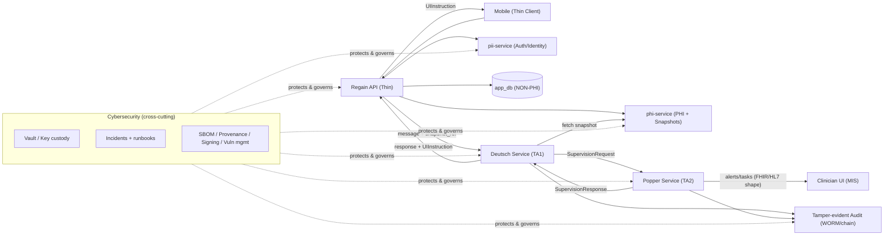
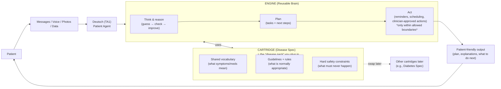
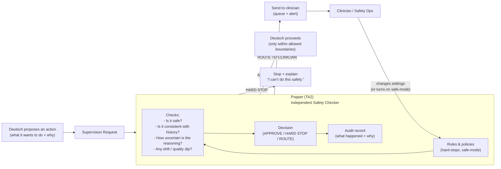
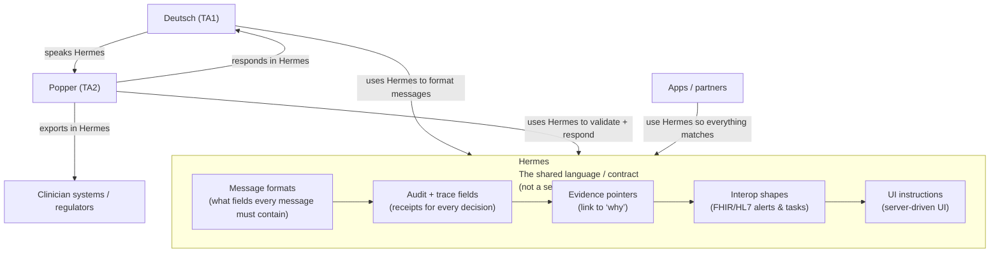
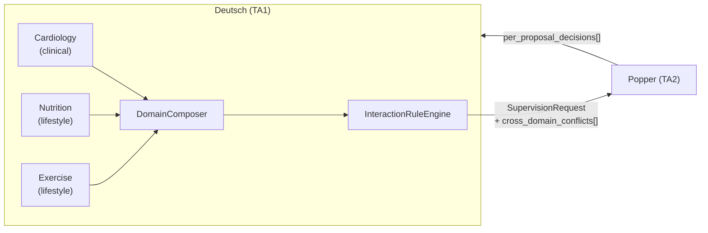

# Architecture Overview: Deutsch, Popper & Hermes

## Executive Summary

This document outlines the architectural strategy for the **ADVOCATE** program. It defines a "Trinity" of agentic systems designed to implement rigorous **Epistemological Engineering** for medical AI safety.

### System Diagram

```mermaid
flowchart TD
    %% Define styles for high contrast
    classDef universal fill:#0288d1,stroke:#01579b,stroke-width:3px,color:white;
    classDef implementation fill:#f3e5f5,stroke:#4a148c,stroke-width:2px;
    classDef external fill:#fff3e0,stroke:#e65100,stroke-width:2px;
    classDef observer fill:#e8f5e9,stroke:#1b5e20,stroke-width:2px;
    classDef service fill:#e0f2f1,stroke:#004d40,stroke-width:2px;

    %% Universal Layer (The Product we Sell)
    subgraph Universal["UNIVERSAL LAYER (SaaS Platform)"]
        Hermes["HERMES (Protocol / Language)"]:::universal
        Popper["POPPER (Safety Service)"]:::universal
        DeutschSvc["DEUTSCH (Reasoning Service)"]:::universal

        DeutschSvc -- "Speaks" --> Hermes
        DeutschSvc -- "SupervisionRequest" --> Popper
        Popper -- "Validates via" --> Hermes
    end

    %% Regain Implementation (Our App)
    subgraph Regain["REGAIN IMPLEMENTATION (Our App)"]
        RegainAPI["Regain API (Thin Backend)"]:::implementation
        AppDB[("Postgres app_db (NON‑PHI)")]:::implementation
        PHIService["phi-service (PHI storage)"]:::service
        PIIService["pii-service (Auth/Accounts)"]:::service
        MobileApp["Our Mobile App"]:::implementation
        RegainMIS["Regain Medical (Clinician UI)"]:::implementation

        RegainAPI -- "API Call" --> DeutschSvc
        RegainAPI -- "Reads/Writes (NON‑PHI)" --> AppDB
        RegainAPI -- "Reads/Writes (PHI)" --> PHIService
        RegainAPI -- "Auth/session" --> PIIService
        MobileApp -- "Sync + Server‑Driven UI" --> RegainAPI
        RegainAPI -- "UIInstruction" --> MobileApp
        Popper -- "Clinician alerts + dashboards" --> RegainMIS
    end

    %% External Startup (B2B Customer)
    subgraph Startup["SOME OTHER STARTUP (B2B Customer)"]
        StartupAPI["Startup Backend"]:::external
        StartupDB[("Startup DB")]:::external

        StartupAPI -- "Imports" --> Hermes
        StartupAPI -- "API Call" --> DeutschSvc
        StartupAPI -- "Reads" --> StartupDB
    end

    %% External Observers
    subgraph Observers["EXTERNAL OBSERVERS"]
        Doctor["Doctor (EHR)"]:::observer
        FDA["Regulator (FDA)"]:::observer

        Popper -- "FHIR/HL7 alert (Hermes.FHIR schema)" --> Doctor
        Popper -- "De‑identified audit export (Hermes.Audit schema)" --> FDA
    end

    %% Legend
    class Hermes,Popper,DeutschSvc universal
    class RegainAPI,AppDB,MobileApp,RegainMIS implementation
    class PHIService,PIIService service
    class StartupAPI,StartupDB external
    class Doctor,FDA observer
    style Universal fill:#E1F5FE,stroke:#01579b,stroke-width:4px
```



### Callouts (прочитай это за 2 минуты)

- **Brain vs Shield**: **Deutsch** генерирует гипотезы/план/действия; **Popper** — независимый “щит”, который **разрешает / блокирует / отправляет к врачу**. TA1 без TA2 не выпускает рискованные действия.
- **Hermes = контракт, не сервер**: Hermes — это “язык” (типы/схемы/правила), который импортируют Deutsch/Popper/приложения. Он стандартизирует **request/response**, **audit/trace metadata**, **evidence pointers** и **interop payloads**.
- **Режимы (Wellness vs ADVOCATE Clinical)**: один и тот же Deutsch может работать по-разному. В wellness любые “treatment-changing” действия → **hard-stop + route**. В clinical — только **внутри заранее утверждённой TA3 границы автономии** и под Popper-надзором.
- **<100ms (TA2) = snapshot-first**: низкая латентность достигается только если Popper/Deutsch работают по **кешируемому `HealthStateSnapshot`**, а не “ходят в EHR на каждую мысль”.
- **TA3 adoption = read-only first**: начинаем с **read-only** (alerts/tasks), затем IRB cohort, затем **phase-gated write-back** (если и когда TA3 готов).
- **Cybersecurity ортогональна, но обязательна**: клиническая безопасность (Deutsch/Popper/Hermes) и кибербезопасность (Fortress + supply-chain) — разные слои. В проде они встречаются на уровне runtime: **ключи, доступы, логи, инциденты, обновления**.
  - **Fortress baseline**: `/Users/gsizm/dev/01-regain-health/docs/00-vision/01-ADVOCATE/06-cybersecurity.md`
  - **ADVOCATE supply-chain addendum**: [12-ADVOCATE-security-specs.md](<../../../01-product/roadmap/01-cybersecurity/12-ADVOCATE-security-specs.md>) + [13-ADVOCATE-linear-tickets.md](<../../../01-product/roadmap/01-cybersecurity/13-ADVOCATE-linear-tickets.md>)
- **“Glass Box” как контракт**: у каждого решения есть стандартный `DisclosureBundle` (trace_id, mode, outcome, uncertainty, model/ruleset versions, evidence refs) — чтобы врач/TA3 могли быстро понять “почему” и управлять риском.

### Mental Model Diagram: один "supervised action" (snapshot-first + cross-cutting security)



---

## 1. System Definitions

### Deutsch (TA1 - The Patient Agent)
*   **Repo**: `regain-deutsch`
*   **Deployment**: **Centralized SaaS Service** (primary) | Library embedding (optional for enterprise on-prem)
*   **Role**: Autonomous Care Management & Conjecture Generation.
*   **Philosophy**: "General Engine, Specialized Specs."
*   **Mental Model**: **"Game Engine + Cartridge"**.
    *   The **Engine** (Core) knows how to think, reason, and refute.
    *   The **Spec** (Cartridge) contains the medical ontology, theories, and protocols.
*   **Core**: The **Popperian Assessment Engine** (Conjecture & Refutation).
*   **Specialization**: Modular **Domain Modules** (e.g., `Cardiology`, `Nutrition`, `Exercise`).
    *   Each module contains domain-specific ontology, guidelines, and interaction rules.
*   **Multi-Domain Composition** (v1.4.0+): The **DomainComposer** orchestrates multiple domain modules into unified patient sessions, detecting cross-domain conflicts and proposing resolutions via data-driven `InteractionRuleEngine`.
    *   See: [01-deutsch-specs/04-multi-domain-composition-spec.md](../01-deutsch-specs/04-multi-domain-composition-spec.md)
*   **Client**: The **Mobile App** (`apps/mobile`) acts as a "Thin Client," rendering the UI/UX driven by Deutsch's state.
*   **Privacy boundary (Regain implementation)**: all PHI lives in `phi-service` (see `/Users/gsizm/dev/01-regain-health/packages/integrations/src/phi/client.ts`), and auth/identity lives in `pii-service` (see `/Users/gsizm/dev/01-regain-health/packages/integrations/src/pii/client.ts`). Our Postgres (`app_db`) stores **NON‑PHI only**.
*   **Offline-first reality**: if we cache health data on-device (offline-first), that cache must be treated as **PHI-on-device** and hardened accordingly (encryption-at-rest, key management, remote wipe/session revocation). This is a **cross-cutting** requirement (see Cybersecurity section below).

> **Why Service-First (not Library)?**
> 1. **Monetization**: API-based pricing (per-session, per-message, or subscription) is cleaner than NPM license enforcement.
> 2. **Consistency**: All clients use the same version; no fragmentation across deployments.
> 3. **Observability**: Centralized monitoring, drift detection, and quality metrics across all tenants.
> 4. **Updates**: We control deployment cadence; no dependency on client upgrade cycles.
> 5. **Compliance**: Easier to audit, certify, and demonstrate regulatory compliance.
>
> By separating the "Engine" (Logic) from the "Spec" (Medical Knowledge), we can use the same brain to treat Heart Failure today and Diabetes tomorrow. We just swap the cartridge.

#### Deutsch diagram — “Game Engine + Cartridge” (non-technical view)



**Plain-English takeaway:**
- **Engine** = the reusable “brain” (stays the same).
- **Cartridge** = the disease “pack” (we can swap it to change what Deutsch specializes in).
- **For higher-risk actions**, Deutsch asks Popper before proceeding (next diagram).

### Popper (TA2 - The Supervisory Agent)
*   **Repo**: `regain-popper`
*   **Role**: Independent Oversight & Safety ("The Shield").
*   **Philosophy**: "Disease Agnostic Monitor."
*   **Function**: Intercepts Deutsch's proposed actions (conjectures), evaluates Risk/Acuity/Accuracy, and enforces "Hard Stops" or "Clinician Routing" via rigorous falsification attempts.
*   **Interface**: Connects primarily to the **Medical Information System** (`02-regain-medical`) for clinician alerting and dashboarding.
*   **Operations**: Owns the “safety ops” surface: monitoring signals (drift/quality), incident taxonomy, and auditable exports (de-identified) for TA3 governance and regulators.

> **Why this choice?**
> The FDA demands safety. By making Popper a separate entity that *only* checks for errors (and doesn't try to be helpful), we avoid "conflict of interest." Popper is the strict auditor who doesn't care if the patient is happy, only if they are safe.

#### Popper diagram — “The Shield” (non-technical view)



**Plain-English takeaway:**
- Popper is the **independent safety referee** (it doesn’t “help,” it only checks).
- It returns **one of three answers**: *approved*, *hard stop*, or *send to clinician*.
- It also writes **audit receipts** so a reviewer can see what happened and why.

### Hermes (Protocol - The Fusion Layer)
*   **Repo**: `regain-hermes`
*   **Role**: The Messenger & Standard of Truth.
*   **Philosophy**: "The Medium is the Message."
*   **Definition**: Hermes is a **Shared Library (Contract)**, not a middleware server. It defines the Zod schemas, Types, and Protocol Rules that all agents must import and obey.
*   **What Hermes standardizes (beyond the request/response)**:
    *   **Audit & trace metadata** (trace IDs, model/ruleset versions, mode, decision outcomes) so Popper/Deutsch outputs are consistently explainable and exportable.
    *   **Evidence references** (citations/provenance pointers) so "Glass Box" claims are consistently bindable to evidence.
    *   **Interoperability payloads** (e.g., minimal FHIR/HL7 alert/task shapes) without hardcoding a specific EHR vendor.
    *   **Multi-domain composition types** (v1.4.0+): `CrossDomainConflict`, `ContributingDomain`, `CompositionMetadata`, `per_proposal_decisions[]` for partial approval workflows.
*   **Why "Hermes"?**: In David Deutsch's *The Beginning of Infinity*, Hermes (and the dialogue with Socrates) illustrates the nature of knowledge creation and transmission. Hermes is the god of boundaries, transitions, and interpretation—perfect for a protocol that mediates between the generative and critical worlds.

> **Mental Model: Hermes is the Language, Popper is the Speaker.**
> Think of Hermes as the **Grammar Book**. It defines *how* to construct a valid medical alert.
> Think of Popper as the **Person** who actually writes the letter and puts it in the mailbox.
> We do not route traffic *through* a "Hermes Server". Instead, Popper imports the Hermes library to format his messages correctly before sending them to the Doctor.

#### Hermes diagram — “Shared language (not a server)” (non-technical view)



**Plain-English takeaway:**
- Hermes is the **shared rulebook for messages** (so Deutsch, Popper, and apps “speak the same language”).
- Hermes is **not a server**. Nothing “goes through Hermes” — it just defines the format everyone follows.

---

## 2. Compatibility Analysis

### Is `09-Popperian-Assessment-Engine` compatible with TA1 Specs?

**YES.** The Popperian architecture is not only compatible but arguably **superior** for meeting the "Clinical Reasoning" requirements of TA1 (Spec Section 2.A).

*   **Requirement**: "Autonomous Analysis... capture relevant nuances... Timely diagnoses."
*   **Popperian Fit**: The "Conjecture & Refutation" loop (ArgMed) prevents premature closure and explicitly handles "nuance" by generating multiple competing theories and killing the ones that don't fit the data.
*   **Requirement**: "Predictive Analytics."
*   **Popperian Fit**: The engine's "Causal Predictions" (Section 6.1 of `09-Popperian...`) directly map to this.
*   **Requirement**: "Minimize AI Sycophancy" (Spec Section 1).
*   **Popperian Fit**: The "Critic" (Verifier) agent is explicitly designed to destroy the Generator's theories, preventing the sycophancy common in standard LLM chains.

**Adaptation Required**:
*   The current `09-Popperian...` doc focuses on *Assessment*. Deutsch needs an **Action/Protocol Layer** ("The Muscle") to handle *Prescription Management* and *Care Navigation* (Spec Section 2.B & 2.C).
*   **Deutsch Architecture**: `Popperian Brain (Reasoning)` -> `Protocol Engine (Action)` -> `Output`.

---

## 3. Communication Architecture (Hermes Protocol)

Per TA2 Specs (Section 4), these systems must communicate via a common API with **<100ms latency**. `regain-hermes` defines this API.

### 3.1 The Fusion Protocol (Internal: Deutsch <-> Popper)

**Flow:**
1.  **Deutsch (TA1)** generates a `ProposedIntervention` (e.g., `EscalateToCareTeam`, `ScheduleVisit`, or `MedicationOrderChange` **within a clinician-approved protocol** in ADVOCATE clinical mode).
2.  **Deutsch** sends a `SupervisionRequest` (defined in `regain-hermes`) to **Popper (TA2)**.
    *   *Payload (conceptual)*: `{ intent, mode, trace_id, evidence_refs, risk, uncertainty, proposed_orders? }`
3.  **Popper (TA2)** evaluates:
    *   *Drift Check*: Is this action consistent with history?
    *   *Guideline Check*: Does this violate a hard safety constraint (e.g., hyperkalemia)?
    *   *Sycophancy Check*: Is Deutsch just agreeing with the patient?
4.  **Popper** responds via `regain-hermes`:
    *   `decision: APPROVED` -> Deutsch executes.
    *   `decision: HARD_STOP` -> Deutsch informs patient "I cannot do this safely."
    *   `decision: ROUTE_TO_CLINICIAN` -> Deutsch informs patient "I'm checking with your doctor." -> Popper alerts `regain-medical`.
    *   `decision: REQUEST_MORE_INFO` -> Deutsch requests additional information (patient/clinician) and MUST NOT execute the proposed action until re-supervised.

> **Important safety note (mode-dependent):**
> - In **wellness** mode (`wellness`), treatment-changing actions (including medication start/stop/titration) are blocked and routed to a licensed clinician.
> - In **ADVOCATE clinical mode** (`advocate_clinical`), medication actions are permitted **only** under an explicit governance boundary (TA3 organization control), with Popper supervision and auditable traceability.

### 3.2 External Communication Strategy (Universal Interfaces)

Hermes defines **Abstract Interfaces**, not rigid implementations. This allows "Regain" to be just one of many possible implementations.

#### A. Data Provider Interface (`Hermes.HealthData`)
*   **Standard**: `interface HealthDataProvider { getHealthState(): Promise<HealthState>; subscribe(): void; }`
*   **Regain Implementation**: a provider that composes **NON‑PHI** data from Postgres + **PHI** data from `phi-service` into a Hermes-compatible `HealthState` snapshot (PHI is never persisted into `app_db`).
*   **Other Startup Implementation**: `FirebaseProvider` or `EpicEHRProvider`.
*   **Benefit**: Deutsch doesn't care where data comes from, as long as it matches the Hermes Schema.

#### B. UI Protocol (server-driven UI; implementation-specific)
*   **Standard**: Hermes v1 does **not** standardize UI. UI instructions are an implementation-layer contract.
*   **Regain Implementation**: See `../01-deutsch-specs/02-deutsch-contracts-and-interfaces.md` (`UIInstruction`) and the mobile renderer in `apps/mobile`.
*   **Other Startup Implementation**: Defines their own UI contract and renderer (chatbot, web dashboard, etc.).

#### C. Compliance Interface (`Hermes.Audit`)
*   **Standard**: Defined cryptographic log format.
*   **Regain Implementation**: Writes tamper-evident audit logs and supports **de-identified** regulatory exports.
*   **Other Startup Implementation**: Writes logs to their on-premise Vault.

### 3.3 Latency Strategy for TA2 (“<100ms”) — Snapshot-First HealthState

TA2’s **<100ms** requirement cannot mean “Popper queries EHR/PHI stores on every reasoning step.” The only scalable interpretation is:

*   **Deutsch/Popper reason over a pre-computed, cached `HealthStateSnapshot`**, not raw upstream systems.
*   **Data ingestion is asynchronous** (wearables, labs, EHR pulls) and continuously updates the snapshot.
*   The **supervision call path** stays fast because Popper evaluates:
    *   the `ProposedIntervention`,
    *   the `mode` (wellness vs clinical),
    *   a bounded `HealthStateSnapshot` (or `SnapshotRef` to a cached snapshot),
    *   and a deterministic safety ruleset.

> **Regain implementation note**: we already enforce PHI separation via `phi-service` and sanitize PHI in logs (see `/Users/gsizm/dev/01-regain-health/apps/api/src/lib/phi-guard.ts` and `/Users/gsizm/dev/01-regain-health/apps/api/src/lib/audit.ts`). The missing piece for the architecture is making the **snapshot-first** pattern explicit in Hermes (types) and in the runtime (cache/indexing).

### 3.4 TA3 Interoperability & Adoption Strategy — Read-Only First, Phase-Gated Write-Back

To make TA3 adoption realistic (security review + clinician workflow fit), the integration strategy should be explicitly **phased**:

*   **Step 0 (Read-only)**: Popper emits **alerts/tasks** outward (e.g., as Hermes-defined minimal FHIR/HL7 payloads). No write-back into the EHR.
*   **Step 1 (Cohort validation)**: small IRB cohort; Popper produces de-identified evidence bundles for review.
*   **Step 2 (Phase-gated write-back)**: any write-back (orders, titration workflows) only after governance milestones and only within the explicitly approved “autonomy boundary” enforced by Popper.

This aligns with the demo script and de-risks TA3 rollout.

### 3.5 Multi-Domain Composition (v1.4.0+)

Deutsch supports composing multiple domain modules (e.g., Cardiology + Nutrition + Exercise) into unified patient sessions. This enables holistic care recommendations while maintaining TA2 oversight.

**Architecture Flow:**



**Key Design Principles:**

1. **Domain-agnostic priorities**: No hardcoded "clinical > lifestyle" hierarchy. Priority is computed from patient context via `PriorityRule` system.
2. **Data-driven conflict detection**: Interaction rules are YAML/JSON registries, not code. Extensible without recompilation.
3. **TA2 independence preserved**: Deutsch proposes resolutions; Popper evaluates ALL conflicts independently (even "resolved" ones).
4. **Partial approval**: `per_proposal_decisions[]` allows Popper to approve nutrition plan while routing medication change to clinician.
5. **Graceful degradation**: If a `lifestyle` domain fails, session can proceed with constraints. `clinical` domain failure = `HARD_STOP`.

**Domain Categories:**
- `clinical` — medications, treatments (failure = HARD_STOP)
- `lifestyle` — nutrition, exercise, sleep (graceful degradation by default)
- `behavioral`, `preventive`, `rehabilitative` — require TA3 opt-in for graceful degradation
- `other` — extension point

**Conflict Resolution Strategies:**
- `override` — higher-priority domain wins
- `constrain` — apply limits from both domains
- `merge` — combine compatible recommendations
- `sequence` — temporal separation
- `escalate` — require clinician review

**Specs:**
- [01-deutsch-specs/04-multi-domain-composition-spec.md](../01-deutsch-specs/04-multi-domain-composition-spec.md) — composition architecture
- [01-deutsch-specs/05-domain-module-template.md](../01-deutsch-specs/05-domain-module-template.md) — domain module template
- [01-deutsch-specs/06-interaction-rule-registry-spec.md](../01-deutsch-specs/06-interaction-rule-registry-spec.md) — interaction rule format
- [02-popper-specs/03-popper-safety-dsl.md](../02-popper-specs/03-popper-safety-dsl.md) §7 — conflict evaluation rules
- [03-hermes-specs/02-hermes-contracts.md](../03-hermes-specs/02-hermes-contracts.md) §3.3.1 — multi-domain types

### 3.6 Deutsch Service API (Primary Deployment Model)

Deutsch is deployed as a **centralized SaaS service** that clients access via HTTP API. This enables monetization, centralized monitoring, and consistent versioning across all tenants.

#### 3.6.1 Design Principles

| Principle | Decision | Rationale |
|-----------|----------|-----------|
| **Snapshot ownership** | Hybrid (client choice) | Client can pass `snapshot_ref` (Deutsch fetches) or `snapshot_payload` (inline). Flexibility for different PHI architectures. |
| **Response style** | Streaming (SSE) | Progressive UX for chat; shows "thinking" states during ArgMed debate (2-5 sec). |
| **Session model** | Stateful (server-side) | Smaller payloads, server manages conversation context, enables cross-session analytics. |
| **D↔P communication** | Deutsch calls Popper | Client sees single API; Deutsch coordinates supervision internally. |

#### 3.6.2 API Specification

```yaml
# Base URL: https://api.deutsch.health/v1

# === Session Management ===

POST /sessions
  Description: Create a new reasoning session for a patient
  Request:
    patient_ref: string           # Pseudonymous patient ID (NOT PII)
    mode: "wellness" | "advocate_clinical"
    domains: ["cardiology", "nutrition", ...]  # Domain modules to load
    snapshot_ref?: string         # "phi://snapshots/{id}" — Deutsch will fetch
    snapshot_payload?: object     # Alternative: inline snapshot (≤1MB)
    config?:
      streaming: boolean          # Default: true (SSE responses)
      webhook_url?: string        # Optional callback for async results
  Response:
    session_id: string
    expires_at: string            # ISO timestamp
    domains_loaded: [{ domain_id, version, status }]

DELETE /sessions/{session_id}
  Description: Explicitly close a session (releases resources)

# === Messaging (Core API) ===

POST /sessions/{session_id}/messages
  Description: Send a message and receive clinical reasoning response
  Request:
    content: string               # User message
    attachments?: [{ type: "voice" | "image" | "file", data: base64 }]
    snapshot_refresh?: boolean    # Re-fetch snapshot before reasoning
  Response (streaming=false):
    message_id: string
    response: string              # Patient-facing text
    ui_instructions: UIInstruction[]
    supervision_result:
      outcome: "APPROVED" | "HARD_STOP" | "ROUTE_TO_CLINICIAN"
      trace_id: string
      reason_code?: string
    disclosure: DisclosureBundle
    contributing_domains: [{ domain_id, status }]
  Response (streaming=true):
    → Server-Sent Events stream (see below)

# === Streaming Events ===

event: status
data: { phase: "understanding" | "reasoning" | "debating" | "supervising" | "responding" }

event: partial
data: { content: "Based on your recent weight change..." }  # Progressive text

event: supervision
data: { status: "pending" | "approved" | "routed" | "stopped", trace_id }

event: conflict
data: { conflict_type, domains, resolution_strategy }  # Cross-domain conflicts

event: complete
data: { message_id, response, ui_instructions, disclosure, trace_id }

event: error
data: { code: string, message: string, retriable: boolean }

# === Session Introspection ===

GET /sessions/{session_id}
  Description: Get session state and history summary
  Response:
    session_id: string
    patient_ref: string
    mode: string
    domains: [{ domain_id, version, status }]
    message_count: number
    created_at: string
    expires_at: string
    last_activity: string

GET /sessions/{session_id}/trace
  Description: Full audit trail for regulatory/clinical review
  Response:
    trace_id: string
    events: AuditEvent[]          # Hermes audit format

# === Health & Metrics ===

GET /health
  Response: { status: "healthy" | "degraded", components: {...} }

GET /metrics
  Description: Prometheus-format metrics for observability
```

#### 3.6.3 Session Lifecycle

```
┌─────────────────────────────────────────────────────────────────┐
│                     Session Lifecycle                            │
├─────────────────────────────────────────────────────────────────┤
│                                                                  │
│   POST /sessions                                                 │
│        │                                                         │
│        ▼                                                         │
│   ┌──────────────┐                                              │
│   │   CREATED    │ ← Domains loaded, snapshot fetched/cached    │
│   └──────┬───────┘                                              │
│          │                                                       │
│          │ POST /sessions/{id}/messages                         │
│          ▼                                                       │
│   ┌──────────────┐                                              │
│   │    ACTIVE    │ ← Conversation in progress                   │
│   └──────┬───────┘                                              │
│          │                                                       │
│    ┌─────┴─────┐                                                │
│    │           │                                                 │
│    ▼           ▼                                                 │
│ DELETE    TTL expires                                            │
│    │           │                                                 │
│    └─────┬─────┘                                                │
│          ▼                                                       │
│   ┌──────────────┐                                              │
│   │    CLOSED    │ ← Resources released, audit preserved        │
│   └──────────────┘                                              │
│                                                                  │
│   Default TTL: 30 minutes of inactivity                         │
│   Max TTL: 24 hours absolute                                     │
│                                                                  │
└─────────────────────────────────────────────────────────────────┘
```

#### 3.6.4 Multi-Tenancy & Pricing Model

| Model | Description | Use Case |
|-------|-------------|----------|
| **Per-session** | Charged per session created | Low-volume / testing |
| **Per-message** | Charged per message processed | Pay-as-you-go |
| **Subscription** | Monthly fee + included volume | Enterprise contracts |
| **On-prem license** | Library deployment for enterprise | Hospitals requiring data locality |

**Tenant isolation:**
- Each tenant has isolated session storage
- Cross-tenant data access is impossible by design
- Audit logs are tenant-scoped
- Rate limits and quotas are per-tenant

#### 3.6.5 Snapshot Access Patterns

| Pattern | Flow | When to Use |
|---------|------|-------------|
| **A: Reference** | Client sends `snapshot_ref`, Deutsch fetches from phi-service | Client has PHI service, wants small payloads |
| **B: Inline** | Client sends `snapshot_payload` directly | Client aggregates own snapshot, no shared PHI service |
| **C: Hybrid** | `snapshot_ref` + `snapshot_payload` for hot data | Optimization: base snapshot + real-time deltas |

**Deutsch ↔ phi-service trust:**
- Deutsch Service has read-only access to phi-service snapshots
- Access is scoped by `patient_ref` + tenant credentials
- Snapshot fetch timeout: 50ms (fail-safe to inline if unavailable)

#### 3.6.6 Error Handling & Resilience

| Failure | Deutsch Behavior | Client Action |
|---------|------------------|---------------|
| Popper timeout | Return `ROUTE_TO_CLINICIAN` (fail-safe) | Show "checking with doctor" |
| Snapshot unavailable | Request inline payload or fail with clear error | Retry with `snapshot_payload` |
| Domain module failure | Graceful degradation (if lifestyle) or `HARD_STOP` (if clinical) | Show available domains |
| Rate limit exceeded | 429 with `retry-after` header | Backoff and retry |
| Session expired | 404 with `session_expired` code | Create new session |

**Circuit breakers:**
- Deutsch → Popper: Opens after 5 failures in 60 seconds
- Deutsch → phi-service: Opens after 3 failures in 30 seconds
- Recovery: Half-open after 30 seconds, full open after 3 successes

#### 3.6.7 Security Requirements

| Requirement | Implementation |
|-------------|----------------|
| **Authentication** | OAuth 2.0 / API Key per tenant |
| **Transport** | TLS 1.3 required (mTLS for enterprise) |
| **PHI in transit** | Encrypted, never logged in full |
| **Audit** | Every API call logged with trace_id |
| **Rate limiting** | Per-tenant, configurable quotas |
| **IP allowlisting** | Optional for enterprise tenants |

### 3.8 Cybersecurity is Orthogonal (Cross-Cutting) — and Mandatory in ADVOCATE

**Mental model**:
*   **Deutsch/Popper/Hermes** define the *clinical safety + auditability* architecture ("bounded autonomy").
*   **Fortress cybersecurity** defines the *confidentiality/integrity/availability + key custody + incident response* architecture.

In regulated deployments, both are required. Concretely:
*   **Baseline cybersecurity architecture ("Fortress")**: see `docs/00-vision/01-ADVOCATE/06-cybersecurity.md`.
*   **ADVOCATE supply-chain delta (SBOM, provenance, signed artifacts, vulnerability management, secure update/rollback, evidence bundle)**:
    *   [12-ADVOCATE-security-specs.md](<../../../01-product/roadmap/01-cybersecurity/12-ADVOCATE-security-specs.md>)
    *   [13-ADVOCATE-linear-tickets.md](<../../../01-product/roadmap/01-cybersecurity/13-ADVOCATE-linear-tickets.md>)

### 3.9 Evidence & Transparency ("Glass Box") — Disclosure Bundle as a First-Class Contract

For ADVOCATE adoption, it’s not enough to be “safe” — the system must be **reviewable** by clinicians and governable by TA3.

*   **Standard (Hermes)**: define a minimal, consistent `DisclosureBundle` that includes:
    *   `trace_id` + `mode` + decision outcome (`APPROVED/HARD_STOP/ROUTE`)
    *   calibrated `confidence/uncertainty`
    *   inputs used (data categories, not raw PHI)
    *   `modelVersion` / `rulesetVersion`
    *   `evidence_refs` / citations pointers
*   **Regain implementation**: we already have PHI-safe audit logging + AI trace capture (`/Users/gsizm/dev/01-regain-health/apps/api/src/lib/audit.ts`) and a citations/evidence surface (`/Users/gsizm/dev/01-regain-health/apps/api/src/modules/v1/evidence/controller.ts`) that can be used to power a clinician “why” view and de-identified exports.

---

## 4. Architecture Layers: Standard vs. Implementation

It is critical to distinguish between the "Product we sell (SDK)" and "The Product we build (Regain App)".

| Layer | Component | Repo | Deployment | Generalizability | Callout |
| :--- | :--- | :--- | :--- | :--- | :--- |
| **1. The Standard** | **Hermes Protocol** | `regain-hermes` | NPM Package | **100% Universal.** Contains only Types, Schemas, and Interfaces. Used by Regain and B2B Partners. | "The Dictionary" |
| **2. The Safety Service** | **Popper Service** | `regain-popper` | **SaaS** | **100% Universal.** Independent supervisory service. No hardcoded hospital logic. | "The Shield" |
| **3. The Reasoning Service** | **Deutsch Service** | `regain-deutsch` | **SaaS** (primary) | **100% Universal.** Centralized reasoning engine + multi-domain composition. Stateful sessions, streaming responses. | "The Brain" |
| **4. The Implementation** | **Regain App** | `01-regain-health` (+ `02-regain-medical`) | Custom | **0% Universal.** This is *our* startup. Thin API that calls Deutsch/Popper services, connects to our **PHI/PII split** (phi-service/pii-service) and our **NON‑PHI** Postgres, and serves our Mobile + Clinician UIs. | "The Application" |

> **Cross-cutting requirement (ADVOCATE)**:
> Any regulated deployment of Layers 1–4 also requires the **Fortress cybersecurity baseline** + **ADVOCATE supply-chain controls** (SBOM, provenance, signed artifacts, vuln management, secure update) as defined in the cybersecurity roadmap docs.

> **Why this choice?**
> This separation allows us to "eat our own dog food." We build the Universal Tools (Deutsch/Popper) first, and then we use them to build our own app (Regain). If a Partner wants to use our tools, they just take Layers 1-3 and build their own Layer 4.

---

## 5. Commercial & Platform Strategy

### 5.1 B2B Model: "Safety as a Service"
This architecture is designed for dual-use: proprietary products and a B2B platform for other AI healthcare companies.

*   **Hermes = The USB Cable (SDK).**
    *   Hermes is the open protocol (Apache 2.0). Regain maintains the reference implementation (`@regain/hermes`). Third parties can create their own implementations.
    *   Distributed as an npm package: `@regain/hermes`.
    *   Partners install this SDK to make their agents "Safety-Compatible."
    *   *Lightweight:* Contains only Types, Schemas, and Clients. No proprietary logic.
*   **Popper = The Safety Layer (Tool + optional managed service).**
    *   **ADVOCATE alignment:** TA2 solutions are strongly preferred to be open source; an “open-core + managed service” posture is the safest way to reconcile adoption, regulatory trust, and commercialization.
    *   Partners can self-host the open core, or pay for a managed deployment, audits, and compliance-grade operations.

### 5.2 Commercial Resilience (Plan B)
If FDA authorization is delayed or denied, the architecture supports alternative commercial paths:

1.  **Clinical Decision Support (CDS):** By using Popper to provide transparency ("Glass Box") to physicians, the system can function under the CDS exemption (21st Century Cures Act), allowing commercialization without full "Medical Device" status, provided a human is in the loop.
2.  **AI Governance Platform:** Popper + Hermes can be sold as a generic "Risk Management Layer" for any healthcare GenAI, a rapidly growing market independent of specific therapeutic approvals.
3.  **Wellness/Lifestyle:** Deutsch can swap the "CVD Spec" for a "Wellness Spec," operating in the non-regulated lifestyle market while maintaining rigorous safety checks via Popper.

---

## 6. End-to-End User Journey (Example: Maria's Decompensation)

This workflow traces the "Patient Crisis" demo script through our architecture.

| Step | Component Used | Action |
| :--- | :--- | :--- |
| **1. Intake** | **Deutsch (Intake Sub-Agent)** | Deutsch maps Maria's swelling legs & breathlessness into a timeline of "Unexplained Phenomena". |
| **2. Hypothesis** | **Deutsch (Conjecturer)** | Deutsch generates hypotheses: "Heart Failure Decompensation" (Confidence: Moderate). |
| **3. Refutation** | **Deutsch (Critic)** | Deutsch attempts to refute it. Checks weight gain. "Weight +3lbs." Hypothesis survives. |
| **4. Selection** | **Deutsch (Synthesizer)** | Deutsch selects "Decompensation" as the Survivor Theory. |
| **5. Intent** | **Deutsch (Protocol Engine)** | Deutsch decides: "Recommend Immediate Escalation (ER/Cardiologist)." |
| **6. The Check** | **Hermes (Protocol)** | Deutsch **CANNOT** send this to Maria yet. It sends a `SupervisionRequest` to Popper. |
| **7. The Shield** | **Popper (Safety Engine)** | Popper receives the request. It runs its **Deterministic Safety DSL**. |
| **8. Validation** | **Popper (Safety DSL)** | Popper checks: `IF Intent == "Escalate" AND Confidence > Low THEN ALLOW`. |
| **9. Verdict** | **Popper (Response)** | Popper returns `SupervisionResponse { decision: "APPROVED" }`. (Or `HARD_STOP` if flawed). |
| **10. Action** | **Deutsch (Execution)** | Deutsch finally sends the message to Maria's **Mobile App**. |
| **11. Audit** | **Hermes (Audit)** | Popper logs the entire "Brain vs Shield" trace to the **Regulator Dashboard**. |

---

## 7. Next Steps for Implementation

1.  **Initialize Repos**:
    *   `regain-deutsch` (TA1): Setup Monorepo with `packages/core` and `packages/specs/cvd`.
    *   `regain-popper` (TA2): Initialize with "Monitor/Proxy" pattern.
    *   `regain-hermes` (Protocol): Initialize with Zod/TS definitions and sub-packages (`ui`, `fhir`, `audit`).

2.  **Define the API (Hermes)**:
    *   Create the `SupervisionRequest` and `SupervisionResponse` schemas.
    *   Add explicit types for `mode`, `HealthStateSnapshot/SnapshotRef`, and audit/evidence metadata (trace IDs, model/ruleset versions, citations pointers).

3.  **Refine Mobile App**:
    *   Refactor `apps/mobile` to remove local business logic.
    *   Implement a `ServerDrivenUI` renderer that accepts layouts from Deutsch.
    *   Treat offline caches as PHI-on-device and harden accordingly (encryption, key management, session revocation), per Fortress docs.

4.  **Close ADVOCATE cybersecurity delta (supply chain)**:
    *   Implement SBOM + provenance + signed artifacts + vulnerability management + secure update/rollback per:
        *   `docs/01-product/roadmap/01-cybersecurity/12-ADVOCATE-security-specs.md`
        *   `docs/01-product/roadmap/01-cybersecurity/13-ADVOCATE-linear-tickets.md`
    *   Extend the evidence pack and release gates (CYBER-024/CYBER-025) to include the supply-chain bundle.

## Reference Files
*   **Specs**: `/Users/gsizm/dev/01-regain-health/docs/00-vision/01-ADVOCATE/TA1 Specs/TA1-Specs.md`
*   **Specs**: `/Users/gsizm/dev/01-regain-health/docs/00-vision/01-ADVOCATE/TA2 Specs/TA2-Specs.md`
*   **Architecture**: `/Users/gsizm/dev/01-regain-health/docs/00-vision/09-Popperian-Assessment-Engine.md`
*   **Safety/claims boundaries**: `/Users/gsizm/dev/01-regain-health/docs/00-vision/05-Compliance-Safety-Privacy.md`
*   **ADVOCATE CVD Edition (canonical Regain scope)**: `/Users/gsizm/dev/01-regain-health/docs/00-vision/17-ADVOCATE-CVD-Edition.md`
*   **Mobile thin-client + offline-first**: `/Users/gsizm/dev/01-regain-health/docs/00-vision/12-Mobile-UI-UX-Design-System.md`
*   **Protocol (Muscle)**: `/Users/gsizm/dev/01-regain-health/docs/00-vision/16-Protocol.md`
*   **Generative UI (Server-Driven UI)**: `/Users/gsizm/dev/01-regain-health/docs/00-vision/11-Generative-UI-Mini-Apps.md`
*   **Cybersecurity baseline (Fortress)**: `/Users/gsizm/dev/01-regain-health/docs/00-vision/01-ADVOCATE/06-cybersecurity.md`
*   **Cybersecurity roadmap folder (artifacts + tickets)**: `/Users/gsizm/dev/01-regain-health/docs/01-product/roadmap/01-cybersecurity/`
*   **ADVOCATE supply-chain addendum specs**: `/Users/gsizm/dev/01-regain-health/docs/01-product/roadmap/01-cybersecurity/12-ADVOCATE-security-specs.md`
*   **ADVOCATE supply-chain ticket list**: `/Users/gsizm/dev/01-regain-health/docs/01-product/roadmap/01-cybersecurity/13-ADVOCATE-linear-tickets.md`
*   **Audit logging (PHI-safe + AI traces)**: `/Users/gsizm/dev/01-regain-health/apps/api/src/lib/audit.ts`
*   **Security incidents (cross-border, etc.)**: `/Users/gsizm/dev/01-regain-health/apps/api/src/services/security-incidents.service.ts`
*   **Alpha operations executor (time-lock / break-glass)**: `/Users/gsizm/dev/01-regain-health/apps/api/src/jobs/alpha-executor.ts`

## External Primary Sources (for TA3 / security / regulatory review)

*   **FDA — Cybersecurity in Medical Devices (guidance landing page)**: `https://www.fda.gov/regulatory-information/search-fda-guidance-documents/cybersecurity-medical-devices-quality-system-considerations-and-content-premarket-submissions`
*   **NIST — AI Risk Management Framework 1.0 (AI 100-1)**: `https://doi.org/10.6028/NIST.AI.100-1`
*   **IMDRF — SaMD: Clinical Evaluation (N41)**: `https://www.imdrf.org/sites/default/files/docs/imdrf/final/technical/imdrf-tech-200218-samd-n41.pdf`
*   **HL7 — SMART App Launch**: `https://hl7.org/fhir/smart-app-launch/`

---

## Implementation Spec Index (what detailed specs must exist to fully implement TA1 + TA2)

The table below is a **checklist of specification documents** that must exist (and be kept consistent) to fully implement:
* TA1 requirements: `/Users/gsizm/dev/01-regain-health/docs/00-vision/01-ADVOCATE/TA1 Specs/TA1-Specs.md`
* TA2 requirements: `/Users/gsizm/dev/01-regain-health/docs/00-vision/01-ADVOCATE/TA2 Specs/TA2-Specs.md`
* Popperian core docs: `/Users/gsizm/dev/01-regain-health/docs/00-vision/09-Popperian-Assessment-Engine.md`, `/Users/gsizm/dev/01-regain-health/docs/00-vision/09A-Improvement.md`
* Popperian implementation detail: `/Users/gsizm/dev/01-regain-health/docs/01-product/technical-specs/21-popperian-implementation.md`

**Status legend**:
- `READY` = sufficient detail to implement (as a spec)
- `PARTIAL` = useful but missing key details; needs additions
- `MISSING` = spec file should be created (recommended path below)

| Category | Spec file (absolute path) | What it must specify (brief) | Status | Gap check (what’s missing to fully implement TA1/TA2) |
| --- | --- | --- | --- | --- |
| **Program requirements** | `/Users/gsizm/dev/01-regain-health/docs/00-vision/01-ADVOCATE/TA1 Specs/TA1-Specs.md` | Canonical TA1 requirements: device vs non-device functions, <100ms pipeline, interoperability (FHIR/HL7/TEFCA/USCDI), evaluation metrics. | READY | Source-of-truth requirements doc; implementation detail lives in the technical specs below. |
| **Program requirements** | `/Users/gsizm/dev/01-regain-health/docs/00-vision/01-ADVOCATE/TA2 Specs/TA2-Specs.md` | Canonical TA2 requirements: supervision/control, drift monitoring, safe mode, de-identified exports, open-source preference, <100ms fusion protocol. | READY | Source-of-truth requirements doc; needs explicit fusion protocol + TA2 ops artifacts in build specs below. |
| **CVD product + regulatory spec** | `/Users/gsizm/dev/01-regain-health/docs/00-vision/17-ADVOCATE-CVD-Edition.md` | Intended use, boundaries, HF/post‑MI workflows, TA1/TA2/TA3 responsibility split, endpoints + evaluation plan. | READY | Ensure each TA3 site fills and version-controls its “Site Integration Profile” (template: `/Users/gsizm/dev/01-regain-health/docs/00-vision/00-clinical-agents/03-hermes-specs/additional/TA3-SITE-INTEGRATION-PROFILE.template.md`). |
| **Architecture (this doc)** | `/Users/gsizm/dev/01-regain-health/docs/00-vision/00-clinical-agents/00-overall-specs/00-deutsch-popper-hermes-architecture.md` | Standalone system model: Brain vs Shield, Hermes contracts, modes, snapshot-first latency strategy, phased TA3 adoption, cross-cutting cybersecurity. | READY | Companion **Hermes/Fusion Protocol** spec exists in this repo (see Hermes row below); ensure it is published into the standalone `regain-hermes` repo before implementation. |
| **Reasoning core (vision)** | `/Users/gsizm/dev/01-regain-health/docs/00-vision/09-Popperian-Assessment-Engine.md` | ArgMed conjecture/refutation loop, HTV scoring, IDK protocol, glass-box trace principles. | READY | Vision-level; implementation contract + persistence + orchestration are in `21-popperian-implementation.md`. |
| **Reasoning improvement (vision)** | `/Users/gsizm/dev/01-regain-health/docs/00-vision/09A-Improvement.md` | Improvement loop: monitoring → refutation → updates; how we evolve prompts/rules safely over time. | READY | Includes an ADVOCATE/regulated change-control section (change classes, validation, rollback, audit evidence). |
| **Reasoning implementation** | `/Users/gsizm/dev/01-regain-health/docs/01-product/technical-specs/21-popperian-implementation.md` | Concrete agent specs, schemas, orchestration plan (LangGraph), state machine, negative search/refutation, sequential testing, persistence model. | READY | Explicitly wires to snapshot-first `HealthStateSnapshotRef`, standardizes `DisclosureBundle`, and defines a CVD cartridge/policy pack packaging plan. |
| **TA2 detailed spec** | `/Users/gsizm/dev/01-regain-health/docs/01-product/technical-specs/22-supervisory-agent-ta2.md` | Popper supervisory design: routing/hard-stops/safe-mode, monitoring & drift, incidents, export bundles, operational settings governance. | READY | References canonical Hermes fusion protocol + safe-mode control API + de-identified export bundle spec. |
| **Safety & escalation** | `/Users/gsizm/dev/01-regain-health/docs/01-product/technical-specs/18-safety-escalation.md` | Red flags, escalation rules, “route-to-clinician” protocols, safe-mode triggers, required clinician UI actions. | READY | Adds site override mechanism, test vectors, queue/SLA mapping reference, and replaces placeholder HF guideline sources with stable guideline IDs. |
| **Claims validation** | `/Users/gsizm/dev/01-regain-health/docs/01-product/technical-specs/19-claims-validation.md` | Deterministic claims grammar by mode; validator/sanitizer; strength indicators; templates. | READY | Explicitly splits patient vs clinician audiences and hardens regulated ADVOCATE medication boundary. |
| **Audit logging** | `/Users/gsizm/dev/01-regain-health/docs/01-product/technical-specs/20-audit-logging.md` | Event taxonomy, PHI-safe rules, retention, tamper-evident model, exports and review workflows. | READY | Spec is strong; recommended follow-up is mapping its event schema to production implementation (`apps/api/src/lib/audit.ts`) + WORM/archive mechanics. |
| **Evidence engine** | `/Users/gsizm/dev/01-regain-health/docs/01-product/technical-specs/12-evidence-architecture.md` | Evidence ingestion/retrieval, EvidencePack, citation binding, standard treatment DB. | READY | Includes ADVOCATE CVD guideline ingestion/versioning posture and TA2-facing evidence quality metrics outputs. |
| **Evidence governance** | `/Users/gsizm/dev/01-regain-health/docs/01-product/technical-specs/13-evidence-governance.md` | Allowed sources, licensing/quoting, tiering, conflict handling, takedown, privacy posture. | READY | Ensure the Allowed Sources registry explicitly includes the ADVOCATE CVD guideline bodies we will rely on (Tier 1/2). |
| **Data model + PHI boundary** | `/Users/gsizm/dev/01-regain-health/docs/01-product/technical-specs/02-data-model.md` | app_db vs PHI data distribution, Health State aggregation rules, identifiers (pii_user_id vs anon_user_id), key PHI tables. | READY | Includes snapshot-first materialization contract + staleness handling + performance budgets for TA1/TA2 supervision. |
| **Clinical services (clinic layer)** | `/Users/gsizm/dev/01-regain-health/docs/01-product/technical-specs/10-clinical-services.md` | Expanded/regulated clinical mode workflows, clinician approval/override, clinic visit lifecycle, provider network integration surface. | READY | Good base; for ADVOCATE, confirm the exact regulated workflow boundaries for treatment-changing actions and how TA2 gates/records them. |
| **TA1 device function** | `/Users/gsizm/dev/01-regain-health/docs/01-product/technical-specs/16-prescription-management.md` | Prescription routing, eligibility, eRx integration, tracking & outcomes. | READY | Defines ADVOCATE HF/post‑MI medication change workflow with TA2 supervision hooks, clinician approval gates, and FHIR `MedicationRequest` mapping posture. |
| **Telemedicine integration** | `/Users/gsizm/dev/01-regain-health/docs/01-product/technical-specs/15-telemedicine-integration.md` | Async/sync visits, partner networks, BYOD, documentation, CDS panels, credentialing hooks. | READY | TA1 requires “secure calls/texts” channels; ensure product-level channel requirements are specified (HIPAA constraints, logging) if this is in-scope for ADVOCATE rollout. |
| **Provider UI** | `/Users/gsizm/dev/01-regain-health/docs/01-product/technical-specs/14-provider-dashboard.md` | Clinician-facing UX: assessment packs, reasoning trace, overrides (AHITL), EHR mirror, audit trail links. | READY | Adds explicit TA2 Ops views (drift dashboards, incident queue, safe-mode controls, export bundle links). |
| **Clinical compliance** | `/Users/gsizm/dev/01-regain-health/docs/01-product/technical-specs/17-clinical-compliance.md` | Mode boundary enforcement, HIPAA posture, provider credentialing, telehealth regulation scaffolding. | READY | Good foundation; ensure `advocate_clinical` mode references the exact intended use + governance boundary from the CVD Edition doc. |
| **Mobile app** | `/Users/gsizm/dev/01-regain-health/docs/01-product/technical-specs/04-mobile-app.md` | Mobile constraints, offline-first posture, UX rules, performance targets. | READY | Adds thin-client guarantee, server-driven UI renderer contract, PHI-on-device hardening, and secure update/rollback requirements. |
| **Server-driven UI** | `/Users/gsizm/dev/01-regain-health/docs/01-product/technical-specs/11-generative-ui.md` | Component registry + layouts + safe assembly (config, not code). | READY | Explicitly aligns to Spec 28 unified schema and declares mobile schema validation as the source-of-truth gate. |
| **Mini-App schema bridge** | `/Users/gsizm/dev/01-regain-health/docs/01-product/technical-specs/new-specs/28-mini-app-editions-bridge.md` | Unified EUC schema, required DB tables, API contracts, validation guardrails. | READY | Make sure Hermes UI contracts reference this schema (or supersede it) to avoid divergence across repos. |
| **Health integrations** | `/Users/gsizm/dev/01-regain-health/docs/01-product/technical-specs/06-health-integrations.md` | Wearables ingestion, unified interface, sync/edge processing details. | READY | EHR interoperability + de-dup/indexing/snapshot materialization are specified in `29-ehr-interoperability.md`. |
| **Protocol engine (vision)** | `/Users/gsizm/dev/01-regain-health/docs/00-vision/16-Protocol.md` | Conceptual daily execution surface; actions-as-tests; clinic plan merge principles. | READY | Vision-level only; backend build specs are below (protocol/*). |
| **Protocol backend data model** | `/Users/gsizm/dev/01-regain-health/docs/01-product/technical-specs/new-specs/protocol/01-protocol-data-model.md` | app_db non-PHI tables, events, idempotency, PHI pointer rules. | READY | Keep strict non-PHI boundary; ensure phi-service pointer types match runtime. |
| **Protocol backend API** | `/Users/gsizm/dev/01-regain-health/docs/01-product/technical-specs/new-specs/protocol/02-protocol-api-contracts.md` | Render-ready timeline cards, idempotent completion/skip, change preview/apply, logging endpoints. | READY | Ensure auth + offline idempotency are implemented consistently across clients. |
| **Protocol timeline composition** | `/Users/gsizm/dev/01-regain-health/docs/01-product/technical-specs/new-specs/protocol/03-protocol-timeline-composition.md` | Deterministic composition algorithm, ordering, clustering, presence policy, acceptance criteria. | READY | Ensure stable card IDs and fallback behavior when PHI services are down (read-only timeline still works). |
| **Protocol compatibility engine** | `/Users/gsizm/dev/01-regain-health/docs/01-product/technical-specs/new-specs/protocol/04-protocol-compatibility-engine.md` | Deterministic Aligned/Review/Blocked ruleset + reconciliation/escalation to clinic. | READY | Needs integration hooks so TA2 can observe policy outcomes and recommend safe-mode if needed. |
| **HealthState logging (Protocol → PHI)** | `/Users/gsizm/dev/01-regain-health/docs/01-product/technical-specs/new-specs/protocol/06-protocol-healthstate-logging.md` | Capture-first logging endpoints, PHI boundary rules, offline-friendly idempotency, failure modes. | READY | Ensure the PHI store named here matches the current PHI service boundary (phi-service) and audit logging captures these events safely. |
| **Cybersecurity baseline** | `/Users/gsizm/dev/01-regain-health/docs/00-vision/01-ADVOCATE/06-cybersecurity.md` | Fortress architecture: key custody, PHI/PII/linkage isolation, tamper-evident logs, IR/DR, residency planes. | READY | Baseline is strong; ADVOCATE delta is covered by the supply-chain addendum specs/tickets below. |
| **Cybersecurity supply-chain delta** | `/Users/gsizm/dev/01-regain-health/docs/01-product/roadmap/01-cybersecurity/12-ADVOCATE-security-specs.md` | SBOM, provenance, signed artifacts, vulnerability mgmt, secure update/rollback, evidence bundle requirements. | READY | Ensure the evidence pack + release gate tickets are executed (CYBER-024/CYBER-025 extensions). |
| **Cybersecurity implementation tickets** | `/Users/gsizm/dev/01-regain-health/docs/01-product/roadmap/01-cybersecurity/13-ADVOCATE-linear-tickets.md` | Linear-ready backlog for implementing the supply-chain delta + amendments to existing gates/evidence packs. | READY | Convert to Linear and execute; this is the implementation plan. |
| **EHR interoperability (FHIR/HL7v2/TEFCA/USCDI)** | `/Users/gsizm/dev/01-regain-health/docs/01-product/technical-specs/29-ehr-interoperability.md` | Concrete EHR-agnostic integration kit: required FHIR resources, HL7v2 mappings, TEFCA/USCDI constraints, dedup/indexing/normalization, security boundaries, connector patterns. | READY | Ensure TA3 sites choose and implement at least one connector path (FHIR and/or HL7v2 and/or TEFCA/QHIN) and meet the snapshot materialization performance budgets. |
| **Hermes / Fusion Protocol (open-source contract)** | `/Users/gsizm/dev/01-regain-health/docs/00-vision/00-clinical-agents/03-hermes-specs/02-hermes-contracts.md` | SupervisionRequest/Response schemas, HealthStateSnapshot refs, DisclosureBundle/audit fields, interop pointers, versioning/compatibility, perf & security constraints. | READY | Remaining work is implementation: publish as a standalone Hermes repo/package and ship fixture packs in CI. |
| **Deutsch Service API Spec** | `/Users/gsizm/dev/01-regain-health/docs/00-vision/00-clinical-agents/01-deutsch-specs/10-deutsch-service-api-spec.md` | HTTP API specification: session management, streaming responses, multi-tenancy, pricing models, error handling, SDK support. | READY | Primary deployment model for Deutsch. Defines the SaaS API surface for B2B clients. |
| **Deutsch CVD Spec (TA1 cartridge)** | `/Users/gsizm/dev/01-regain-health/docs/00-vision/00-clinical-agents/01-deutsch-specs/03-deutsch-cvd-cartridge-spec.md` | HF/post‑MI ontology, guideline mappings, allowed actions, safety constraints, test case library, versioning for clinical updates. | READY | Ensure TA3 sites replace/extend the starter protocol registry with their approved protocol allowlist and governance review cycles. |
| **Multi-Domain Composition Spec** | `/Users/gsizm/dev/01-regain-health/docs/00-vision/00-clinical-agents/01-deutsch-specs/04-multi-domain-composition-spec.md` | DomainComposer architecture, InteractionRuleEngine, conflict detection/resolution, priority computation, graceful degradation posture. | READY | Core multi-domain architecture; sites configure graceful degradation categories in TA3 Site Integration Profile. |
| **Domain Module Template** | `/Users/gsizm/dev/01-regain-health/docs/00-vision/00-clinical-agents/01-deutsch-specs/05-domain-module-template.md` | Reference structure for creating new domain modules: DomainModule interface, required fields, interaction registry refs, health check contract. | READY | Template for domain module authors; use as starting point for new domains (Diabetes, Oncology, etc.). |
| **Interaction Rule Registry Spec** | `/Users/gsizm/dev/01-regain-health/docs/00-vision/00-clinical-agents/01-deutsch-specs/06-interaction-rule-registry-spec.md` | YAML/JSON format for interaction rules, rule matching semantics, conflict detection triggers, resolution strategy selection. | READY | Data-driven rules format; organizations can extend with custom registries. |
| **Popper Safety DSL (TA2 policy/ruleset)** | `/Users/gsizm/dev/01-regain-health/docs/00-vision/00-clinical-agents/02-popper-specs/03-popper-safety-dsl.md` | Deterministic policy language for hard-stops/route-to-clinician/safe-mode, rule versioning, enforcement semantics, §7 multi-domain conflict evaluation rules. | READY | Ensure policy packs ship with test vectors and rule trace is included (redacted) in regulatory export bundles. |
| **Popper Service Architecture** | `/Users/gsizm/dev/01-regain-health/docs/00-vision/00-clinical-agents/02-popper-specs/10-popper-service-architecture.md` | Tech stack (Bun/Elysia/PostgreSQL/Redis/Minio), repo structure, data storage schema, core processing pipeline, transport (HTTP/2 REST), configuration. | READY | Implementation architecture for open source Popper service. |
| **TA3 Site Integration Profile (template)** | `/Users/gsizm/dev/01-regain-health/docs/00-vision/00-clinical-agents/03-hermes-specs/additional/TA3-SITE-INTEGRATION-PROFILE.template.md` | Site-specific governance parameters: snapshot access mode, protocol allowlists, staleness thresholds, multi-domain composition settings, integrity/auth strategy. | READY | Each TA3 site must fill and version-control their own profile based on this template. |

---

## 8. FDA Regulatory Alignment Reference

The ADVOCATE clinical agent system requires comprehensive regulatory alignment. The following reference documents provide FDA guidance mapping:

| Document | Purpose |
|----------|---------|
| [`0B-FDA-alignment/00-fda-alignment-overview.md`](./0B-FDA-alignment/00-fda-alignment-overview.md) | Executive summary of FDA regulatory strategy |
| [`0B-FDA-alignment/01-samd-classification-and-pathways.md`](./0B-FDA-alignment/01-samd-classification-and-pathways.md) | SaMD risk categories, 510(k)/De Novo pathways |
| [`0B-FDA-alignment/02-mddt-qualification-guide.md`](./0B-FDA-alignment/02-mddt-qualification-guide.md) | MDDT qualification process (Popper as NAM) |
| [`0B-FDA-alignment/03-iec-62304-software-lifecycle.md`](./0B-FDA-alignment/03-iec-62304-software-lifecycle.md) | IEC 62304 software lifecycle compliance |
| [`0B-FDA-alignment/04-gmlp-ai-ml-principles.md`](./0B-FDA-alignment/04-gmlp-ai-ml-principles.md) | Good Machine Learning Practice principles |
| [`0B-FDA-alignment/05-iso-14971-risk-management.md`](./0B-FDA-alignment/05-iso-14971-risk-management.md) | ISO 14971 risk management framework |
| [`0B-FDA-alignment/06-clinical-evidence-framework.md`](./0B-FDA-alignment/06-clinical-evidence-framework.md) | IMDRF clinical evidence 3-pillar framework |
| [`0B-FDA-alignment/07-cybersecurity-requirements.md`](./0B-FDA-alignment/07-cybersecurity-requirements.md) | FDA cybersecurity, SBOM requirements |
| [`0B-FDA-alignment/08-human-factors-usability.md`](./0B-FDA-alignment/08-human-factors-usability.md) | Human factors engineering, IEC 62366 |
| [`0B-FDA-alignment/09-pccp-change-control.md`](./0B-FDA-alignment/09-pccp-change-control.md) | Predetermined Change Control Plans |
| [`0B-FDA-alignment/10-post-market-surveillance.md`](./0B-FDA-alignment/10-post-market-surveillance.md) | Real-world monitoring, TPLC approach |
| [`0B-FDA-alignment/11-documentation-requirements.md`](./0B-FDA-alignment/11-documentation-requirements.md) | DHF, DMR, premarket submission content |
| [`0B-FDA-alignment/12-spec-to-fda-traceability.md`](./0B-FDA-alignment/12-spec-to-fda-traceability.md) | Spec → FDA requirement traceability matrix |
| [`0B-FDA-alignment/13-qualified-mddt-solutions.md`](./0B-FDA-alignment/13-qualified-mddt-solutions.md) | FDA-qualified MDDTs for ADVOCATE (11 relevant tools) |

### Key MDDT Integrations

| Component | FDA-Qualified MDDTs Used |
|-----------|-------------------------|
| **Deutsch (TA1)** | KCCQ, MLHFQ (HF PROs), Apple Watch AFib (BT), INSPIRE, WOUND-Q (comorbidity PROs), IMAnalytics/Virtual MRI Safety (implant safety) |
| **Popper (TA2)** | UCSF LAD (validation dataset), NAM precedents: MRI Temperature Rise, ENDPOINT numaScrew |
| **Hermes** | MITRE CVSS Rubric (vulnerability scoring methodology) |