# Naked FDA Speed-Run Strategy

> **Document Version:** 1.7.0
> **Last Updated:** 2026-01-25
> **Applies To:** Deutsch (TA1), Popper (TA2), Hermes (Protocol)
> **Scenario:** Self-funded pathway without ARPA-H selection

---

## Regain's Current Position: Pole Position

**Critical context:** Regain is NOT behind ARPA — Regain is AHEAD.

| | ARPA Teams | Regain |
|--|-----------|--------|
| **Product status** | Program starts Jul 2026 | ✅ **Fully implemented** |
| **Timeline to FDA submission** | 24-30 months from program start | 12-18 months (if funded) |
| **Primary constraint** | Development time | **Capital** |
| **Who becomes predicate?** | Regain (if funded now) | ARPA (if Regain waits) |

### The Race

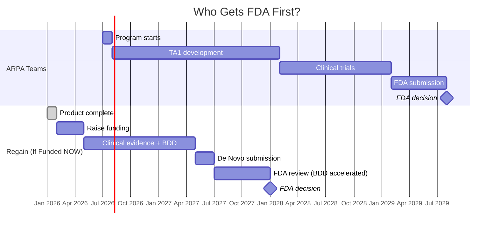
```mermaid
gantt
    title Who Gets FDA First?
    dateFormat  YYYY-MM
    axisFormat  %b %Y

    section ARPA Teams
    Program starts               :a0, 2026-07, 1M
    TA1 development              :a1, 2026-08, 18M
    Clinical trials              :a2, after a1, 12M
    FDA submission               :a3, after a2, 6M
    FDA decision                 :milestone, m1, after a3, 0d

    section Regain (If Funded NOW)
    Product complete             :done, r0, 2026-01, 1M
    Raise funding                :r1, 2026-02, 3M
    Clinical evidence + BDD      :r2, 2026-05, 12M
    De Novo submission           :r3, after r2, 2M
    FDA review (BDD accelerated) :r4, after r3, 6M
    FDA decision                 :milestone, m2, after r4, 0d
```

**If funded now:** Regain clears FDA ~Q3 2027
**ARPA teams:** Submit ~2029, clear ~2030

**Regain is potentially 2-3 years ahead of ARPA.**

### The Funding Gap

| What's Needed | Cost | Purpose |
|---------------|------|---------|
| BDD + De Novo regulatory | $1.3M - $2.9M | FDA pathway |
| Clinical evidence | $1.8M - $3.5M | Pilot + pivotal studies |
| MDDT Phase 1 (optional) | $75K - $150K | Call option on Popper qualification |
| **Total minimum** | **$3.2M - $6.5M** | |

### Funding Options

| Option | Amount | Timeline | Trade-offs |
|--------|--------|----------|------------|
| **Seed round** | $3-5M | 3-6 months | Dilution, but you keep control |
| **Strategic health system partner** | $1-3M + trial site | 2-4 months | They get exclusivity, you get funding + IRB + patients |
| **SBIR/STTR Phase II** | $1-2M | 6-12 months | Non-dilutive, but slow |
| **License Popper/Hermes now** | $100-500K/year | Immediate | Early B2B revenue, validates tech |
| **International first** | Self-funding | 6-12 months | UAE/India revenue → fund US FDA |
| **ARPA-H selection** | $10M+ | 4 months (Feb 27 deadline) | Best case, but competitive |

### The Pitch

| For Seed Investors | For Health System Partners |
|--------------------|---------------------------|
| "Product is built. ARPA won't start for 6 months. We can be first FDA-cleared CVD agent." | "Our tech is ready. We need trial site + IRB. You get exclusivity + first-mover in your region." |
| "De Novo = we become the predicate. All competitors must compare to us." | "If ARPA teams come later, you already have the deployed, proven solution." |
| "$3-5M gets us to FDA clearance. Access to $500B clinical market." | "Co-development: you fund trials, we bring FDA-ready product." |

### Recommended Strategy: "Pole Position"

```
Now (Jan 2026):
├── Submit ARPA-H Solution Summary (Feb 27) — costs nothing, potential $10M+
├── Start health system partner outreach — they fund trials, you bring tech
├── License Popper/Hermes to 1-2 early adopters — $100-300K validation revenue
└── Prepare BDD Q-Sub package — ready to submit day funding arrives

If ARPA-H selects (Apr 2026):
└── Execute with full ARPA support + TA3 sites

If ARPA-H doesn't select (Apr 2026):
├── Close seed round with "product complete, need FDA funding" pitch
├── Health system partner as co-investor or independent funder
└── Execute naked speed-run — you're still 2+ years ahead of ARPA teams
```

**Bottom line:** The constraint is capital, not development. Solve the funding problem and Regain becomes the predicate that everyone else follows.

---

## TL;DR: What Are These FDA Programs?

Before diving into strategy, here's what each program actually means in plain English:

### The Programs Explained

| Program | What It Is (Simple) | Analogy |
|---------|---------------------|---------|
| **SaMD** | "Software as a Medical Device" — software that diagnoses or treats patients is regulated like a physical medical device | Your app is treated like a pacemaker, not like a fitness tracker |
| **510(k)** | "Your device is similar to one already approved" — fast track if you can show equivalence | "My car is basically a Honda Civic, which is already on the road" |
| **De Novo** | "First of its kind" — creates a new device category when nothing similar exists | "My flying car is new, but it's low-risk enough to not need the full airplane certification" |

### Why Deutsch Requires De Novo (Not 510(k))

**510(k) requires a predicate device** — a similar, already-cleared device. We researched potential predicates:

| Potential Predicate | Pathway | What It Does | Why NOT Suitable |
|---------------------|---------|--------------|------------------|
| **DreaMed Advisor Pro** | De Novo (2018) | Insulin dosing for diabetes | Different disease, single medication class |
| **IDx-DR / LumineticsCore** | De Novo (2018) | Autonomous diabetic retinopathy diagnosis | Diagnosis only, no treatment decisions |
| **Tempus ECG-Low EF** | 510(k) (2025) | Detects low ejection fraction | Detection only, not medication management |
| **EchoGo Amyloidosis** | 510(k) (2025) | Screens for cardiac amyloidosis | Screening/referral, not prescribing |

**The gap:** No FDA-cleared device makes autonomous, protocol-bound medication decisions for CVD across multiple drug classes.

```
EXISTING AI DEVICES (510(k) eligible):          DEUTSCH (De Novo required):
├── Detection: "You might have X"               ├── Protocol-bound prescribing
├── Screening: "Possible condition"             ├── Multi-class medications (10+)
├── Dosing: "Adjust insulin by 2 units"         ├── Multi-disease (HF, MI, HTN, AFib)
└── Decision SUPPORT only                       └── Autonomous within clinician protocols
```

**However:** If an ARPA team gets De Novo first, their device becomes a predicate. Regain could then use 510(k) as a fast-follower (see "Leveraging ARPA" section).

**Sources:** [JACC Advances](https://www.jacc.org/doi/10.1016/j.jacadv.2025.102174), [Lancet Digital Health](https://www.thelancet.com/journals/landig/article/PIIS2589-7500(23)00126-7/fulltext), [FDA DreaMed Review](https://www.accessdata.fda.gov/cdrh_docs/reviews/DEN170043.pdf)
| **BDD** | "Breakthrough Device Designation" — VIP treatment from FDA for transformative tech | "Skip the line, talk directly to senior FDA staff, get faster review" |
| **PCCP** | "Pre-approved update plan" — FDA agrees upfront what algorithm changes you can make without re-applying | "We agreed I can repaint the car any color without a new license" |
| **MDDT** | "FDA-blessed development tool" — once qualified, other companies can use it without re-proving it works | "This crash-test dummy is officially accepted; anyone can use it" |
| **RWE** | "Real-World Evidence" — data from actual patients in production can count as regulatory evidence | "How it actually performs in the wild matters, not just clinical trials" |

### Why Each Matters for Regain

```
┌─────────────────────────────────────────────────────────────────────────────┐
│                         WHAT WE'RE BUILDING                                  │
├─────────────────────────────────────────────────────────────────────────────┤
│                                                                              │
│  DEUTSCH (TA1)              POPPER (TA2)              HERMES                │
│  ════════════════           ════════════════          ════════════════      │
│  Patient-facing             Safety supervisor         Communication         │
│  CVD clinical agent         (watches Deutsch)         protocol library      │
│                                                                              │
│  Needs: SaMD clearance      Needs: MDDT qualification Not regulated         │
│  Path: De Novo + BDD        Path: NAM qualification   Path: Open-source     │
│                                                                              │
└─────────────────────────────────────────────────────────────────────────────┘
```

---

## Strategic & Commercial Value: Is This Worth It?

### What SaMD Clearance Gets Us (Deutsch)

| Value | Description | Moat Strength |
|-------|-------------|---------------|
| **Legal to sell** | Without clearance, selling Deutsch for clinical use is federal crime | Table stakes |
| **First-in-class** | De Novo creates NEW device category — we define the rules | **STRONG** |
| **Predicate status** | Future competitors must compare to us (we're the benchmark) | **STRONG** |
| **Reimbursement path** | CMS can create billing codes for cleared devices | Revenue enabler |
| **Enterprise sales** | Health systems require FDA clearance for clinical tools | Market access |
| **Liability shield** | "FDA-cleared" provides legal defense in malpractice suits | Risk reduction |

### What MDDT Qualification Gets Us (Popper)

| Value | Description | Moat Strength |
|-------|-------------|---------------|
| **Industry standard** | Other AI companies use Popper without re-validating | **VERY STRONG** |
| **Licensing revenue** | Charge other device makers to use qualified Popper | New revenue stream |
| **Ecosystem lock-in** | If everyone uses Popper, switching costs are high | **VERY STRONG** |
| **FDA trust** | "Uses FDA-qualified MDDT" speeds up their reviews too | Halo effect |
| **Open-source compatible** | MDDT status + open-source = maximum adoption | Network effects |

### The Moat Analysis

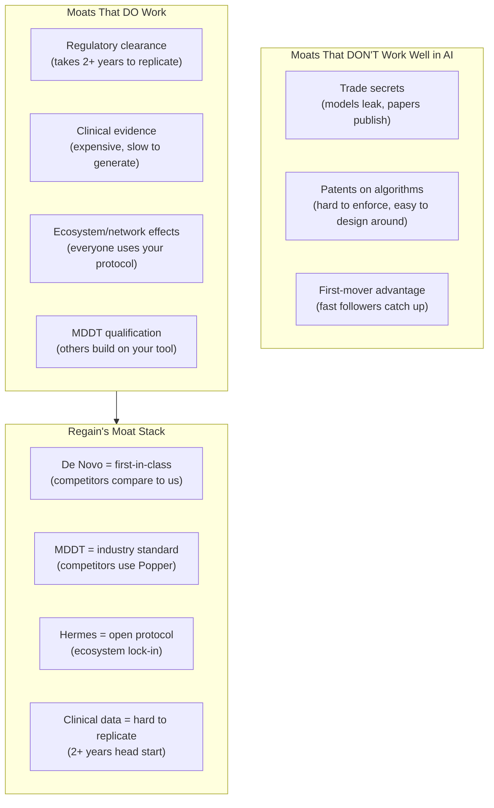
```mermaid
flowchart TB
    subgraph WEAK_MOATS["Moats That DON'T Work Well in AI"]
        W1["Trade secrets<br/>(models leak, papers publish)"]
        W2["Patents on algorithms<br/>(hard to enforce, easy to design around)"]
        W3["First-mover advantage<br/>(fast followers catch up)"]
    end

    subgraph STRONG_MOATS["Moats That DO Work"]
        S1["Regulatory clearance<br/>(takes 2+ years to replicate)"]
        S2["Clinical evidence<br/>(expensive, slow to generate)"]
        S3["Ecosystem/network effects<br/>(everyone uses your protocol)"]
        S4["MDDT qualification<br/>(others build on your tool)"]
    end

    subgraph REGAIN_STRATEGY["Regain's Moat Stack"]
        R1["De Novo = first-in-class<br/>(competitors compare to us)"]
        R2["MDDT = industry standard<br/>(competitors use Popper)"]
        R3["Hermes = open protocol<br/>(ecosystem lock-in)"]
        R4["Clinical data = hard to replicate<br/>(2+ years head start)"]
    end

    STRONG_MOATS --> REGAIN_STRATEGY
```

### Is It Worth the $4-8M Investment?

| Scenario | Without FDA Clearance | With FDA Clearance |
|----------|----------------------|-------------------|
| **Market access** | Wellness apps only (~$50B TAM) | Clinical AI (~$500B TAM) |
| **Price point** | $10-50/user/month (consumer) | $500-5000/patient/year (B2B) |
| **Customer type** | Individuals | Health systems, payers |
| **Liability** | High (practicing medicine without license) | Managed (FDA-cleared) |
| **Competition** | Thousands of wellness apps | <10 cleared clinical AI agents |
| **Exit multiple** | 3-5x revenue (consumer health) | 10-20x revenue (regulated healthtech) |

**Bottom line:** The $4-8M buys access to a 10x larger market with 10x better unit economics and 3-4x better exit multiples. The math works.

### Commercial Model Options

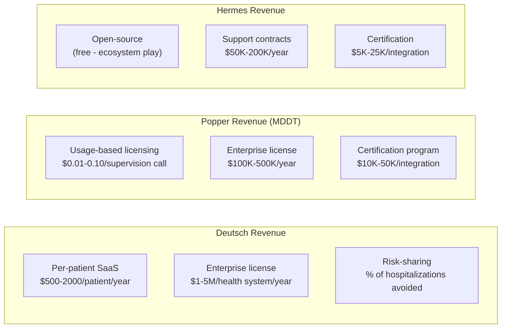
```mermaid
flowchart LR
    subgraph DEUTSCH_REVENUE["Deutsch Revenue"]
        D1["Per-patient SaaS<br/>$500-2000/patient/year"]
        D2["Enterprise license<br/>$1-5M/health system/year"]
        D3["Risk-sharing<br/>% of hospitalizations avoided"]
    end

    subgraph POPPER_REVENUE["Popper Revenue (MDDT)"]
        P1["Usage-based licensing<br/>$0.01-0.10/supervision call"]
        P2["Enterprise license<br/>$100K-500K/year"]
        P3["Certification program<br/>$10K-50K/integration"]
    end

    subgraph HERMES_REVENUE["Hermes Revenue"]
        H1["Open-source<br/>(free - ecosystem play)"]
        H2["Support contracts<br/>$50K-200K/year"]
        H3["Certification<br/>$5K-25K/integration"]
    end
```

---

## Patent Strategy: Summary

> **Full analysis:** [00-patenting-strategy.md](../0C-commercialization/00-patenting-strategy.md)

### The Bottom Line

| Strategy | Recommendation |
|----------|----------------|
| **Algorithm patents** | Skip — weak, expensive, easy to design around |
| **Architecture patents** | File 2-3 defensive patents ($100-200K) |
| **Hermes/Popper** | Open-source — adoption > exclusivity |
| **Training data** | Trade secret — defensible, not patentable |
| **Primary moat** | FDA clearance + MDDT + clinical evidence |

### Why Regulatory > Patents

```
Patent grants:         36-60 months (after the AI model is obsolete)
FDA clearance:         18-24 months (immediate market protection)
Competitor catch-up:   24-36 months (no shortcut through regulatory)

→ Regulatory moats provide IMMEDIATE protection that compounds
→ Clinical evidence is cumulative and hard to replicate
→ MDDT qualification creates ecosystem lock-in
```

**Invest 5-10% on patents, 90-95% on regulatory moats.**

---

## Leveraging ARPA Even Without Selection

### How FDA Treats Non-ARPA Teams

**The Good News:** FDA doesn't discriminate based on funding source. They evaluate products on safety/efficacy evidence regardless of ARPA involvement.

**The Reality Gap:**

| ARPA Teams Get | Non-ARPA Teams Must |
|----------------|---------------------|
| Facilitated FDA communication (ARPA-H arranges meetings) | Self-arrange Pre-Sub meetings ($4K fee + 3-4 month wait) |
| 513(g) meetings built into program timeline | Request 513(g) independently (same process, no coordinator) |
| IV&V infrastructure provided by ARPA-H | Build own IV&V or hire CRO ($300K-$600K) |
| MDDT submission support | Navigate MDDT process alone |
| Coordinated IDE studies across TA3 sites | Find own clinical trial sites |

**However**, FDA will be **more receptive** to this product category after working with ARPA teams:
- Reviewers will understand the architecture (TA1 + TA2 separation)
- Classification precedent will exist (De Novo decisions)
- Safety evaluation frameworks will be established

### What Regain Can Leverage

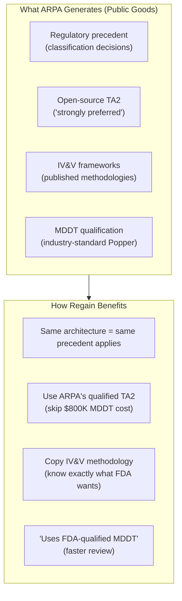
```mermaid
flowchart TB
    subgraph ARPA_GENERATES["What ARPA Generates (Public Goods)"]
        A1["Regulatory precedent<br/>(classification decisions)"]
        A2["Open-source TA2<br/>('strongly preferred')"]
        A3["IV&V frameworks<br/>(published methodologies)"]
        A4["MDDT qualification<br/>(industry-standard Popper)"]
    end

    subgraph REGAIN_BENEFITS["How Regain Benefits"]
        B1["Same architecture = same precedent applies"]
        B2["Use ARPA's qualified TA2<br/>(skip $800K MDDT cost)"]
        B3["Copy IV&V methodology<br/>(know exactly what FDA wants)"]
        B4["'Uses FDA-qualified MDDT'<br/>(faster review)"]
    end

    ARPA_GENERATES --> REGAIN_BENEFITS
```

### 1. Architectural Alignment (Immediate Benefit)

Regain is already building to ARPA specs:

| Regain Component | ARPA Equivalent | Benefit |
|------------------|-----------------|---------|
| **Deutsch** | TA1 (Clinical Agent) | Any FDA decision for ARPA TA1 creates precedent for Deutsch |
| **Popper** | TA2 (Supervisory Agent) | If ARPA TA2 is MDDT-qualified + open-source, Regain could use it |
| **Hermes** | Protocol between TA1↔TA2 | Already aligned with ARPA interface expectations |

### 2. Open-Source TA2 (Major Opportunity)

From the ARPA-H ISO: *"TA2 solutions are strongly preferred to be open source"*

**Strategic Options:**

| Option | Cost Savings | Risk |
|--------|--------------|------|
| **Wait and use ARPA's qualified TA2** | $800K-$2M (skip MDDT) | Dependent on ARPA timeline |
| **Contribute Popper to ARPA open-source** | Influence the standard | Need to be selected |
| **Build Popper compatible with ARPA interface** | Hedge both ways | Additional development |

#### Should Regain Still Pursue Popper MDDT?

**If ARPA achieves MDDT qualification for their TA2 (and it's open-source), do we still need our own?**

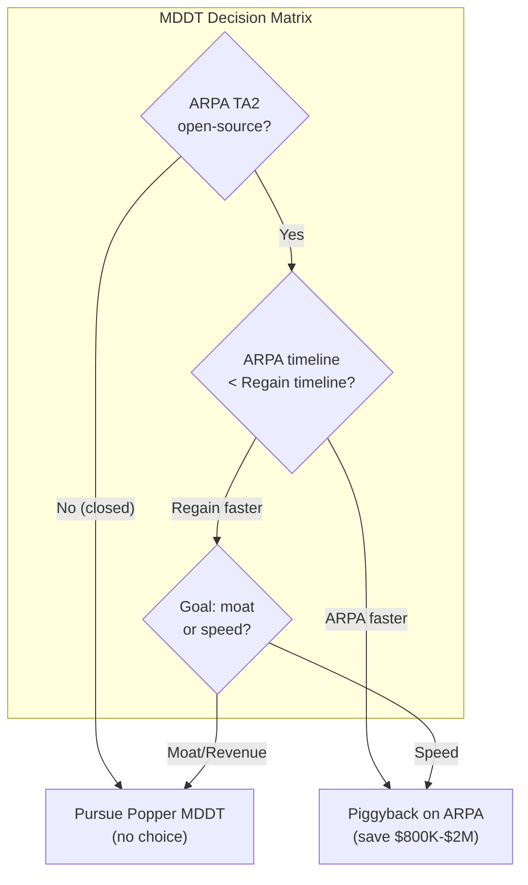
```mermaid
flowchart TB
    subgraph DECISION["MDDT Decision Matrix"]
        Q1{"ARPA TA2<br/>open-source?"}
        Q2{"ARPA timeline<br/>< Regain timeline?"}
        Q3{"Goal: moat<br/>or speed?"}
    end

    Q1 -->|"No (closed)"| OWN_MDDT["Pursue Popper MDDT<br/>(no choice)"]
    Q1 -->|"Yes"| Q2

    Q2 -->|"ARPA faster"| PIGGYBACK["Piggyback on ARPA<br/>(save $800K-$2M)"]
    Q2 -->|"Regain faster"| Q3

    Q3 -->|"Speed"| PIGGYBACK
    Q3 -->|"Moat/Revenue"| OWN_MDDT
```

**Why you might still want your own MDDT:**

| Reason | Value |
|--------|-------|
| **Licensing revenue** | Can't charge for ARPA's open-source tool; your MDDT = $100K-$500K/year/enterprise |
| **Roadmap control** | You decide features, not ARPA's timeline |
| **Brand/ecosystem** | "Popper-certified" vs "uses ARPA TA2" — ecosystem lock-in |
| **Beat them to market** | ARPA's MDDT might take 4+ years; you could be 2 years ahead |

**Recommended Hybrid Strategy:**

```
Phase 1: Start MDDT proposal ($75K-$150K)
         ↓
         Gets you in the program, low commitment
         ↓
Phase 2: Track ARPA's TA2 progress
         ↓
         ┌─────────────┴─────────────┐
         ↓                           ↓
   ARPA is ahead              ARPA is behind
         ↓                           ↓
   Pause MDDT effort          Proceed to full
   Wait for ARPA's            qualification ($400K+)
   (save $400K+)              (own MDDT, licensing revenue)
```

**Key insight:** The MDDT proposal ($75K-$150K) is a call option. You're not locked in until Phase 2 qualification ($400K+). Start the proposal, track ARPA, decide later.

### 3. Regulatory Precedent (Passive Benefit)

Whatever FDA decides for the first ARPA TA1 creates precedent:

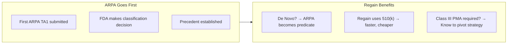
```mermaid
flowchart LR
    subgraph ARPA_FIRST["ARPA Goes First"]
        A1["First ARPA TA1 submitted"]
        A2["FDA makes classification decision"]
        A3["Precedent established"]
    end

    subgraph REGAIN_FOLLOWS["Regain Benefits"]
        R1["De Novo? → ARPA becomes predicate"]
        R2["Regain uses 510(k) → faster, cheaper"]
        R3["Class III PMA required? → Know to pivot strategy"]
    end

    ARPA_FIRST --> REGAIN_FOLLOWS
```

**The 510(k) Fast-Follower Opportunity:**

Today, 510(k) is NOT available for Deutsch (no predicate exists). But once ARPA's TA1 gets De Novo:

| Pathway | Fee | Timeline | Available |
|---------|-----|----------|-----------|
| **De Novo (today)** | $134,000 | 6-12 months | ✅ Yes |
| **510(k) (after ARPA)** | $21,000 | 3-6 months | ❌ Not yet |

**Savings if ARPA goes first:** ~$113K in fees + ~3-6 months faster review.

Per [Lancet Digital Health](https://www.thelancet.com/journals/landig/article/PIIS2589-7500(23)00126-7/fulltext): Once a De Novo device clears, it becomes a predicate for future 510(k) submissions. This is exactly what happened with IDx-DR (De Novo 2018) → EyeArt and AEYE-DS (510(k) 2020-2022).

### 4. Evidence Standards (Copy the Homework)

ARPA's IV&V framework will be published:

> *"IV&V data generated under this program are meant to meet FDA criteria for authorization or qualification"* — ARPA-H ISO

**Implication:** Once published, Regain knows exactly what evidence FDA expects. Clinical trial design can mirror ARPA's validated approach.

### 5. BDD Access (Equal Footing)

BDD is available to everyone. ARPA funding does not grant special BDD access. Regain can apply independently with the same criteria.

### The "Fast Follower" Strategy

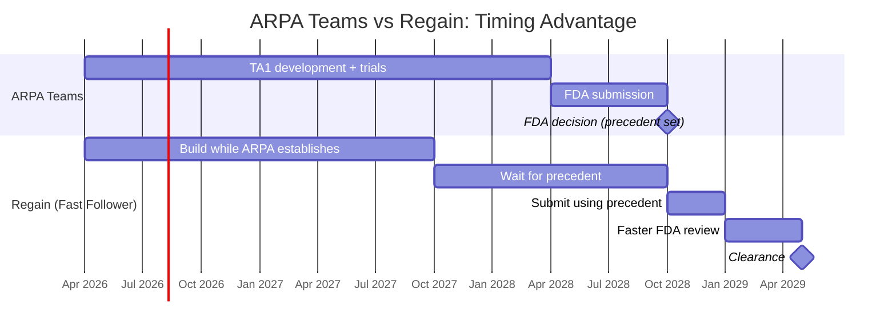
```mermaid
gantt
    title ARPA Teams vs Regain: Timing Advantage
    dateFormat  YYYY-MM
    axisFormat  %b %Y

    section ARPA Teams
    TA1 development + trials       :a1, 2026-04, 24M
    FDA submission                 :a2, after a1, 6M
    FDA decision (precedent set)   :milestone, m1, after a2, 0d

    section Regain (Fast Follower)
    Build while ARPA establishes   :r1, 2026-04, 18M
    Wait for precedent             :r2, after r1, 12M
    Submit using precedent         :r3, after m1, 3M
    Faster FDA review              :r4, after r3, 4M
    Clearance                      :milestone, m2, after r4, 0d
```

**Timeline Reality:**
- ARPA teams submit ~2028 (24+ months of development)
- FDA decision ~2028-2029 (sets precedent)
- Regain can submit immediately after, citing precedent
- FDA review faster because classification is established

### What This Means for the Naked Speed-Run

| Original Assumption | Updated with ARPA Leverage |
|---------------------|---------------------------|
| De Novo timeline: 12 months | Could be 6-9 months if ARPA establishes precedent first |
| MDDT cost: $525K-$1M | Could be $0 if ARPA's open-source TA2 is qualified |
| IV&V cost: $300K-$600K | Could be $50K-$100K (adopt ARPA methodology) |
| Risk: "First-in-class" uncertainty | Reduced: ARPA goes first |

### Decision: Pursue Now or Wait for ARPA?

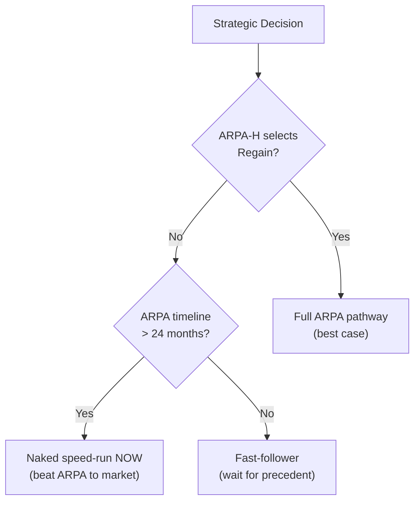
```mermaid
flowchart TB
    START["Strategic Decision"]

    Q1{"ARPA-H selects<br/>Regain?"}
    Q2{"ARPA timeline<br/>> 24 months?"}

    A1["Full ARPA pathway<br/>(best case)"]
    A2["Naked speed-run NOW<br/>(beat ARPA to market)"]
    A3["Fast-follower<br/>(wait for precedent)"]

    START --> Q1
    Q1 -->|"Yes"| A1
    Q1 -->|"No"| Q2

    Q2 -->|"Yes"| A2
    Q2 -->|"No"| A3
```

**Recommendation:** Pursue the naked speed-run now. Even without selection:
- ARPA teams are 24+ months from FDA submission
- Regain has 70% frontend built, 40% TA1 specs complete
- First-mover advantage > waiting for precedent
- Can still benefit from ARPA precedents when they materialize

### Go First vs. Piggyback: The Economics

#### Cost Savings from Piggybacking

**Deutsch (TA1) Savings:**

| Cost Item | Go First (De Novo) | Piggyback (510(k)) | Savings |
|-----------|-------------------|-------------------|---------|
| FDA fee | $134,000 | $21,000 | **$113,000** |
| Regulatory consultant | $150K-$300K | $75K-$150K | **$75K-$150K** |
| Review timeline | 6-12 months | 3-6 months | **3-6 months** |
| **Subtotal Deutsch** | **$284K-$434K** | **$96K-$171K** | **$188K-$263K** |

*Note: Clinical evidence costs ($1.8M-$3.5M) are the same either way.*

**Popper (TA2) Savings:**

| Cost Item | Own MDDT | Piggyback ARPA's TA2 | Savings |
|-----------|----------|---------------------|---------|
| Full MDDT qualification | $525K-$1,050K | $0 | **$525K-$1,050K** |

**Total Savings Summary:**

| Strategy | Total Cost | vs. Full Speed-Run |
|----------|------------|-------------------|
| **Full naked speed-run** | $3.9M - $8.1M | Baseline |
| **Piggyback Deutsch only** | $3.7M - $7.8M | Save $200K-$300K |
| **Piggyback Popper only** | $3.3M - $7.0M | Save $525K-$1M |
| **Piggyback both** | $3.1M - $6.7M | **Save $750K-$1.4M** |

#### But What Does Waiting Cost?

**Commercial value of being first:**

| Factor | Go First (2028) | Piggyback (2029-2030) |
|--------|-----------------|----------------------|
| Revenue start | 2028 | 2029-2030 |
| 1-2 year head start revenue | $4M-$11M | $0 |
| Predicate status | YOU are the benchmark | ARPA is the benchmark |
| TA3 partner attractiveness | High (you're ahead) | Lower (following) |
| Fundraising narrative | "First FDA-cleared CVD agent" | "Another CVD agent" |

**The math:**

```
Savings from piggybacking:        $750K - $1.4M
Revenue lost from 1-2 year delay: $4M - $11M
─────────────────────────────────────────────
Net value of going first:         $2.6M - $9.6M
```

#### Why FDA Clearance is Mandatory (Not Optional)

| Without FDA Clearance | With FDA Clearance |
|-----------------------|-------------------|
| Wellness apps only ($10-50/user/month) | Clinical AI ($500-5000/patient/year) |
| Consumer market (~$50B TAM) | Healthcare market (~$500B TAM) |
| Liability risk (practicing medicine) | Liability shield |
| No EHR integration for clinical use | Full clinical EHR integration |
| Compete with 1000s of wellness apps | Compete with <10 cleared agents |

**FDA clearance is table stakes for clinical revenue.** The question is WHEN and HOW, not WHETHER.

#### Recommendation: Hybrid Strategy

```
Now (2026):
├── Start BDD application ($150K-$300K) — works for either path
├── Start clinical evidence ($1.8M-$3.5M) — required either way
├── Start Popper MDDT Phase 1 only ($75K-$150K) — call option
└── Track ARPA's TA1 progress

Decision Point (late 2027):
├── If ARPA is 6+ months ahead → pause De Novo, wait for 510(k)
├── If ARPA is behind → complete De Novo, become predicate
└── If ARPA's TA2 is ahead → piggyback, save $400K+
```

**Bottom line:** The $750K-$1.4M savings from piggybacking isn't worth the $4M-$11M in delayed revenue and lost first-mover advantage. **Go first unless severely capital-constrained.**

---

## Executive Summary

This document outlines the **layered FDA regulatory strategy** for obtaining market clearance without ARPA-H funding. The "speed-run" is not about choosing between pathways—it's about **stacking multiple FDA programs simultaneously** to compress timelines and maximize strategic value.

### The 6-Layer Stack

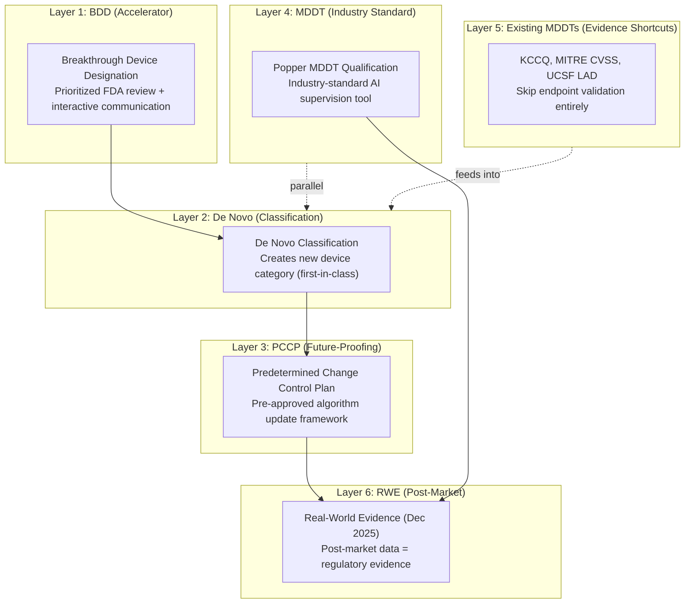
```mermaid
flowchart TB
    subgraph LAYER1["Layer 1: BDD (Accelerator)"]
        BDD["Breakthrough Device Designation<br/>Prioritized FDA review + interactive communication"]
    end

    subgraph LAYER2["Layer 2: De Novo (Classification)"]
        DENOVO["De Novo Classification<br/>Creates new device category (first-in-class)"]
    end

    subgraph LAYER3["Layer 3: PCCP (Future-Proofing)"]
        PCCP["Predetermined Change Control Plan<br/>Pre-approved algorithm update framework"]
    end

    subgraph LAYER4["Layer 4: MDDT (Industry Standard)"]
        MDDT["Popper MDDT Qualification<br/>Industry-standard AI supervision tool"]
    end

    subgraph LAYER5["Layer 5: Existing MDDTs (Evidence Shortcuts)"]
        EXISTING["KCCQ, MITRE CVSS, UCSF LAD<br/>Skip endpoint validation entirely"]
    end

    subgraph LAYER6["Layer 6: RWE (Post-Market)"]
        RWE["Real-World Evidence (Dec 2025)<br/>Post-market data = regulatory evidence"]
    end

    BDD --> DENOVO
    DENOVO --> PCCP
    LAYER4 -.->|parallel| LAYER2
    LAYER5 -.->|feeds into| LAYER2
    PCCP --> RWE
    MDDT --> RWE
```

---

## System Architecture Overview


```mermaid
flowchart LR
    subgraph DEUTSCH["Deutsch (TA1)<br/>Patient-Facing CVD Agent"]
        D_ENGINE["Engine<br/>(reusable core)"]
        D_CARTRIDGE["CVD Cartridge<br/>(disease pack)"]
        D_ARGMED["ArgMed Debate<br/>(Popperian reasoning)"]
    end

    subgraph HERMES["Hermes<br/>Protocol Library"]
        H_SCHEMAS["Zod Schemas"]
        H_CONTRACTS["SupervisionRequest/<br/>SupervisionResponse"]
        H_AUDIT["AuditEvent"]
    end

    subgraph POPPER["Popper (TA2)<br/>Supervisory Agent"]
        P_DSL["Safety DSL<br/>(deterministic)"]
        P_POLICY["Policy Engine"]
        P_HTV["HTV Evaluation"]
    end

    DEUTSCH -->|"high-risk proposal"| HERMES
    HERMES --> POPPER
    POPPER -->|"APPROVED/HARD_STOP/<br/>ROUTE_TO_CLINICIAN"| HERMES
    HERMES --> DEUTSCH
```

### Regulatory Classification

| System | FDA Category | Regulatory Path | Strategic Value |
|--------|--------------|-----------------|-----------------|
| **Deutsch** | SaMD (IMDRF Category III) | De Novo + BDD + PCCP | First-in-class clinical agent for CVD |
| **Popper** | MDDT (NAM) | MDDT Qualification | Industry-standard AI supervision tool |
| **Hermes** | Not regulated (protocol) | Open-source | Ecosystem enabler, de-risks integrations |

---

## What Deutsch Actually Does (The Regulated Product)

Deutsch is the **primary regulated product**. Everything else (Popper, Hermes, MDDT) supports getting Deutsch to market. This section details what Deutsch does clinically.

### Clinical Functions

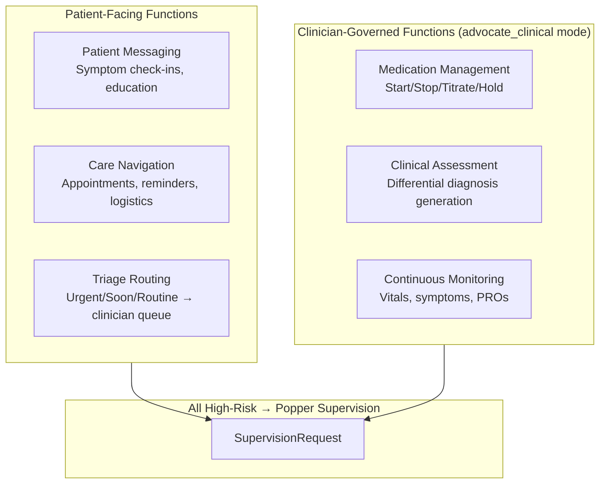
```mermaid
flowchart TB
    subgraph PATIENT_FACING["Patient-Facing Functions"]
        MSG["Patient Messaging<br/>Symptom check-ins, education"]
        NAV["Care Navigation<br/>Appointments, reminders, logistics"]
        TRIAGE["Triage Routing<br/>Urgent/Soon/Routine → clinician queue"]
    end

    subgraph CLINICAL_FUNCTIONS["Clinician-Governed Functions (advocate_clinical mode)"]
        MED["Medication Management<br/>Start/Stop/Titrate/Hold"]
        ASSESS["Clinical Assessment<br/>Differential diagnosis generation"]
        MONITOR["Continuous Monitoring<br/>Vitals, symptoms, PROs"]
    end

    subgraph SUPERVISION["All High-Risk → Popper Supervision"]
        SUP["SupervisionRequest"]
    end

    PATIENT_FACING --> SUP
    CLINICAL_FUNCTIONS --> SUP
```

### Disease Coverage (CVD Cartridge v1)

| Condition | What Deutsch Does | Medication Classes |
|-----------|-------------------|-------------------|
| **Heart Failure (HF)** | GDMT optimization, fluid management, symptom monitoring | ACEi/ARB/ARNI, beta-blockers, MRAs, SGLT2i, diuretics |
| **Post-MI** | Secondary prevention, cardiac rehab coordination | Statins, antiplatelet, beta-blockers, ACEi/ARB |
| **Hypertension** | BP monitoring, medication titration | ACEi/ARB, CCBs, thiazides, beta-blockers |
| **Hyperlipidemia** | Statin optimization, non-statin add-on | Statins, ezetimibe, PCSK9i |
| **Atrial Fibrillation** | Anticoagulation management, rate/rhythm control | DOACs, warfarin, beta-blockers, antiarrhythmics |

### The Supervision Flow (Why It's Safe)

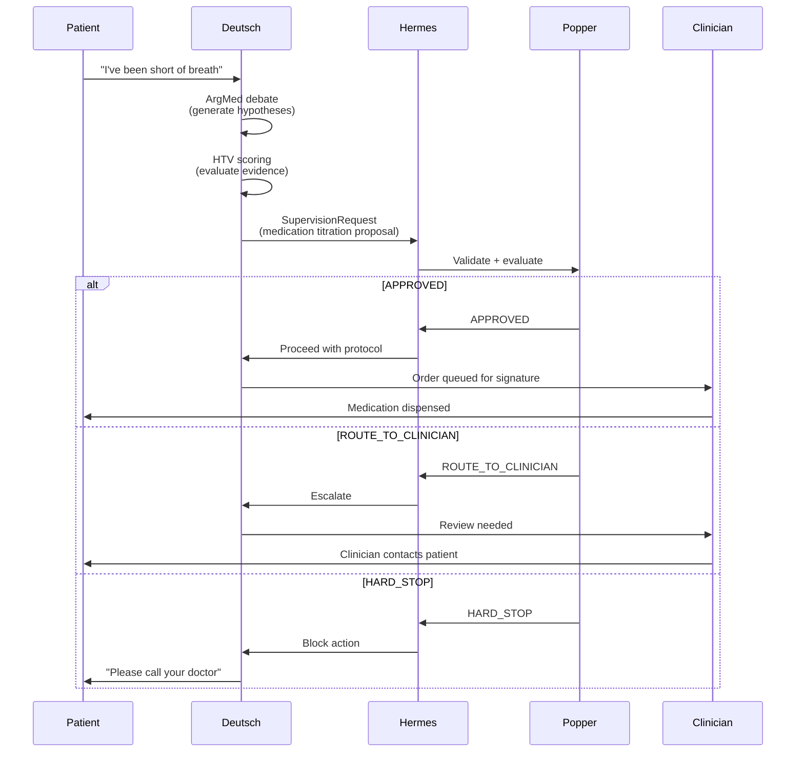
```mermaid
sequenceDiagram
    participant P as Patient
    participant D as Deutsch
    participant H as Hermes
    participant Po as Popper
    participant C as Clinician

    P->>D: "I've been short of breath"
    D->>D: ArgMed debate<br/>(generate hypotheses)
    D->>D: HTV scoring<br/>(evaluate evidence)
    D->>H: SupervisionRequest<br/>(medication titration proposal)
    H->>Po: Validate + evaluate

    alt APPROVED
        Po->>H: APPROVED
        H->>D: Proceed with protocol
        D->>C: Order queued for signature
        C->>P: Medication dispensed
    else ROUTE_TO_CLINICIAN
        Po->>H: ROUTE_TO_CLINICIAN
        H->>D: Escalate
        D->>C: Review needed
        C->>P: Clinician contacts patient
    else HARD_STOP
        Po->>H: HARD_STOP
        H->>D: Block action
        D->>P: "Please call your doctor"
    end
```

### What Makes Deutsch Novel (De Novo Justification)

| Feature | Current State of Art | Deutsch Innovation |
|---------|---------------------|-------------------|
| **Autonomous prescribing** | No AI has FDA clearance for autonomous medication orders | First autonomous clinical agent with prescribing authority |
| **Protocol-bound** | CDS tools provide suggestions, clinician decides | Clinician pre-approves protocols, Deutsch executes within bounds |
| **Multi-disease** | Single-disease tools (e.g., diabetes only) | Integrated CVD management across HF, post-MI, HTN, lipids, AFib |
| **Continuous supervision** | Batch review of AI outputs | Real-time supervision of every action by Popper |
| **Agentic architecture** | Rule-based or single-shot inference | Multi-agent debate with conjecture-refutation |

### Why It's IMDRF Category III (Not IV)

```
IMDRF Risk Classification:

Dimension 1: Healthcare Situation
├── Critical (life-threatening, immediate intervention) → NOT THIS
├── SERIOUS (could progress to critical if untreated) → THIS ONE
└── Non-serious (no immediate health threat)

Dimension 2: Significance of Information
├── TREAT/DIAGNOSE (directly informs treatment) → THIS ONE
├── Drive clinical management (aids in treatment direction)
└── Inform clinical management (supplementary information)

Result: Serious + Treat/Diagnose = CATEGORY III

Why not Category IV (Critical)?
- Outpatient management, not ICU/acute care
- Always clinician-in-the-loop for execution
- Protocol-bound (not free-form prescribing)
- Independent supervision (Popper)
- Default-to-safe behavior
```

### Deutsch Risk Mitigations (For FDA Submission)

| Risk | Mitigation | Evidence |
|------|------------|----------|
| **Incorrect medication order** | Popper supervision required for all orders | Audit logs show 100% supervision rate |
| **Hallucination** | HTV scoring + evidence requirements | Proposals without evidence refs rejected |
| **Missing data** | IDK Protocol (admits uncertainty) | Routes to clinician instead of guessing |
| **Stale data** | Snapshot staleness checks | Auto-routes if data >4 hours old |
| **Protocol violation** | clinician_protocol_ref required | Orders without valid protocol rejected |
| **Clinician override ignored** | Prior override awareness | Checks override history before proposing |
| **Popper unavailable** | Default-to-safe | Hard stop if supervision fails |

### Intended Use Statement (Draft for De Novo)

> **Intended Use:**
>
> The Deutsch CVD Agent is a software-based clinical decision support system intended to provide autonomous and semi-autonomous cardiovascular care management for adult patients with heart failure or post-myocardial infarction, under the supervision of a healthcare provider. The device analyzes patient data from electronic health records, wearable devices, and patient-reported inputs to:
>
> 1. Generate differential diagnoses and treatment recommendations
> 2. Autonomously adjust medications for hypertension, hyperlipidemia, heart failure, and atrial fibrillation within clinician-approved protocols
> 3. Provide care navigation and health coaching
> 4. Triage and escalate urgent findings to the clinical team
>
> The device operates in conjunction with the Popper Supervisory Agent for continuous safety monitoring. The device is intended for use by healthcare providers in outpatient settings.

### Modes of Operation (Regulatory Implications)

| Mode | Regulated? | What Deutsch Can Do | What It Cannot Do |
|------|------------|---------------------|-------------------|
| **`wellness`** | Enforcement discretion | Education, reminders, "discuss with doctor" | ANY medication or treatment advice |
| **`advocate_clinical`** | **Yes - SaMD** | Protocol-bound medication orders, clinical assessment, triage | Orders without clinician_protocol_ref |

**Key insight:** The `wellness` mode lets us deploy and iterate before full clearance. The `advocate_clinical` mode is what requires De Novo.

---

## Timeline: The Naked Speed-Run

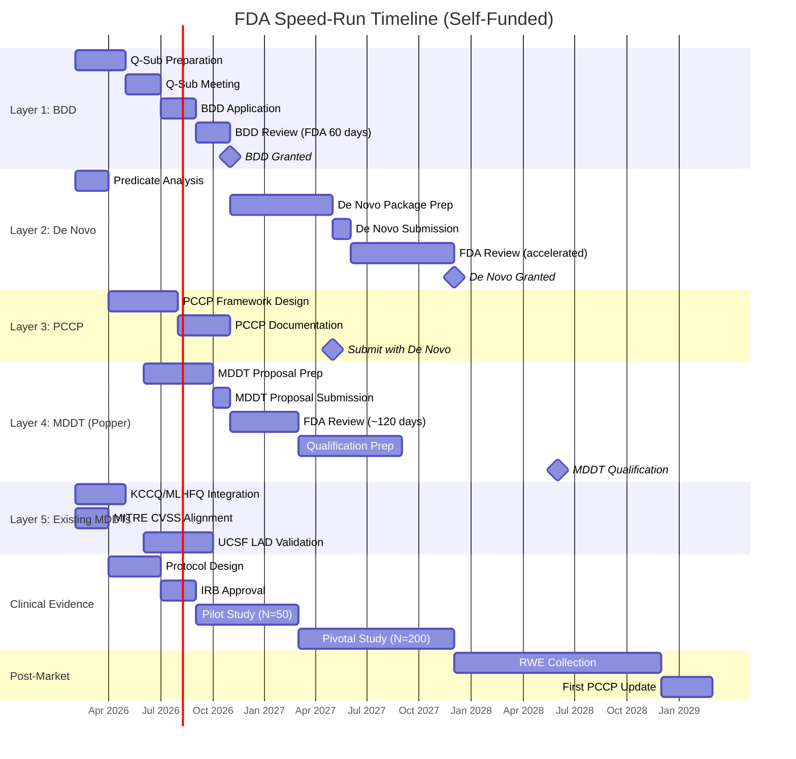
```mermaid
gantt
    title FDA Speed-Run Timeline (Self-Funded)
    dateFormat  YYYY-MM
    axisFormat  %b %Y

    section Layer 1: BDD
    Q-Sub Preparation           :q1, 2026-02, 3M
    Q-Sub Meeting               :q2, after q1, 2M
    BDD Application             :bdd1, after q2, 2M
    BDD Review (FDA 60 days)    :bdd2, after bdd1, 2M
    BDD Granted                 :milestone, m1, after bdd2, 0d

    section Layer 2: De Novo
    Predicate Analysis          :dn1, 2026-02, 2M
    De Novo Package Prep        :dn2, after m1, 6M
    De Novo Submission          :dn3, after dn2, 1M
    FDA Review (accelerated)    :dn4, after dn3, 6M
    De Novo Granted             :milestone, m2, after dn4, 0d

    section Layer 3: PCCP
    PCCP Framework Design       :pccp1, 2026-04, 4M
    PCCP Documentation          :pccp2, after pccp1, 3M
    Submit with De Novo         :milestone, m3, after dn2, 0d

    section Layer 4: MDDT (Popper)
    MDDT Proposal Prep          :mddt1, 2026-06, 4M
    MDDT Proposal Submission    :mddt2, after mddt1, 1M
    FDA Review (~120 days)      :mddt3, after mddt2, 4M
    Qualification Prep          :mddt4, after mddt3, 6M
    MDDT Qualification          :milestone, m4, 2028-06, 0d

    section Layer 5: Existing MDDTs
    KCCQ/MLHFQ Integration      :ex1, 2026-02, 3M
    MITRE CVSS Alignment        :ex2, 2026-02, 2M
    UCSF LAD Validation         :ex3, 2026-06, 4M

    section Clinical Evidence
    Protocol Design             :ce1, 2026-04, 3M
    IRB Approval                :ce2, after ce1, 2M
    Pilot Study (N=50)          :ce3, after ce2, 6M
    Pivotal Study (N=200)       :ce4, after ce3, 9M

    section Post-Market
    RWE Collection              :rwe1, after m2, 12M
    First PCCP Update           :rwe2, after rwe1, 3M
```

---

## Layer 1: Breakthrough Device Designation (BDD)

### Purpose
Accelerates FDA review through interactive communication and prioritized review.

### Eligibility Criteria (Deutsch Qualifies)

| Criterion | Deutsch Evidence |
|-----------|------------------|
| Life-threatening condition | Heart failure + post-MI (leading cause of death) |
| Breakthrough technology | First autonomous clinical agent for CVD |
| No approved alternatives | No AI agents with prescribing authority |
| Significant advantage | 49% of US counties lack cardiologists |

### Process

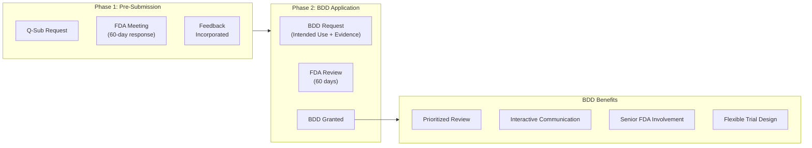
```mermaid
flowchart LR
    subgraph PHASE1["Phase 1: Pre-Submission"]
        QS1["Q-Sub Request"]
        QS2["FDA Meeting<br/>(60-day response)"]
        QS3["Feedback<br/>Incorporated"]
    end

    subgraph PHASE2["Phase 2: BDD Application"]
        BDD1["BDD Request<br/>(Intended Use + Evidence)"]
        BDD2["FDA Review<br/>(60 days)"]
        BDD3["BDD Granted"]
    end

    subgraph BENEFITS["BDD Benefits"]
        B1["Prioritized Review"]
        B2["Interactive Communication"]
        B3["Senior FDA Involvement"]
        B4["Flexible Trial Design"]
    end

    PHASE1 --> PHASE2
    BDD3 --> BENEFITS
```

### Blockers

| Blocker | Severity | Mitigation |
|---------|----------|------------|
| **FDA rejects BDD eligibility** | HIGH | Strong justification: cardiology access gap data + novel architecture |
| **Q-Sub delays** | MEDIUM | Submit early, have backup 510(k) predicate strategy |
| **No US clinical data** | MEDIUM | Reference Uzbekistan pilot methodology (not results) |

### Costs

| Item | Estimated Cost |
|------|----------------|
| Regulatory consultant (BDD prep) | $50,000 - $100,000 |
| Q-Sub meeting preparation | $25,000 - $50,000 |
| Internal team time (3 months) | $75,000 - $150,000 |
| **Total Layer 1** | **$150,000 - $300,000** |

---

## Layer 2: De Novo Classification

> **Why not 510(k)?** We analyzed all FDA-cleared AI cardiovascular devices. No suitable predicate exists for autonomous clinical agents with medication authority. See "Why Deutsch Requires De Novo" in TL;DR section above. If ARPA's TA1 gets De Novo first, the fast-follower 510(k) path opens up.

### Purpose
Creates a new device classification (first-in-class), establishing Deutsch as the predicate for future clinical agents.

### Classification Strategy

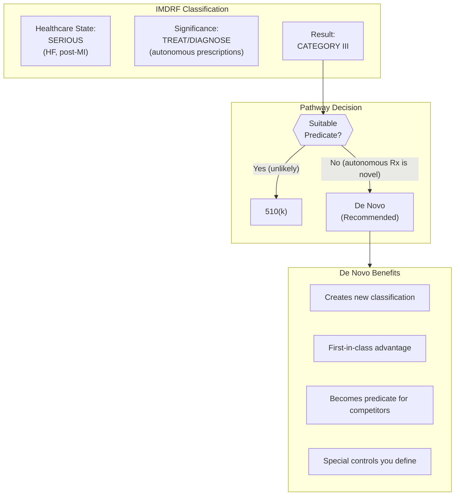
```mermaid
flowchart TB
    subgraph CLASSIFICATION["IMDRF Classification"]
        STATE["Healthcare State:<br/>SERIOUS<br/>(HF, post-MI)"]
        SIG["Significance:<br/>TREAT/DIAGNOSE<br/>(autonomous prescriptions)"]
        CAT["Result:<br/>CATEGORY III"]
    end

    subgraph PATH["Pathway Decision"]
        PRED{{"Suitable<br/>Predicate?"}}
        K510["510(k)"]
        DN["De Novo<br/>(Recommended)"]
    end

    CAT --> PRED
    PRED -->|"Yes (unlikely)"| K510
    PRED -->|"No (autonomous Rx is novel)"| DN

    subgraph DENOVO_BENEFITS["De Novo Benefits"]
        DN1["Creates new classification"]
        DN2["First-in-class advantage"]
        DN3["Becomes predicate for competitors"]
        DN4["Special controls you define"]
    end

    DN --> DENOVO_BENEFITS
```

### De Novo + BDD Synergy

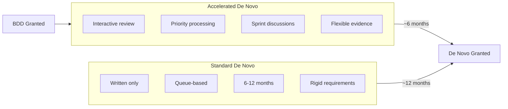
```mermaid
flowchart LR
    BDD["BDD Granted"]

    subgraph ACCELERATED["Accelerated De Novo"]
        A1["Interactive review"]
        A2["Priority processing"]
        A3["Sprint discussions"]
        A4["Flexible evidence"]
    end

    subgraph STANDARD["Standard De Novo"]
        S1["Written only"]
        S2["Queue-based"]
        S3["6-12 months"]
        S4["Rigid requirements"]
    end

    BDD --> ACCELERATED
    ACCELERATED -->|"~6 months"| CLEARED["De Novo Granted"]
    STANDARD -->|"~12 months"| CLEARED
```

### Blockers

| Blocker | Severity | Mitigation |
|---------|----------|------------|
| **FDA requests PMA instead** | HIGH | Strong safety architecture (Popper supervision), PCCP for updates |
| **Insufficient clinical evidence** | HIGH | Self-fund pilot + pivotal studies |
| **Autonomous Rx concerns** | HIGH | Clinician-in-the-loop design, protocol-bound prescribing |
| **No US health system partner** | HIGH | Partner acquisition (see separate strategy doc) |

### Costs

| Item | Estimated Cost |
|------|----------------|
| De Novo submission fee (FDA) | $134,000 |
| Regulatory consultant (De Novo) | $150,000 - $300,000 |
| Clinical evidence package | $500,000 - $1,500,000 |
| Software documentation (IEC 62304) | $100,000 - $200,000 |
| Risk management (ISO 14971) | $75,000 - $150,000 |
| Human factors study | $150,000 - $300,000 |
| **Total Layer 2** | **$1,100,000 - $2,600,000** |

---

## Layer 3: PCCP (Predetermined Change Control Plan)

### Purpose
Pre-approved framework for AI/ML algorithm updates without requiring new submissions.

### PCCP Architecture

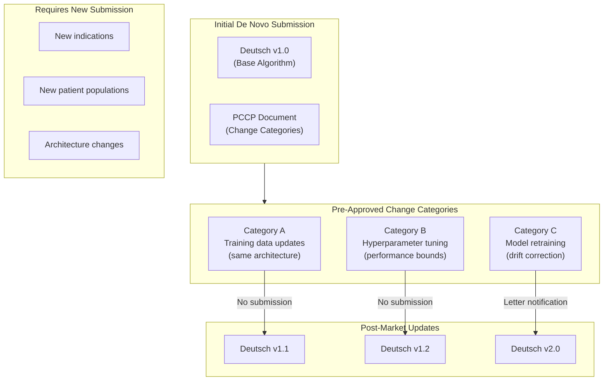
```mermaid
flowchart TB
    subgraph INITIAL["Initial De Novo Submission"]
        ALGO1["Deutsch v1.0<br/>(Base Algorithm)"]
        PCCP1["PCCP Document<br/>(Change Categories)"]
    end

    subgraph CATEGORIES["Pre-Approved Change Categories"]
        CAT_A["Category A<br/>Training data updates<br/>(same architecture)"]
        CAT_B["Category B<br/>Hyperparameter tuning<br/>(performance bounds)"]
        CAT_C["Category C<br/>Model retraining<br/>(drift correction)"]
    end

    subgraph POST_MARKET["Post-Market Updates"]
        UPDATE1["Deutsch v1.1"]
        UPDATE2["Deutsch v1.2"]
        UPDATE3["Deutsch v2.0"]
    end

    INITIAL --> CATEGORIES
    CAT_A -->|"No submission"| UPDATE1
    CAT_B -->|"No submission"| UPDATE2
    CAT_C -->|"Letter notification"| UPDATE3

    subgraph EXCLUDED["Requires New Submission"]
        EX1["New indications"]
        EX2["New patient populations"]
        EX3["Architecture changes"]
    end
```

### PCCP Speed Benefit

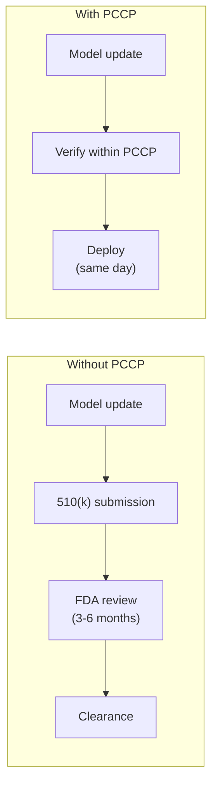
```mermaid
flowchart LR
    subgraph WITHOUT_PCCP["Without PCCP"]
        W1["Model update"]
        W2["510(k) submission"]
        W3["FDA review<br/>(3-6 months)"]
        W4["Clearance"]
        W1 --> W2 --> W3 --> W4
    end

    subgraph WITH_PCCP["With PCCP"]
        P1["Model update"]
        P2["Verify within PCCP"]
        P3["Deploy<br/>(same day)"]
        P1 --> P2 --> P3
    end
```

### Blockers

| Blocker | Severity | Mitigation |
|---------|----------|------------|
| **FDA rejects PCCP scope** | MEDIUM | Conservative initial scope, expand later |
| **Performance bounds too narrow** | MEDIUM | Build in generous margins |
| **Drift detection inadequate** | MEDIUM | Popper's drift monitoring is PCCP-aligned |

### Costs

| Item | Estimated Cost |
|------|----------------|
| PCCP framework design | $50,000 - $100,000 |
| Algorithm change protocol (ACP) | $25,000 - $50,000 |
| Re-validation infrastructure | $100,000 - $200,000 |
| **Total Layer 3** | **$175,000 - $350,000** |

---

## Layer 4: MDDT Qualification (Popper)

> **ARPA Piggyback Option:** If ARPA's TA2 achieves MDDT qualification and is open-source, Regain can use it instead — saving $525K-$1M. See "Leveraging ARPA Even Without Selection" section above for the hybrid decision framework.

### Purpose
Qualify Popper as an FDA-recognized Medical Device Development Tool (MDDT) under the Non-Clinical Assessment Model (NAM) category.

### Strategic Value

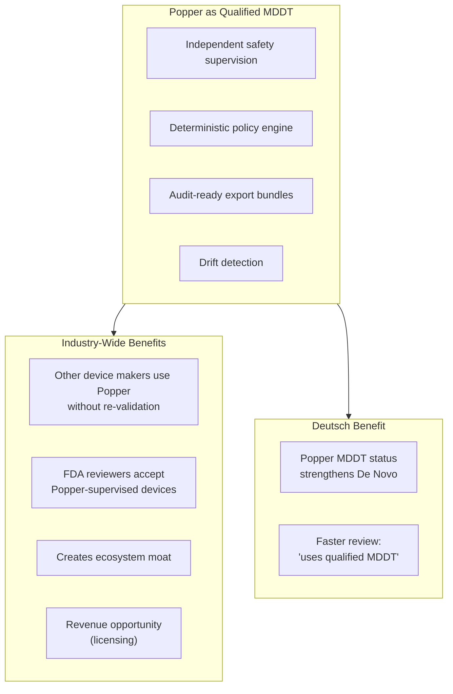
```mermaid
flowchart TB
    subgraph POPPER_MDDT["Popper as Qualified MDDT"]
        P1["Independent safety supervision"]
        P2["Deterministic policy engine"]
        P3["Audit-ready export bundles"]
        P4["Drift detection"]
    end

    subgraph BENEFITS["Industry-Wide Benefits"]
        B1["Other device makers use Popper<br/>without re-validation"]
        B2["FDA reviewers accept<br/>Popper-supervised devices"]
        B3["Creates ecosystem moat"]
        B4["Revenue opportunity<br/>(licensing)"]
    end

    subgraph DEUTSCH_BENEFIT["Deutsch Benefit"]
        D1["Popper MDDT status<br/>strengthens De Novo"]
        D2["Faster review:<br/>'uses qualified MDDT'"]
    end

    POPPER_MDDT --> BENEFITS
    POPPER_MDDT --> DEUTSCH_BENEFIT
```

### Two-Phase MDDT Process

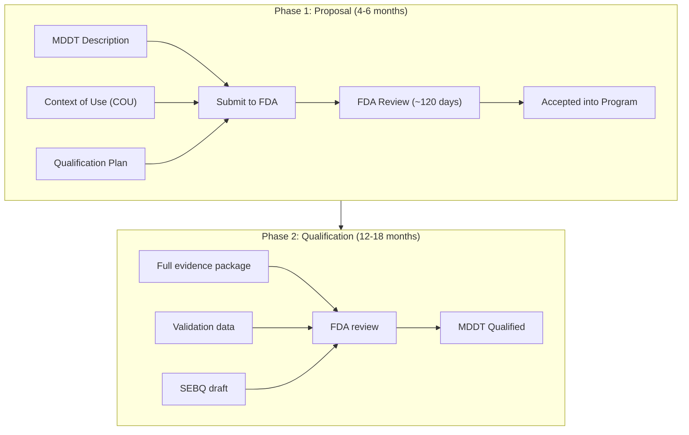
```mermaid
flowchart TB
    subgraph PHASE1["Phase 1: Proposal (4-6 months)"]
        P1_1["MDDT Description"]
        P1_2["Context of Use (COU)"]
        P1_3["Qualification Plan"]
        P1_4["Submit to FDA"]
        P1_5["FDA Review (~120 days)"]
        P1_6["Accepted into Program"]

        P1_1 --> P1_4
        P1_2 --> P1_4
        P1_3 --> P1_4
        P1_4 --> P1_5 --> P1_6
    end

    subgraph PHASE2["Phase 2: Qualification (12-18 months)"]
        P2_1["Full evidence package"]
        P2_2["Validation data"]
        P2_3["SEBQ draft"]
        P2_4["FDA review"]
        P2_5["MDDT Qualified"]

        P2_1 --> P2_4
        P2_2 --> P2_4
        P2_3 --> P2_4
        P2_4 --> P2_5
    end

    PHASE1 --> PHASE2
```

### Popper Context of Use (COU)

```
The Popper Supervisory Agent is a non-clinical assessment model for
the continuous, automated evaluation of AI-enabled clinical decision
support systems and clinical agents. Popper assesses safety, accuracy,
and reliability by:

1. Validating output schema compliance against defined contracts
2. Detecting policy violations using deterministic rule evaluation
3. Quantifying uncertainty levels in clinical recommendations
4. Identifying high-risk proposals requiring clinician review
5. Monitoring algorithmic drift through quality signal tracking
6. Enabling safe-mode transitions when safety thresholds are exceeded

Qualified for use with AI/ML clinical agents that:
- Operate in cardiovascular disease management
- Communicate via the Hermes protocol
- Are intended for adult patient populations
```

### Blockers

| Blocker | Severity | Mitigation |
|---------|----------|------------|
| **No precedent for AI supervision MDDT** | MEDIUM | First-in-class = define the category |
| **Evidence generation expensive** | HIGH | IV&V infrastructure required |
| **Long timeline (18-24 months)** | MEDIUM | Run parallel to De Novo, not sequential |

### Costs

**Full MDDT Qualification (if pursuing own):**

| Item | Estimated Cost |
|------|----------------|
| MDDT proposal preparation | $75,000 - $150,000 |
| Evidence generation (IV&V) | $300,000 - $600,000 |
| SEBQ documentation | $50,000 - $100,000 |
| Regulatory consultant | $100,000 - $200,000 |
| **Total Layer 4** | **$525,000 - $1,050,000** |

**Hybrid Strategy (Recommended):**

| Phase | Cost | Commitment |
|-------|------|------------|
| **Phase 1: Proposal only** | $75,000 - $150,000 | Low — "call option" |
| **Phase 2: Full qualification** | $450,000 - $900,000 | High — only if ARPA is behind |
| **Piggyback on ARPA** | $0 | Wait for their open-source MDDT |

**Bottom line:** Start Phase 1 ($75K-$150K). Track ARPA's progress. Decide on Phase 2 based on whether ARPA's TA2 is ahead or behind.

---

## Layer 5: Leverage Existing Qualified MDDTs

### Purpose
Use FDA-qualified tools and endpoints to skip validation work entirely.

### Available Qualified MDDTs

```mermaid
flowchart TB
    subgraph PRO["Patient-Reported Outcomes"]
        KCCQ["KCCQ-23/KCCQ-12<br/>(Oct 2016)<br/>HF symptom tracking"]
        MLHFQ["MLHFQ-21<br/>(May 2018)<br/>HF quality of life"]
    end

    subgraph DIGITAL["Digital Health"]
        APPLE["Apple Watch AFib History<br/>(May 2024)<br/>First digital health MDDT"]
    end

    subgraph CYBER["Cybersecurity"]
        MITRE["MITRE CVSS Rubric<br/>(May 2020)<br/>Security scoring"]
    end

    subgraph VALIDATION["Validation Datasets"]
        UCSF["UCSF LAD<br/>(Mar 2024)<br/>Arrhythmia ground truth"]
    end

    subgraph BENEFIT["How It Helps"]
        B1["Reference 'FDA-qualified MDDT'<br/>in submission"]
        B2["Skip endpoint validation"]
        B3["Faster FDA review"]
    end

    PRO --> BENEFIT
    DIGITAL --> BENEFIT
    CYBER --> BENEFIT
    VALIDATION --> BENEFIT
```

### Integration Points

| Qualified MDDT | Deutsch Integration | Popper Integration |
|----------------|--------------------|--------------------|
| **KCCQ-23** | `snapshot.pro_scores.kccq_total` | Threshold-based safety checks |
| **MLHFQ-21** | `snapshot.pro_scores.mlhfq_total` | Quality of life monitoring |
| **Apple Watch AFib** | `snapshot.afib_burden.weekly_percentage` | AFib drift detection |
| **MITRE CVSS** | N/A | Cybersecurity scoring in audit |
| **UCSF LAD** | N/A | Arrhythmia validation ground truth |

### Blockers

| Blocker | Severity | Mitigation |
|---------|----------|------------|
| **None** | — | These are already qualified; just reference them |

### Costs

| Item | Estimated Cost |
|------|----------------|
| Integration development | $25,000 - $50,000 |
| Validation testing | $10,000 - $25,000 |
| **Total Layer 5** | **$35,000 - $75,000** |

---

## Layer 6: Real-World Evidence (RWE)

### Purpose
Use post-market data as regulatory evidence for label expansion and ongoing compliance.

### December 2025 FDA Guidance

```mermaid
flowchart LR
    subgraph RWE_USES["FDA-Accepted RWE Uses"]
        U1["Training AI/ML algorithms"]
        U2["Supporting label expansion"]
        U3["Primary clinical evidence<br/>(some cases)"]
        U4["Post-market surveillance"]
    end

    subgraph SOURCES["RWE Sources"]
        S1["EHR data"]
        S2["Claims data"]
        S3["Wearables"]
        S4["Patient registries"]
    end

    subgraph POPPER_ROLE["Popper Generates RWE"]
        P1["Audit logs<br/>(decision data)"]
        P2["Drift metrics<br/>(performance over time)"]
        P3["Override patterns<br/>(clinician feedback)"]
        P4["Safety signals<br/>(adverse events)"]
    end

    SOURCES --> RWE_USES
    POPPER_ROLE --> RWE_USES
```

### RWE + PCCP Synergy

```mermaid
flowchart TB
    subgraph CYCLE["Continuous Improvement Cycle"]
        DEPLOY["Deutsch v1.0<br/>Deployed"]
        COLLECT["Popper collects RWE"]
        ANALYZE["Drift analysis +<br/>performance monitoring"]
        UPDATE["Model update<br/>(within PCCP bounds)"]
        EVIDENCE["RWE supports<br/>PCCP compliance"]

        DEPLOY --> COLLECT --> ANALYZE --> UPDATE --> EVIDENCE --> DEPLOY
    end

    subgraph EXPANSION["Label Expansion Path"]
        E1["RWE from CVD population"]
        E2["Demonstrate safety in<br/>new population"]
        E3["Supplement submission"]
        E4["Expanded indication"]

        E1 --> E2 --> E3 --> E4
    end
```

### Blockers

| Blocker | Severity | Mitigation |
|---------|----------|------------|
| **RWE quality concerns** | MEDIUM | Popper's structured audit logs = high-quality RWE |
| **FDA guidance still evolving** | LOW | Dec 2025 guidance is latest; monitor updates |

### Costs

| Item | Estimated Cost |
|------|----------------|
| RWE infrastructure | $50,000 - $100,000 |
| Data analysis pipeline | $25,000 - $50,000 |
| Ongoing monitoring (annual) | $25,000 - $50,000 |
| **Total Layer 6** | **$100,000 - $200,000** |

---

## Clinical Evidence: The Critical Blocker

### The Evidence Gap

```mermaid
flowchart TB
    subgraph WITH_ARPA["With ARPA-H"]
        A1["TA3 health system partners"]
        A2["IV&V infrastructure"]
        A3["Patient access"]
        A4["IRB + EHR integration"]
        A5["$10M+ funding"]
    end

    subgraph WITHOUT_ARPA["Without ARPA-H (Self-Funded)"]
        B1["Find health system partner<br/>independently"]
        B2["Build IV&V infrastructure<br/>yourself"]
        B3["Recruit patients<br/>yourself"]
        B4["Fund IRB + integration<br/>yourself"]
        B5["$2-5M self-funding<br/>required"]
    end

    subgraph EVIDENCE_NEED["Clinical Evidence Needed"]
        E1["Pilot study<br/>(N=50, 6 months)"]
        E2["Pivotal study<br/>(N=200, 12 months)"]
        E3["Cardiologist comparison<br/>(non-inferiority)"]
    end

    WITH_ARPA --> EVIDENCE_NEED
    WITHOUT_ARPA --> EVIDENCE_NEED
```

### Study Design

| Phase | Sample Size | Duration | Primary Endpoint | Estimated Cost |
|-------|-------------|----------|------------------|----------------|
| **Pilot** | N=50 | 6 months | Safety + feasibility | $300,000 - $500,000 |
| **Pivotal** | N=200 | 12 months | Non-inferiority vs cardiologist | $1,500,000 - $3,000,000 |

### Health System Partner Requirements

```mermaid
flowchart TB
    subgraph PARTNER_NEEDS["What You Need from Partner"]
        N1["Patient access<br/>(HF/post-MI population)"]
        N2["IRB infrastructure"]
        N3["EHR access<br/>(Epic/Cerner)"]
        N4["Clinical champion<br/>(cardiologist PI)"]
    end

    subgraph YOU_PROVIDE["What You Provide"]
        P1["Technology platform<br/>(Deutsch + Popper + Hermes)"]
        P2["Funding<br/>($1-3M for study)"]
        P3["Regulatory strategy<br/>(FDA pathway)"]
        P4["Open-source protocol<br/>(reduces their risk)"]
    end

    N1 --> PARTNERSHIP["Academic Medical Center<br/>or Health System"]
    N2 --> PARTNERSHIP
    N3 --> PARTNERSHIP
    N4 --> PARTNERSHIP

    P1 --> PARTNERSHIP
    P2 --> PARTNERSHIP
    P3 --> PARTNERSHIP
    P4 --> PARTNERSHIP
```

### Blockers

| Blocker | Severity | Mitigation |
|---------|----------|------------|
| **No health system partner** | CRITICAL | Active outreach, leverage open-source as risk reducer |
| **No US clinical data** | HIGH | Reference Uzbekistan methodology, generate US data |
| **Cardiologist recruitment** | HIGH | Recruit before study (team addition) |
| **Funding gap** | HIGH | Seed round or strategic partnership |

---

## Total Cost Summary

### Layer-by-Layer Costs

| Layer | Low Estimate | High Estimate | Critical? |
|-------|--------------|---------------|-----------|
| **Layer 1: BDD** | $150,000 | $300,000 | Yes (accelerator) |
| **Layer 2: De Novo** | $1,100,000 | $2,600,000 | Yes (authorization) |
| **Layer 3: PCCP** | $175,000 | $350,000 | Yes (future-proofing) |
| **Layer 4: MDDT (Popper)** | $525,000 | $1,050,000 | Strategic (parallel) |
| **Layer 5: Existing MDDTs** | $35,000 | $75,000 | Yes (shortcuts) |
| **Layer 6: RWE** | $100,000 | $200,000 | Post-market |
| **Clinical Evidence** | $1,800,000 | $3,500,000 | CRITICAL |
| **TOTAL** | **$3,885,000** | **$8,075,000** |

### With ARPA Piggyback Strategy

| Scenario | Layer 4 Cost | Total Cost | Notes |
|----------|--------------|------------|-------|
| **Full MDDT (own)** | $525K-$1M | $3.9M-$8.1M | Maximum moat + licensing revenue |
| **Phase 1 only (hedge)** | $75K-$150K | $3.4M-$7.2M | Call option, decide later |
| **Piggyback on ARPA** | $0 | $3.3M-$7.0M | Use ARPA's open-source TA2 |

**Recommendation:** Start with Phase 1 ($75K-$150K) as a hedge. If ARPA's TA2 is progressing faster, piggyback. If Regain is ahead, complete qualification for competitive moat.

### Funding Strategy

```mermaid
flowchart LR
    subgraph SOURCES["Funding Sources"]
        S1["Seed Round<br/>($2-5M)"]
        S2["Strategic Partner<br/>(health system)"]
        S3["SBIR/STTR Grants<br/>($1-2M)"]
        S4["Revenue<br/>(wellness mode)"]
    end

    subgraph ALLOCATION["Allocation"]
        A1["Clinical evidence<br/>(45%)"]
        A2["Regulatory<br/>(25%)"]
        A3["Engineering<br/>(20%)"]
        A4["Operations<br/>(10%)"]
    end

    SOURCES --> ALLOCATION
```

---

## Timeline: 30-36 Month Path to Clearance

```mermaid
gantt
    title Naked Speed-Run: 30-36 Month Timeline
    dateFormat  YYYY-MM
    axisFormat  %Y Q%q

    section Foundation
    Team building (cardiologist, biostatistician)  :2026-02, 2M
    Seed funding close                              :2026-03, 2M
    Health system partner acquisition               :2026-02, 6M

    section Layer 1-2 (Regulatory)
    Q-Sub + BDD application                         :2026-04, 6M
    BDD granted                                     :milestone, 2026-10, 0d
    De Novo prep (with BDD acceleration)            :2026-10, 6M
    De Novo submission                              :2027-04, 1M
    FDA review (accelerated via BDD)                :2027-05, 6M
    De Novo granted                                 :milestone, 2027-11, 0d

    section Layer 4 (MDDT - Parallel)
    MDDT proposal prep                              :2026-06, 4M
    MDDT proposal submission                        :2026-10, 1M
    FDA review                                      :2026-11, 4M
    Qualification evidence                          :2027-03, 12M
    MDDT qualified                                  :milestone, 2028-03, 0d

    section Clinical Evidence
    Protocol design + IRB                           :2026-04, 4M
    Pilot study (N=50)                              :2026-08, 6M
    Pivotal study (N=200)                           :2027-02, 12M
    Data analysis + submission prep                 :2028-02, 3M

    section Post-Market
    Commercial launch                               :2027-12, 1M
    RWE collection                                  :2027-12, 12M
    First PCCP update                               :2028-12, 3M
```

---

## Risk Matrix

| Risk | Probability | Impact | Mitigation |
|------|-------------|--------|------------|
| **No health system partner by Month 6** | HIGH | CRITICAL | Multiple parallel outreach, leverage open-source |
| **FDA rejects BDD** | MEDIUM | HIGH | Strong justification, backup 510(k) strategy |
| **Clinical study fails non-inferiority** | LOW | CRITICAL | Conservative study design, interim analyses |
| **Funding gap** | MEDIUM | HIGH | Multiple funding sources, phased approach |
| **Popper MDDT rejected** | LOW | MEDIUM | Proceed with De Novo regardless |
| **Regulatory landscape changes** | LOW | MEDIUM | Active FDA engagement, Q-Sub process |

---

## Decision Tree: When to Pursue Each Layer

```mermaid
flowchart TB
    START["Start: Regain without ARPA-H"]

    Q1{"Health system<br/>partner available?"}
    Q2{"Seed funding<br/>secured?"}
    Q3{"BDD eligible?"}
    Q4{"Clinical evidence<br/>timeline?"}

    START --> Q1

    Q1 -->|"Yes"| Q2
    Q1 -->|"No"| PARTNER["Priority: Partner Acquisition<br/>(Pause other work)"]

    Q2 -->|"Yes"| Q3
    Q2 -->|"No"| FUND["Priority: Seed Round<br/>(6-month runway)"]

    Q3 -->|"Yes"| FULL["Full 6-Layer Strategy"]
    Q3 -->|"No"| DENOVO_ONLY["De Novo Only<br/>(skip Layer 1)"]

    Q4 -->|"< 24 months"| PARALLEL["MDDT in Parallel"]
    Q4 -->|"> 24 months"| SEQUENTIAL["MDDT After De Novo"]

    FULL --> Q4
```

---

## Appendix: Document Cross-References

| Document | Purpose | Location |
|----------|---------|----------|
| SaMD Classification | Deutsch classification details | [01-samd-classification-and-pathways.md](./01-samd-classification-and-pathways.md) |
| MDDT Qualification | Popper MDDT process | [02-mddt-qualification-guide.md](./02-mddt-qualification-guide.md) |
| PCCP Framework | Algorithm update strategy | [09-pccp-change-control.md](./09-pccp-change-control.md) |
| Clinical Evidence | IV&V and study design | [06-clinical-evidence-framework.md](./06-clinical-evidence-framework.md) |
| Qualified MDDTs | Existing tools to leverage | [13-qualified-mddt-solutions.md](./13-qualified-mddt-solutions.md) |
| **Patent Strategy** | IP protection analysis | [00-patenting-strategy.md](../0C-commercialization/00-patenting-strategy.md) |
| **Open-Source Strategy** | Hermes + Popper open-source plan | [00-open-sourcing-strategy/](../0C-commercialization/00-open-sourcing-strategy/) |
| **TA3 Acquisition** | Health system partner strategy | [08-ta3-acquisition-strategy.md](../0C-commercialization/00-open-sourcing-strategy/08-ta3-acquisition-strategy.md) |
| **Team Recruitment** | Cardiologist, FDA consultant playbook | [09-team-recruitment-playbook.md](../0C-commercialization/00-open-sourcing-strategy/09-team-recruitment-playbook.md) |
| Deutsch Specs | TA1 system specification | [01-deutsch-specs/](../../01-deutsch-specs/) |
| Popper Specs | TA2 system specification | [02-popper-specs/](../../02-popper-specs/) |
| Hermes Specs | Protocol library | [03-hermes-specs/](../../03-hermes-specs/) |

---

## Document Revision History

| Version | Date | Author | Changes |
|---------|------|--------|---------|
| 1.7.0 | 2026-01-25 | Regain Team | Added "Pole Position" section: Regain ahead of ARPA, funding gap analysis, recommended strategy |
| 1.6.0 | 2026-01-25 | Regain Team | Added go-first vs. piggyback economics: cost savings ($750K-$1.4M) vs. first-mover value ($4M-$11M) |
| 1.5.0 | 2026-01-25 | Regain Team | Added 510(k) predicate analysis explaining why De Novo is required (no suitable predicate exists) |
| 1.4.0 | 2026-01-25 | Regain Team | Added MDDT piggyback decision framework and hybrid cost strategy |
| 1.3.0 | 2026-01-25 | Regain Team | Added "Leveraging ARPA Even Without Selection" section with FDA treatment analysis |
| 1.2.0 | 2026-01-25 | Regain Team | Added comprehensive Deutsch clinical functions section |
| 1.1.0 | 2026-01-25 | Regain Team | Added program explanations, strategic value analysis, patent strategy summary |
| 1.0.0 | 2026-01-25 | Regain Team | Initial release |
