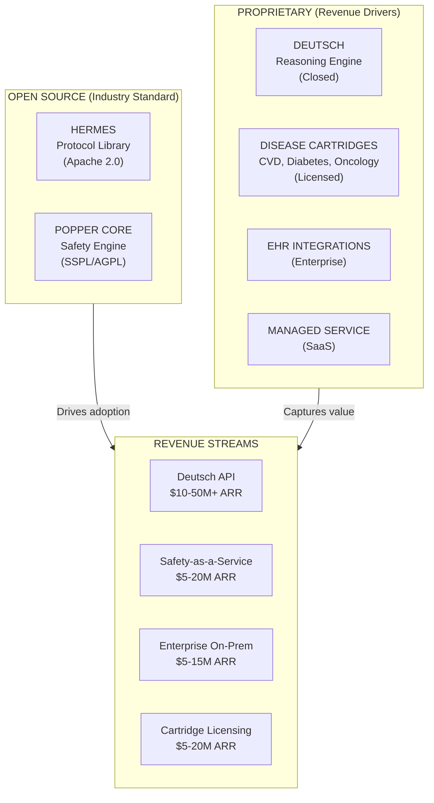

# Commercialization Strategy: Clinical Agents System

## Executive Summary

This document outlines the commercialization strategy for Regain's clinical agents system (Deutsch, Popper, Hermes). The strategy follows an **open-core model**: open-source the safety infrastructure (Hermes protocol + Popper core) to establish industry standards and capture the market, while keeping the clinical intelligence (Deutsch + disease cartridges) proprietary as the primary revenue driver.

### Strategic Positioning

---

## 1. Why Open-Source Hermes + Popper?

### The MongoDB Precedent

MongoDB's shift to SSPL licensing in 2018 demonstrates how open-core can succeed in enterprise software:

| Metric | MongoDB Result |
|--------|---------------|
| FY2025 Revenue | [$2.01 billion](https://www.mongodb.com/company/newsroom/press-releases/mongodb-issues-new-server-side-public-license-for-mongodb-community-server) |
| Customer Count | 54,500+ |
| Cloud Revenue (Atlas) | 71% of total |
| YoY Growth | 19% |

**Key insight**: MongoDB open-sourced the database engine (community edition) while monetizing the managed cloud service, enterprise features, and support.

### Why This Works for Clinical AI Safety

| Factor | Benefit |
|--------|---------|
| **Regulatory trust** | FDA and health systems prefer auditable, inspectable safety layers. Per our [architecture rationale](../00-deutsch-popper-hermes-architecture.md#5-commercial--platform-strategy), open-source safety supervision aligns with regulatory expectations for transparency. |
| **Network effects** | More adopters = industry standard = more trust = more adopters |
| **Hospital requirements** | Health systems often require self-hostable, auditable software ([TRAIN coalition](https://news.microsoft.com/source/2024/03/11/new-consortium-of-healthcare-leaders-announces-formation-of-trustworthy-responsible-ai-network-train-making-safe-and-fair-ai-accessible-to-every-healthcare-organization/) has 16 major health systems seeking AI governance standards) |
| **Talent acquisition** | Engineers want to work on open-source healthcare AI |
| **Competitive moat** | Becoming the "HTTP of clinical AI safety" creates switching costs |

### What to Open vs. Keep Proprietary

| Component | Open/Proprietary | Rationale |
|-----------|------------------|-----------|
| **Hermes** | Open (Apache 2.0) | Protocol/contracts should be universal; creates standard |
| **Popper Core** | Open (SSPL or AGPL) | Safety layer must be auditable; prevents cloud providers from offering competing service without contributing |
| **Popper Policy Packs** | Freemium | Base packs open; clinical-grade packs licensed |
| **Deutsch Engine** | Proprietary | Core reasoning IP; primary differentiator |
| **Disease Cartridges** | Proprietary | Clinical knowledge is hard to replicate; high value |
| **EHR Integrations** | Proprietary | Enterprise value; site-specific customization |
| **Managed Service** | Proprietary | SLAs, compliance, support are revenue drivers |

---

## 2. Revenue Model Overview

### Primary Revenue Streams (by ARR potential)

| Stream | Model | Target ARR | Margin |
|--------|-------|------------|--------|
| **Deutsch API** | Per-interaction + enterprise tiers | $10-50M+ | 50-60% |
| **Safety-as-a-Service** | B2B subscription for third-party AI companies | $5-20M | 70-80% |
| **Cartridge Marketplace** | License + revenue share | $5-20M | 80-90% |
| **Popper Managed Service** | Tiered subscription | $5-20M | 70-80% |
| **Enterprise On-Prem** | License + support | $5-15M | 60-70% |
| **Certification Programs** | Per-company fees | $1-5M | 90%+ |

**Total Addressable Revenue**: $35-135M ARR at scale

### Pricing Benchmarks (from market research)

Healthcare AI commands premium pricing relative to general SaaS:

| Segment | Price Range | Source |
|---------|-------------|--------|
| Healthcare AI per interaction | $1.00-3.00+ | [Everest Group](https://www.everestgrp.com/healthcare-industry/optimizing-pricing-strategies-for-healthcare-ai-startups-expert-insights-for-payer-and-provider-innovation-blog.html) |
| Direct patient care AI | 25-45% premium over administrative AI | [Black Book Market Research](https://www.getmonetizely.com/articles/how-much-does-healthcare-ai-cost-pricing-and-regulatory-factors-to-consider) |
| Enterprise clinical AI | $175K-350K/year (medium deployment) | [KLAS Research](https://www.biz4group.com/blog/cost-of-implementing-ai-in-healthcare) |
| Diagnostic AI per-patient | $5-50/analysis | [Monetizely](https://www.getmonetizely.com/articles/how-much-does-healthcare-ai-cost-pricing-and-regulatory-factors-to-consider) |

---

## 3. Key Differentiators vs. Competitors

### Competitive Landscape

| Company | Focus | Business Model | Revenue (2024) |
|---------|-------|----------------|----------------|
| **Viz.ai** | Imaging AI (stroke, PE, cardiac) | Subscription per algorithm | ~$100M (est.) |
| **Tempus** | Oncology genomics + data | Per-test + data licensing | [$693M](https://www.nasdaq.com/articles/tempus-ai-revenue-jumps-85-pricing-catalysts-line) |
| **PathAI** | Digital pathology | Lab integration + algorithms | ~$50M (est.) |
| **Microsoft TRAIN** | AI governance framework | Consortium (non-revenue) | N/A |

### Regain's Unique Position

| Differentiator | Competitors | Regain |
|----------------|-------------|--------|
| **Safety layer** | Embedded in product (opaque) | Independent, auditable (Popper) |
| **Disease coverage** | Single disease focus | Cartridge architecture (any disease) |
| **Reasoning approach** | LLM-based (non-deterministic) | Deterministic Safety DSL (reproducible) |
| **B2B opportunity** | Point solutions | Platform + Safety-as-a-Service |
| **Open source** | Proprietary | Open-core (Hermes + Popper) |

### Why "Safety-as-a-Service" is Uncontested

Web research found **no existing competitor** offering clinical AI safety as a standalone service. The market is:

1. **Fragmented** - Each company builds its own safety layer
2. **Opaque** - No audit standards across vendors
3. **Regulatory pain point** - FDA wants consistent safety frameworks

> "We think there's enormous potential for AI to benefit healthcare... but right now, we don't have the right mechanisms in place to make sure it is safe." — [ECRI CEO](https://www.chiefhealthcareexecutive.com/view/ai-is-named-among-top-health-tech-hazards-in-2024)

---

## 4. Strategic Risks & Mitigations

### Risk: Cloud Providers Fork Popper

**Mitigation**: SSPL licensing (MongoDB model) requires cloud providers to either:
- Open-source their entire service infrastructure, OR
- Enter commercial agreements

[Redis](https://redis.io/legal/licenses/) and [Elastic](https://www.theregister.com/2024/03/22/redis_changes_license/) followed similar paths with success.

### Risk: FDA Delays or Denies Clearance

**Mitigation**: Architecture supports alternative paths:

| Path | Description | Regulatory Status |
|------|-------------|-------------------|
| Clinical Decision Support | Human-in-the-loop exemption (21st Century Cures) | Lower burden |
| AI Governance Platform | Popper + Hermes as risk management layer | Not a medical device |
| Wellness/Lifestyle | Deutsch with wellness cartridge | Unregulated |

See [Commercial & Platform Strategy](./00-deutsch-popper-hermes-architecture.md#5-commercial--platform-strategy) in architecture doc.

### Risk: No Reimbursement Path

Current reality: [Only 2 CPT Category 1 codes](https://radiologybusiness.com/topics/artificial-intelligence/radiology-dominates-fda-cleared-ai-reimbursement-lags-far-behind) for AI by 2026, despite 1,200+ FDA-cleared algorithms.

**Mitigation**:
- Focus on enterprise contracts (health system budgets, not per-patient billing)
- Value-based arrangements with payers
- B2B licensing (AI companies pay, not patients)
- Grant funding (ARPA-H, NIH, VA/DoD)

---

## 5. Recommended Strategic Actions

### Near-Term (0-6 months)

1. **Publish Hermes as open-source** (Apache 2.0)
   - npm package: `@regain/hermes` (Regain maintains the reference implementation; third parties can create their own)
   - Fixture packs for conformance testing
   - Documentation site

2. **Launch Popper managed service beta**
   - Target: 3-5 pilot health systems
   - Free tier for small AI startups

3. **Establish governance model**
   - Consider founding Hermes Foundation (like OpenSSL Foundation)
   - Include health system representatives for credibility

### Medium-Term (6-18 months)

4. **Launch Deutsch API**
   - Per-interaction pricing for developers
   - Enterprise contracts for health systems

5. **Second disease cartridge**
   - Diabetes or Oncology (based on partnership opportunities)

6. **First Safety-as-a-Service customers**
   - Target: AI health startups needing FDA-grade safety

### Long-Term (18-36 months)

7. **Cartridge marketplace**
   - Third-party cartridge development
   - Revenue share model (70/30)

8. **"Hermes Certified" program**
   - Certification for third-party clinical AI
   - Annual recertification fees

9. **International expansion**
   - UK NHS, EU CE marking
   - Adapt Popper for MDR/IVDR

---

## Glossary

| Term | Definition |
|------|------------|
| **ACV** | Annual Contract Value - full annual value of a signed contract |
| **ARR** | Annual Recurring Revenue - sum of all active contract ACVs at a point in time |
| **Bookings** | New ACV signed in a period (not yet recognized as revenue) |
| **Recognized Revenue** | Revenue recognized per GAAP (prorated for partial-year contracts) |
| **Interaction** | Single request/response cycle through Deutsch or Popper |
| **Supervision Event** | Popper safety evaluation of a Deutsch response |
| **Cartridge** | Disease-specific clinical knowledge module for Deutsch |
| **Policy Pack** | Set of Popper safety rules for a clinical domain |
| **Hermes Protocol** | Schema/contract specification for clinical AI supervision |
| **M0, M6, M12** | Relative month notation (M0 = funding close) |
| **CDS** | Clinical Decision Support (FDA-exempt human-in-the-loop mode) |
| **SaMD** | Software as a Medical Device (FDA-regulated) |

---

## Reference Documents

| Document | Purpose |
|----------|---------|
| [01-market-analysis.md](./01-market-analysis.md) | Detailed market size, competitor analysis, adoption trends |
| [02-pricing-strategy.md](./02-pricing-strategy.md) | Tiered pricing models with benchmarks |
| [03-open-source-strategy.md](./03-open-source-strategy.md) | Licensing choices, governance, cloud protection |
| [04-revenue-streams.md](./04-revenue-streams.md) | All 10 monetization paths in detail |
| [05-go-to-market-timeline.md](./05-go-to-market-timeline.md) | Year-by-year execution plan |

## External Sources

- [Healthcare AI Market Size (StartUs Insights)](https://www.startus-insights.com/innovators-guide/ai-in-healthcare/)
- [AI Commercialization Challenges (Nature npj Digital Medicine)](https://www.nature.com/articles/s41746-025-01867-w)
- [2025 State of AI in Healthcare (Menlo Ventures)](https://menlovc.com/perspective/2025-the-state-of-ai-in-healthcare/)
- [TRAIN Coalition Announcement (Microsoft)](https://news.microsoft.com/source/2024/03/11/new-consortium-of-healthcare-leaders-announces-formation-of-trustworthy-responsible-ai-network-train-making-safe-and-fair-ai-accessible-to-every-healthcare-organization/)
- [Healthcare AI Guardrails Research (arXiv)](https://arxiv.org/abs/2409.17190)
- [MongoDB SSPL FAQ](https://www.mongodb.com/legal/licensing/server-side-public-license/faq)
