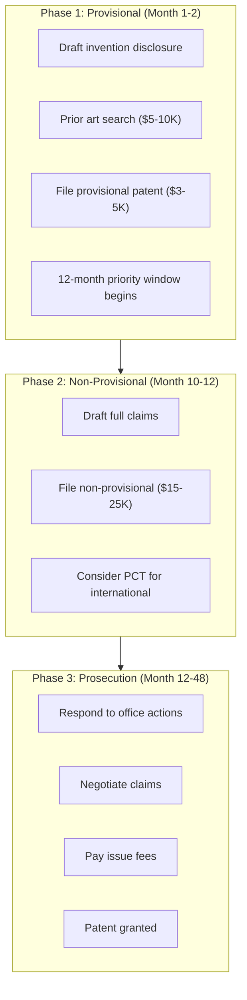
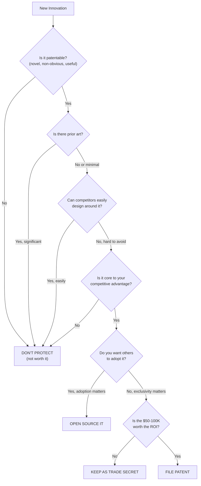

# Patent Strategy for Clinical AI Systems

> **Document Version:** 1.0.0
> **Last Updated:** 2026-01-25
> **Applies To:** Deutsch (TA1), Popper (TA2), Hermes (Protocol)
> **Related Docs:** [00-naked-speed-run.md](../0B-fda-speed-run/00-naked-speed-run.md)

---

## Executive Summary

This document analyzes the patentability of Regain's clinical AI systems and recommends a **regulatory-first, patent-light** strategy. The core insight: in AI healthcare, FDA clearance and clinical evidence create stronger moats than patents.

**Recommended approach:**
- File 2-3 defensive patents ($100-200K total)
- Keep training data as trade secret
- Open-source Hermes and Popper
- Invest in regulatory moats (FDA clearance + MDDT qualification)

---

## 1. What's Patentable? Honest Assessment

### Component-by-Component Analysis

| Component | Patentable? | Prior Art Risk | Enforcement Difficulty | Worth Patenting? |
|-----------|-------------|----------------|------------------------|------------------|
| **Deutsch's clinical reasoning pipeline** | Maybe | HIGH | HIGH | **NO** |
| **ArgMed multi-agent debate** | Maybe | HIGH | MEDIUM | **NO** |
| **HTV (Hard-to-Vary) scoring** | Maybe | HIGH | HIGH | **NO** |
| **Popperian epistemology in AI** | No | VERY HIGH | N/A | **NO** |
| **Safety DSL (Popper)** | Yes | LOW | MEDIUM | **MAYBE** |
| **Hermes protocol** | Yes | LOW | LOW | **NO** (want adoption) |
| **Deutsch↔Popper architecture** | Yes | MEDIUM | MEDIUM | **MAYBE** |
| **Clinical cartridge plug-in format** | Yes | LOW | MEDIUM | **MAYBE** |
| **Snapshot-first data architecture** | Yes | MEDIUM | HIGH | **NO** |
| **FHIR/HL7 integration patterns** | No | VERY HIGH | N/A | **NO** |

### Detailed Analysis by Component

#### Deutsch Clinical Reasoning Pipeline

```
Claim: "A method for autonomous clinical decision support comprising
       multi-agent debate with conjecture-refutation..."

Problems:
├── Prior Art: ArgMed papers (2019-2024), medical debate systems
├── Obviousness: Combination of known techniques
├── Enforcement: How do you prove infringement without source access?
└── Narrow Claims: Any useful claim would be easy to design around

Verdict: NOT WORTH PATENTING
```

#### ArgMed Multi-Agent Debate

```
Claim: "A system comprising Generator, Verifier, and Reasoner agents
       for clinical hypothesis evaluation..."

Problems:
├── Prior Art: ArgMed academic publications
│   - "ArgMed: A system for argumentation-based medical reasoning" (2019)
│   - Multiple follow-up papers with implementation details
├── Academic Exemption: Papers describe exactly this architecture
├── Open Research: Community has published improvements
└── Invalidation Risk: HIGH

Verdict: NOT WORTH PATENTING (would likely be invalidated)
```

#### HTV (Hard-to-Vary) Scoring

```
Claim: "A method for evaluating explanation quality comprising scoring
       on interdependence, specificity, parsimony, and falsifiability..."

Problems:
├── Prior Art: David Deutsch's "The Beginning of Infinity" (2011)
│   - Describes hard-to-vary criterion in detail
│   - Philosophy of science literature
├── Obviousness: Operationalizing well-known concept
├── Indefiniteness: What exactly is "interdependence score"?
└── Invalidation Risk: VERY HIGH

Verdict: NOT WORTH PATENTING (based on published philosophy)
```

#### Safety DSL (Popper)

```
Claim: "A domain-specific language for expressing medical device safety
       policies comprising deterministic rule evaluation with audit trails..."

Analysis:
├── Prior Art: Some DSL patents exist, but not for medical AI supervision
├── Novelty: Specific combination for AI agent supervision is new
├── Non-Obviousness: MEDIUM (DSLs exist, but this application is novel)
├── Enforcement: Could detect via documentation requirements
├── Claim Scope: Could write narrow but defensible claims
└── Strategic Value: Protects core Popper innovation

Verdict: MAYBE WORTH PATENTING (defensive value)
```

#### Hermes Protocol

```
Claim: "A protocol for supervised AI agent communication comprising
       versioned contracts, audit redaction, and safety decisions..."

Analysis:
├── Prior Art: API protocols, message formats exist
├── Novelty: Specific supervision protocol is new
├── Enforcement: Easy to detect (public protocol)
└── BUT: WE WANT ADOPTION

Strategic Problem:
- Patents would DISCOURAGE adoption
- Ecosystem value comes from widespread use
- MDDT qualification requires others to use it
- Open-source is the moat, not exclusivity

Verdict: DO NOT PATENT (open-source instead)
```

#### System Architecture (Deutsch → Hermes → Popper)

```
Claim: "A system for supervised clinical AI comprising an independent
       supervisory agent that evaluates proposals from a clinical agent
       via a versioned protocol..."

Analysis:
├── Prior Art: Supervisory systems exist, but not for clinical AI
├── Novelty: This specific architecture is new
├── Non-Obviousness: MEDIUM-HIGH
├── Enforcement: Could detect via system behavior
├── Claim Scope: Broad enough to be useful
├── Strategic Value: Protects core innovation
└── Defensive Value: Would prevent others from patenting it

Verdict: WORTH PATENTING (defensive, broad architecture)
```

#### Clinical Cartridge Format

```
Claim: "A plug-in architecture for clinical AI systems comprising
       disease-specific modules with standardized interfaces for
       vocabulary, guidelines, and test cases..."

Analysis:
├── Prior Art: Plugin architectures exist, but not for clinical AI
├── Novelty: Specific format for clinical cartridges is new
├── Non-Obviousness: MEDIUM
├── Enforcement: Could detect via documentation
├── Strategic Value: Protects ecosystem play
└── Defensive Value: Prevents competitors from locking down format

Verdict: WORTH PATENTING (ecosystem protection)
```

---

## 2. Types of IP Protection Compared

### Patent vs. Trade Secret vs. Open Source

```mermaid
flowchart TB
    subgraph PATENT["Patents"]
        direction TB
        PAT_PRO["✓ 20-year exclusivity"]
        PAT_PRO2["✓ Can license/sell"]
        PAT_PRO3["✓ Defensive against trolls"]
        PAT_PRO4["✓ Investor credibility"]
        PAT_CON["✗ Expensive ($50K-150K each)"]
        PAT_CON2["✗ Public disclosure required"]
        PAT_CON3["✗ Hard to enforce globally"]
        PAT_CON4["✗ 3-5 years to grant"]
        PAT_CON5["✗ Easy to design around in AI"]
    end

    subgraph TRADE_SECRET["Trade Secrets"]
        direction TB
        TS_PRO["✓ No disclosure"]
        TS_PRO2["✓ Indefinite protection"]
        TS_PRO3["✓ No filing cost"]
        TS_PRO4["✓ Immediate effect"]
        TS_CON["✗ Lost if reverse-engineered"]
        TS_CON2["✗ Lost if employee leaves"]
        TS_CON3["✗ No defensive value"]
        TS_CON4["✗ Hard to license"]
    end

    subgraph OPEN_SOURCE["Open Source"]
        direction TB
        OS_PRO["✓ Maximum adoption"]
        OS_PRO2["✓ Community contributions"]
        OS_PRO3["✓ Hiring signal"]
        OS_PRO4["✓ No maintenance cost"]
        OS_PRO5["✓ Ecosystem lock-in"]
        OS_CON["✗ No exclusivity"]
        OS_CON2["✗ Competitors can use"]
        OS_CON3["✗ Must differentiate on execution"]
    end
```



### When Each Works Best

| Protection Type | Best For | Worst For |
|-----------------|----------|-----------|
| **Patents** | Novel hardware, pharma molecules, unique processes | AI algorithms, fast-moving tech |
| **Trade Secrets** | Training data, internal processes, customer lists | Anything that ships in product |
| **Open Source** | Protocols, standards, ecosystem plays | Core competitive advantage |
| **Regulatory** | Medical devices, fintech, anything regulated | Consumer apps, unregulated markets |

---

## 3. Why Regulatory Moats Beat Patents in AI Healthcare

### The Timeline Problem

```
AI Model Lifecycle:
├── Model trained and deployed: Month 0
├── Model becomes state-of-art: Month 0-6
├── Competitors develop similar: Month 6-12
├── Model becomes commodity: Month 18-24
├── Model obsolete: Month 24-36
└── Patent granted: Month 36-60 ← TOO LATE

Patent grants AFTER the model it protects is obsolete.
```

### The Enforcement Problem

```
To prove patent infringement, you need:
├── Access to competitor's source code (you don't have this)
├── Detailed implementation knowledge (they won't share)
├── Resources for litigation ($1-5M per lawsuit)
└── Global enforcement capability (patents are territorial)

Even if you have a patent, enforcing it is:
- Expensive
- Time-consuming
- Uncertain
- Distracting from building product
```

### The Design-Around Problem

```
AI Algorithm Patent:
"A method for clinical decision support using multi-agent debate..."

Competitor's response:
├── Use 2 agents instead of 3 → different
├── Use "discussion" instead of "debate" → different
├── Use different scoring criteria → different
└── Achieve same outcome with different method → not infringing

AI patents are trivially easy to design around.
```

### Why Regulatory Works Better

```
Regulatory Clearance Timeline:
├── Submit De Novo: Month 0
├── FDA review: Month 0-12
├── De Novo granted: Month 12
├── Competitor starts their submission: Month 12
├── Competitor's FDA review: Month 12-24
├── Competitor cleared: Month 24
└── Your head start: 24 MONTHS of market access

During those 24 months:
- You're generating clinical evidence (compounds)
- You're building health system relationships (sticky)
- You're accumulating RWE (regulatory asset)
- Your MDDT is becoming industry standard (network effects)
```

### The Moat Comparison

| Moat Type | Time to Build | Time for Competitor to Replicate | Strength |
|-----------|---------------|----------------------------------|----------|
| **AI Algorithm Patent** | 3-5 years | 6-12 months (design around) | WEAK |
| **Trade Secret (data)** | 1-2 years | 1-2 years (collect own data) | MEDIUM |
| **FDA Clearance** | 2-3 years | 2-3 years (no shortcut) | STRONG |
| **MDDT Qualification** | 2-3 years | 2-3 years (no shortcut) | STRONG |
| **Clinical Evidence** | 2-5 years | 2-5 years (no shortcut) | VERY STRONG |
| **Ecosystem Adoption** | 2-3 years | 3-5 years (network effects) | VERY STRONG |

---

## 4. Recommended Patent Strategy

### What to Patent (Defensive Only)

| Patent | Estimated Cost | Priority | Reasoning |
|--------|----------------|----------|-----------|
| **System Architecture** (Deutsch↔Hermes↔Popper) | $75,000 | HIGH | Broad, defensible, prevents others from patenting |
| **Clinical Cartridge Format** | $50,000 | MEDIUM | Protects ecosystem, enables licensing |
| **Safety DSL** (optional) | $50,000 | LOW | Narrow, but could have licensing value |
| **TOTAL** | **$125,000-175,000** | | |

### What NOT to Patent

| Component | Reason |
|-----------|--------|
| ArgMed debate | Prior art (academic papers) |
| HTV scoring | Prior art (Deutsch philosophy) |
| Clinical reasoning | Easy to design around |
| Hermes protocol | Want adoption, not exclusivity |
| FHIR integration | Standard, prior art |

### What to Keep as Trade Secret

| Asset | Protection Method |
|-------|-------------------|
| Training datasets | Access controls, NDAs, no public disclosure |
| Model weights | Encrypted storage, access controls |
| Prompt engineering | Internal documentation only |
| Customer data | HIPAA compliance, access controls |
| Performance benchmarks | Selective disclosure |

### What to Open Source

| Component | Licensing | Reasoning |
|-----------|-----------|-----------|
| Hermes | Apache 2.0 + CLA | Maximum adoption, ecosystem standard |
| Popper | Apache 2.0 + CLA | MDDT value comes from adoption |
| Fixtures/test cases | Apache 2.0 | Enables compatibility testing |

---

## 5. Patent Filing Process

### If You Decide to File



### Cost Breakdown

| Phase | Activity | Cost Range |
|-------|----------|------------|
| **Provisional** | Disclosure + search + filing | $10,000-15,000 |
| **Non-Provisional** | Full application + filing | $20,000-35,000 |
| **Prosecution** | Office actions + amendments | $10,000-30,000 |
| **Issue** | Issue fees + maintenance | $5,000-15,000 |
| **TOTAL (US only)** | | **$45,000-95,000** |
| **PCT (international)** | Add 3-5 countries | +$50,000-150,000 |

### Timeline

| Milestone | Timeline |
|-----------|----------|
| Provisional filed | Month 0 |
| Non-provisional filed | Month 10-12 |
| First office action | Month 18-24 |
| Patent granted (typical) | Month 36-48 |
| Patent granted (accelerated) | Month 18-24 |

---

## 6. Defensive Patent Strategy

### Why Defensive Patents?

Even if patents aren't your primary moat, defensive patents:
1. **Prevent others from patenting** your innovations and suing you
2. **Deter patent trolls** who target unprotected companies
3. **Enable cross-licensing** if a competitor threatens you
4. **Signal to investors** that you've protected your IP

### Defensive Portfolio Minimum

For a Series A company in AI healthcare, typical defensive portfolio:

| Type | Count | Purpose |
|------|-------|---------|
| Core architecture | 1-2 | Broad protection of key innovation |
| Process patents | 1-2 | Specific methods that are hard to design around |
| **TOTAL** | 2-4 | Minimum viable defensive portfolio |

### Patent Pool Membership

Consider joining a defensive patent pool:
- **LOT Network**: Free membership, protects against trolls
- **Open Invention Network**: Linux/open-source focused
- **Allied Security Trust**: Healthcare focused (paid)

---

## 7. Trade Secret Best Practices

### What Qualifies as Trade Secret

To be legally protectable, a trade secret must:
1. **Have economic value** from being secret
2. **Be actually secret** (not publicly known)
3. **Be subject to reasonable secrecy measures**

### Reasonable Secrecy Measures

| Measure | Implementation |
|---------|----------------|
| **Access controls** | Role-based access, need-to-know basis |
| **NDAs** | All employees, contractors, partners sign |
| **Marking** | "CONFIDENTIAL" labels on documents |
| **Encryption** | At rest and in transit |
| **Exit interviews** | Remind departing employees of obligations |
| **Monitoring** | Audit logs for sensitive data access |

### Trade Secret Register

Maintain a register of trade secrets:

| Asset | Owner | Access List | Last Audit |
|-------|-------|-------------|------------|
| Training dataset v3.2 | ML Team | 5 engineers | 2026-01-15 |
| Model weights (Deutsch prod) | ML Team | 3 engineers | 2026-01-15 |
| Customer contracts | Legal | 4 people | 2026-01-10 |
| Pricing algorithm | Product | 2 people | 2026-01-20 |

---

## 8. Open Source IP Considerations

### Apache 2.0 + CLA Strategy

```
Apache 2.0 License:
├── Permissive (allows commercial use)
├── Patent grant (users get patent license)
├── Attribution required
└── No copyleft (modifications can be proprietary)

Contributor License Agreement (CLA):
├── Contributors grant you broad license
├── You can relicense contributions
├── Enables dual licensing if needed
└── Standard for corporate open source
```

### Trademark Protection (More Important than Patents)

For open-source projects, trademarks are MORE valuable than patents:

| Trademark | Purpose |
|-----------|---------|
| **HERMES** | Protocol name |
| **POPPER** | Supervisory agent name |
| **Hermes Certified** | Certification program |
| **Hermes Compatible** | Compatibility claim |

Cost: ~$2,000-5,000 per trademark (US)

---

## 9. Decision Framework

### Should You Patent This?



---

## 10. Implementation Checklist

### Immediate Actions (Month 1)

- [ ] Engage patent attorney for initial consultation ($2-5K)
- [ ] Conduct prior art search for top 3 candidates ($10-15K)
- [ ] Draft invention disclosures internally
- [ ] File provisional for architecture patent ($5-10K)
- [ ] Implement trade secret register

### Near-Term Actions (Month 2-6)

- [ ] File provisional for cartridge format patent ($5-10K)
- [ ] Evaluate Safety DSL patent (go/no-go decision)
- [ ] File trademarks for HERMES, POPPER ($5-10K)
- [ ] Complete CLA setup for open-source projects
- [ ] Join LOT Network (free, defensive)

### Ongoing Actions

- [ ] Quarterly trade secret audit
- [ ] Annual patent portfolio review
- [ ] Monitor competitor filings
- [ ] Update invention disclosures as technology evolves

---

## 11. Cost Summary

### Recommended Budget

| Category | Year 1 | Year 2 | Year 3 |
|----------|--------|--------|--------|
| **Provisional patents (2-3)** | $15,000-25,000 | — | — |
| **Non-provisional conversions** | — | $40,000-70,000 | — |
| **Prosecution** | — | $10,000-20,000 | $10,000-20,000 |
| **Trademarks** | $5,000-10,000 | $2,000-5,000 | $2,000-5,000 |
| **Legal counsel (ongoing)** | $10,000-20,000 | $10,000-20,000 | $10,000-20,000 |
| **TOTAL** | **$30,000-55,000** | **$62,000-115,000** | **$22,000-45,000** |

### Compare to Regulatory Investment

| Investment | 3-Year Cost | Moat Strength | ROI |
|------------|-------------|---------------|-----|
| Patent portfolio | $114,000-215,000 | WEAK | LOW |
| FDA clearance | $1,500,000-3,000,000 | STRONG | HIGH |
| MDDT qualification | $500,000-1,000,000 | STRONG | HIGH |
| Clinical evidence | $1,500,000-3,000,000 | VERY STRONG | HIGHEST |

**Recommendation:** Spend 5-10% of IP budget on patents, 90-95% on regulatory moats.

---

## 12. References

### Patent Resources
- [USPTO Patent Basics](https://www.uspto.gov/patents/basics)
- [Software Patent Eligibility (Alice)](https://www.uspto.gov/patents/laws/examination-guidance)
- [Provisional Patent Applications](https://www.uspto.gov/patents/basics/types-patent-applications/provisional-application-patent)

### Trade Secret Resources
- [Defend Trade Secrets Act (2016)](https://www.congress.gov/bill/114th-congress/senate-bill/1890)
- [Trade Secret Best Practices](https://www.wipo.int/tradesecrets/en/)

### Open Source Licensing
- [Apache 2.0 License](https://www.apache.org/licenses/LICENSE-2.0)
- [CLA Best Practices](https://cla.developers.google.com/)
- [Choose a License](https://choosealicense.com/)

---

## Document Revision History

| Version | Date | Author | Changes |
|---------|------|--------|---------|
| 1.0.0 | 2026-01-25 | Regain Team | Initial release |
