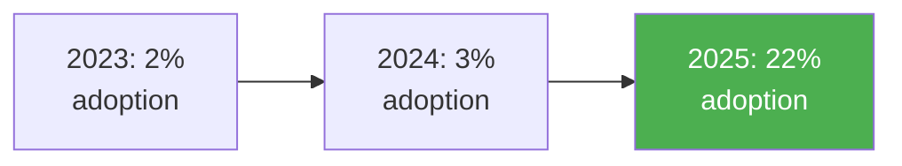
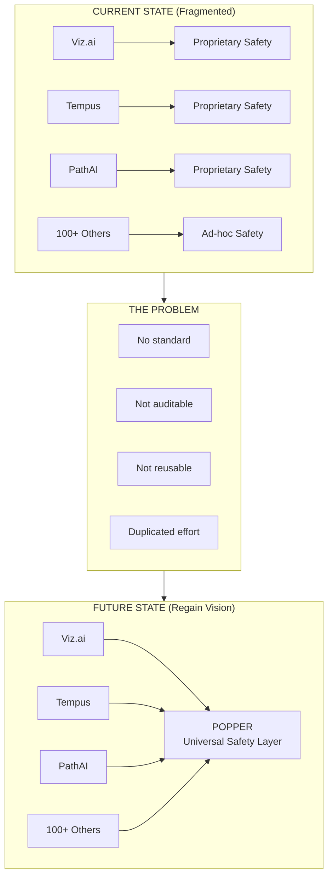

# Market Analysis: Clinical AI Safety & Reasoning

## Executive Summary

The healthcare AI market is experiencing explosive growth, from $26.6B in 2024 to a projected $187B by 2030. However, a critical gap exists: **no standardized, independent safety layer** for clinical AI. This analysis examines market dynamics, competitor strategies, and the opportunity for Regain's clinical agents system.

---

## 1. Market Size & Growth

### Global Healthcare AI Market

| Metric | Value | Source |
|--------|-------|--------|
| 2024 Market Size | $26.6 billion | [StartUs Insights](https://www.startus-insights.com/innovators-guide/ai-in-healthcare/) |
| 2030 Projected | $187 billion | StartUs Insights |
| CAGR (2024-2030) | 38.5% | StartUs Insights |
| 2024 YoY Funding Growth | ~20% | [McKinsey](https://www.mckinsey.com/industries/healthcare/our-insights/the-coming-evolution-of-healthcare-ai-toward-a-modular-architecture) |

### Subsegment Growth

| Segment | 2024 Size | CAGR | 2030 Projection |
|---------|-----------|------|-----------------|
| Radiology AI | $1.2B | 25% | $4.7B |
| Pathology AI | $135M | 27% | $1.15B |
| Clinical Decision Support | $2.1B | 35% | $12B |
| Drug Discovery AI | $1.8B | 40% | $15B |

*Source: [Grand View Research, JAMA Radiology 2024](https://intuitionlabs.ai/articles/imaging-pathology-ai-vendors)*

### Adoption Acceleration



According to [Menlo Ventures](https://menlovc.com/perspective/2025-the-state-of-ai-in-healthcare/):
- **22% of healthcare organizations** have implemented domain-specific AI tools (2025)
- This represents a **7x increase** over 2024
- Health systems lead (27% adoption), followed by outpatient providers (18%) and payers (14%)

---

## 2. Competitor Analysis

### Viz.ai (Imaging AI Leader)

| Attribute | Details |
|-----------|---------|
| **Focus** | FDA-cleared imaging AI for stroke, PE, cardiac conditions |
| **Business Model** | Subscription per algorithm + population size |
| **Deployment** | 1,000+ hospitals (US & Europe) |
| **Funding** | $250M+ raised |
| **Revenue (est.)** | ~$100M ARR |

**Key Strategies** ([Sacra](https://sacra.com/c/viz-ai/)):
- Land-and-expand: Start with stroke (high value, urgent), then upsell cardiology, pulmonary
- 12 FDA-cleared algorithms creates switching costs
- Mobile alerting + care coordination (not just AI detection)

**What We Can Learn**:
- Subscription per algorithm works at scale
- Hospital value = workflow integration, not just AI accuracy
- Expand from high-urgency use cases (builds trust)

---

### Tempus (Oncology + Data Giant)

| Attribute | Details |
|-----------|---------|
| **Focus** | Oncology genomics, precision medicine, data licensing |
| **Business Model** | Per-test genomics + data licensing |
| **Deployment** | 7,000+ oncologists, 600+ health systems |
| **Revenue (2024)** | [$693M](https://www.nasdaq.com/articles/tempus-ai-revenue-jumps-85-pricing-catalysts-line) |
| **Revenue (2025 proj.)** | $1.265B |
| **Public** | NASDAQ: TEM |

**Revenue Breakdown** ([Yahoo Finance](https://finance.yahoo.com/news/tempus-ai-revenue-mix-2026-144100757.html)):

| Segment | 2024 Revenue | % of Total | YoY Growth |
|---------|-------------|------------|------------|
| Genomics | $451.7M | 65% | 117% |
| Data & Services | $241.6M | 35% | 26% |

**Key Strategies** ([Dennis Gong Analysis](https://www.dennisgong.com/blog/tempusipo/)):
- **Two-sided flywheel**: More tests → more data → better AI → more tests
- **Data licensing**: Multi-year agreements with pharma (AstraZeneca pays hundreds of millions)
- **Vertical integration**: Own the lab, own the data, own the insights

**What We Can Learn**:
- Data is a revenue stream, not just a byproduct
- Multi-year enterprise contracts provide predictable revenue
- Pharma/payer partnerships unlock massive budgets

---

### PathAI (Digital Pathology)

| Attribute | Details |
|-----------|---------|
| **Focus** | AI-powered pathology for cancer diagnosis |
| **Business Model** | Lab integration + algorithm licensing |
| **Partnerships** | Quest Diagnostics, Bristol Myers Squibb |
| **Funding** | $240M+ raised |
| **Accuracy** | >95% IHC quantification ([JCO 2024](https://intuitionlabs.ai/articles/imaging-pathology-ai-vendors)) |

**Key Strategies**:
- Lab-as-a-Service model (AISight platform)
- Pharma partnerships for clinical trial support
- Focus on pathologist augmentation, not replacement

**What We Can Learn**:
- Pharma partnerships fund R&D while building credibility
- Augmentation messaging reduces clinician resistance
- Lab integration creates stickiness

---

### Comparison Matrix

| Dimension | Viz.ai | Tempus | PathAI | **Regain** |
|-----------|--------|--------|--------|------------|
| Disease Focus | Stroke, Cardiac, PE | Oncology | Cancer Pathology | **Disease-agnostic (cartridge model)** |
| Primary Customer | Hospitals | Oncologists + Pharma | Labs + Pharma | **Health systems + AI companies** |
| Safety Layer | Embedded (proprietary) | Embedded (proprietary) | Embedded (proprietary) | **Independent (open-source)** |
| B2B Opportunity | No | Data licensing | No | **Safety-as-a-Service** |
| Open Source | No | No | No | **Yes (Hermes + Popper)** |

---

## 3. Industry Governance Initiatives

### TRAIN Coalition (Trustworthy & Responsible AI Network)

Launched March 2024, [TRAIN](https://news.microsoft.com/source/2024/03/11/new-consortium-of-healthcare-leaders-announces-formation-of-trustworthy-responsible-ai-network-train-making-safe-and-fair-ai-accessible-to-every-healthcare-organization/) brings together major health systems and Microsoft:

**Members**:
- AdventHealth, Advocate Health, Boston Children's Hospital
- Cleveland Clinic, Duke Health, Johns Hopkins Medicine
- Mass General Brigham, MedStar Health, Mercy
- Mount Sinai, Northwestern Medicine, Providence
- Sharp HealthCare, UT Southwestern, UW Medicine
- Vanderbilt, **Microsoft** (technology partner)

**Mission**: Operationalize AI governance best practices from CHAI

**Implication for Regain**: These 16 health systems represent ideal early adopters for open, auditable safety infrastructure.

#### TRAIN Members: Specific Sales Targets

| Organization | Size | AI Status | Potential Contract |
|--------------|------|-----------|-------------------|
| **Cleveland Clinic** | 80K employees | TRAIN member, AI-forward | $200-500K/yr |
| **Providence** | 52 hospitals | TRAIN + AI3C member | $300-750K/yr |
| **Duke Health** | 50K employees | AI3C founding member | $200-400K/yr |
| **Mass General Brigham** | 82K employees | TRAIN member | $300-600K/yr |
| **Northwestern Medicine** | 11 hospitals | TRAIN member | $150-300K/yr |
| **Vanderbilt UMC** | 40K employees | TRAIN member | $200-400K/yr |
| **Johns Hopkins Medicine** | 43K employees | TRAIN member, research focus | $200-400K/yr |
| **VA Health System** | 171 medical centers | FedRAMP requirement | $1-5M/yr |

**Target**: 3-5 TRAIN members as pilot customers by Year 2 = $1-2M ARR

---

### CHAI (Coalition for Health AI)

| Metric | Value |
|--------|-------|
| Founded | 2022 |
| Members | 1,300+ organizations |
| Focus | Standards + labeling for AI transparency |

**Key Outputs**:
- AI labeling schema for algorithm transparency
- Best practice guidelines for trustworthy healthcare AI
- Testing frameworks for AI validation

**Relationship to TRAIN**: TRAIN builds on CHAI's principles to create practical implementation tools.

**Implication for Regain**: CHAI/TRAIN alignment could accelerate Hermes adoption as a standard.

---

## 4. FDA & Regulatory Landscape

### FDA-Cleared AI Devices

| Metric | Value | Source |
|--------|-------|--------|
| Total Cleared (all time) | 1,200+ | [FDA](https://www.fda.gov/regulatory-information/search-fda-guidance-documents/cybersecurity-medical-devices-quality-system-considerations-and-content-premarket-submissions) |
| Radiology % of Total | ~80% | [Radiology Business](https://radiologybusiness.com/topics/artificial-intelligence/radiology-dominates-fda-cleared-ai-reimbursement-lags-far-behind) |
| Annual Clearance Rate | Accelerating | FDA |

### The Reimbursement Gap

Despite 1,200+ FDA clearances, reimbursement lags significantly:

| CPT Code Type | Count (2026) | Notes |
|---------------|--------------|-------|
| Category 1 (national rates) | **2** | FFR-CT, coronary plaque |
| Category 3 (tracking only) | ~20 | No assigned fees |

> "As of January 2026, there will only be two CPT category 1 payment codes for newer AI, despite there being hundreds of FDA-cleared medical imaging algorithms." — [ACR](https://www.acr.org/Clinical-Resources/Publications-and-Research/ACR-Bulletin/the-economics-and-strategic-deployment-of-ai-in-radiology)

**Implication for Regain**: Don't rely on per-patient reimbursement; focus on:
- Enterprise contracts (health system budgets)
- B2B licensing (AI companies pay)
- Value-based arrangements (shared savings)

---

## 5. The Safety Gap: Regain's Opportunity

### Current State of Healthcare AI Safety



### Evidence of Need

| Signal | Source |
|--------|--------|
| "AI is named among top health tech hazards in 2024" | [ECRI](https://www.chiefhealthcareexecutive.com/view/ai-is-named-among-top-health-tech-hazards-in-2024) |
| "We don't have the right mechanisms in place to make sure [AI] is safe" | ECRI CEO Marcus Schabacker |
| Guardrails frameworks don't fully address healthcare needs | [arXiv Research](https://arxiv.org/abs/2409.17190) |
| HHS established AI in Healthcare Safety Program | [AHRQ PSO](https://pso.ahrq.gov/sites/default/files/wysiwyg/ai-healthcare-safety-program.pdf) |

### Unmet Market Need

**No existing product offers**:
1. Independent, deterministic safety supervision for clinical AI
2. Open, auditable policy engine (vs. opaque LLM-based filtering)
3. Disease-agnostic safety layer (works for any condition)
4. B2B "Safety-as-a-Service" licensing model

**This is Regain's opportunity**: Become the safety infrastructure layer for the entire healthcare AI industry.

---

## 6. Market Entry Strategy

### Target Customer Segments

| Segment | Size | Priority | Value Proposition |
|---------|------|----------|-------------------|
| **AI Health Startups** | 500+ | High | "Ship faster with FDA-grade safety" |
| **Health Systems** | ~6,000 US | High | "Audit all your AI vendors consistently" |
| **EHR Vendors** | 10 major | Medium | "Add AI safely to your platform" |
| **Pharma** | 50 major | Medium | "Ensure trial AI compliance" |
| **Digital Therapeutics** | 200+ | Medium | "Regulatory-ready safety layer" |

### Buyer Personas by Product

| Product | Economic Buyer | Technical Buyer | End User | Blocker |
|---------|---------------|-----------------|----------|---------|
| **Popper (Safety Layer)** | CISO / VP AI Governance | AI Platform Lead / DevOps | Developers, ML Engineers | Legal, Compliance, Procurement |
| **Deutsch API** | VP Product / CTO | ML Engineering Lead | Product Engineers | InfoSec, Privacy |
| **Disease Cartridges** | CMIO / Chief Clinical Officer | Clinical Informatics Dir | Clinicians, Care Teams | Medical Board, Pharmacy |
| **Enterprise On-Prem** | CIO / CFO | Enterprise Architect | IT Operations | Security, Budget |

**Sales cycle by persona**:

| Persona | Typical Cycle | Key Concerns | Decision Criteria |
|---------|---------------|--------------|-------------------|
| **CISO/Security** | 3-6 months | SOC2, penetration testing, SBOM | Security posture, audit trail |
| **CMIO/Clinical** | 6-12 months | Clinical validation, liability | Evidence, physician acceptance |
| **CTO/Engineering** | 2-4 months | Integration complexity, latency | API quality, documentation |
| **VP AI Governance** | 4-6 months | Policy enforcement, auditability | Compliance features, reporting |

#### AI Healthcare Startups: Specific Sales Targets

**Why they buy**: Skip 12-18 months of building safety infrastructure

| Company | Focus | Stage | Potential Contract |
|---------|-------|-------|-------------------|
| **Viz.ai** | Stroke detection | ~$100M ARR | $100-250K/yr |
| **Abridge Health** | Ambient scribes | Epic partnership | $50-100K/yr |
| **Glass Health** | Clinical LLM | Series A | $25-50K/yr |
| **Hippocratic AI** | Clinical agents | $120M raised | $75-150K/yr |
| **PathAI** | Pathology AI | $500M+ raised | $100-200K/yr |
| **Biofourmis** | Remote monitoring | 100K+ patients | $75-150K/yr |

**Market math**: 500+ AI health startups × 5% penetration = 25 customers × $50K avg = **$1.25M ARR**

#### EHR/Platform Vendors: White-Label Targets

| Company | Reach | Opportunity | Deal Size |
|---------|-------|-------------|-----------|
| **Epic** | 250M+ patients | White-label Popper for AI features | $500K-2M/yr |
| **Oracle/Cerner** | 100M+ patients | Safety API integration | $300K-1M/yr |
| **Meditech** | 2,500 hospitals | Safety supervision | $200-500K/yr |
| **Athenahealth** | 150K providers | Clinical AI safety | $200-500K/yr |

#### Digital Therapeutics: FDA Pathway Customers

| Company | Condition | Status | Potential Contract |
|---------|-----------|--------|-------------------|
| **Akili Interactive** | ADHD | FDA-cleared | $50-100K/yr |
| **Big Health** | Insomnia, anxiety | 1M+ users | $75-150K/yr |
| **Omada Health** | Diabetes prevention | 500K+ members | $100-200K/yr |
| **Livongo** (Teladoc) | Chronic conditions | Public company | $150-300K/yr |

### Competitive Positioning

```mermaid
quadrantChart
    title Healthcare AI Market Positioning
    x-axis Single Disease --> Multi-Disease
    y-axis Proprietary Safety --> Open Safety
    quadrant-1 Platform Play (Target)
    quadrant-2 Niche Open
    quadrant-3 Commodity
    quadrant-4 Point Solutions

    Viz.ai: [0.2, 0.2]
    Tempus: [0.3, 0.2]
    PathAI: [0.2, 0.2]
    Regain: [0.8, 0.85]
```

**Regain's unique position**: Multi-disease capability (cartridge model) + open safety layer creates an uncontested market space.

---

## 7. Key Metrics to Track

### Market Indicators

| Metric | Current | Target (3yr) |
|--------|---------|--------------|
| FDA AI clearances/year | ~200 | Monitor growth |
| TRAIN coalition members | 16 | Expand partnerships |
| Hermes npm downloads | 0 | 10,000+/month |
| Safety-as-a-Service customers | 0 | 20-50 |

### Competitor Movements

| Watch For | Why It Matters |
|-----------|----------------|
| Viz.ai expands to clinical decision support | Direct competition |
| Tempus enters cardiovascular | Cartridge priority |
| Microsoft offers safety layer | Validates market; potential competitor or partner |
| New CHAI/TRAIN standards published | Align Hermes to standard |

---

## Summary

The healthcare AI market is rapidly expanding, but fragmented on safety. Major health systems are organizing (TRAIN, CHAI) to demand better governance. Competitors (Viz.ai, Tempus, PathAI) have validated enterprise demand but use proprietary, opaque safety. The regulatory landscape (1,200+ FDA clearances, minimal reimbursement) favors enterprise sales over per-patient billing.

**Regain's opportunity**: Fill the uncontested "Safety-as-a-Service" gap with open-source Hermes + Popper, while monetizing Deutsch + cartridges.

---

## Sources

- [StartUs Insights: AI in Healthcare 2025-2030](https://www.startus-insights.com/innovators-guide/ai-in-healthcare/)
- [Menlo Ventures: 2025 State of AI in Healthcare](https://menlovc.com/perspective/2025-the-state-of-ai-in-healthcare/)
- [McKinsey: Healthcare AI Modular Architecture](https://www.mckinsey.com/industries/healthcare/our-insights/the-coming-evolution-of-healthcare-ai-toward-a-modular-architecture)
- [Sacra: Viz.ai Analysis](https://sacra.com/c/viz-ai/)
- [Nasdaq: Tempus AI Revenue](https://www.nasdaq.com/articles/tempus-ai-revenue-jumps-85-pricing-catalysts-line)
- [IntuitionLabs: Imaging & Pathology AI Vendors](https://intuitionlabs.ai/articles/imaging-pathology-ai-vendors)
- [Microsoft: TRAIN Coalition](https://news.microsoft.com/source/2024/03/11/new-consortium-of-healthcare-leaders-announces-formation-of-trustworthy-responsible-ai-network-train-making-safe-and-fair-ai-accessible-to-every-healthcare-organization/)
- [ECRI: AI Health Tech Hazards](https://www.chiefhealthcareexecutive.com/view/ai-is-named-among-top-health-tech-hazards-in-2024)
- [arXiv: Enhancing Guardrails for Healthcare AI](https://arxiv.org/abs/2409.17190)
- [Radiology Business: FDA AI Reimbursement Gap](https://radiologybusiness.com/topics/artificial-intelligence/radiology-dominates-fda-cleared-ai-reimbursement-lags-far-behind)
