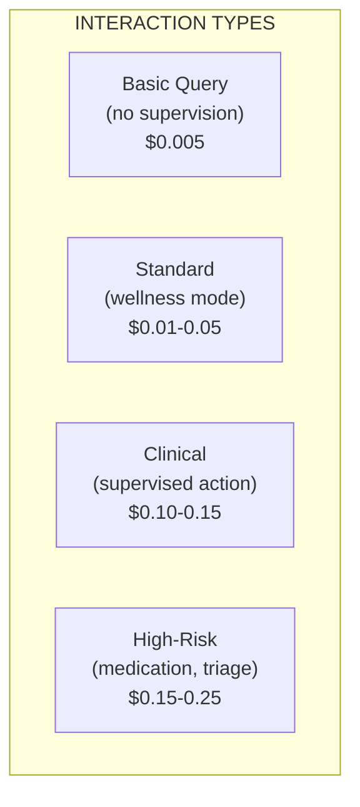
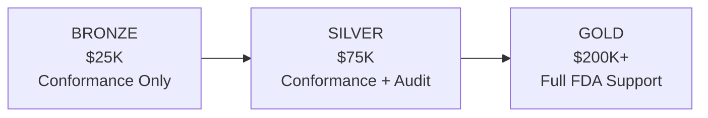

# Pricing Strategy: Clinical Agents System

## Executive Summary

This document defines pricing tiers for Regain's clinical agents system across all product lines. Pricing is benchmarked against healthcare AI market data and structured to maximize adoption (open-source layers) while capturing value (proprietary intelligence).

---

## 1. Market Pricing Benchmarks

### Healthcare AI Pricing Landscape

| Category | Price Range | Source |
|----------|-------------|--------|
| **Healthcare AI per interaction** | $1.00-3.00+ | [Everest Group](https://www.everestgrp.com/healthcare-industry/optimizing-pricing-strategies-for-healthcare-ai-startups-expert-insights-for-payer-and-provider-innovation-blog.html) |
| **General SaaS AI per interaction** | $0.15-1.00 | [Monetizely](https://www.getmonetizely.com/articles/what-are-the-pricing-benchmarks-for-ai-customer-service-in-2024) |
| **Basic AI per interaction** | $0.05-0.15 | Monetizely |
| **Diagnostic AI per-patient** | $5-50/analysis | [Monetizely Healthcare](https://www.getmonetizely.com/articles/how-much-does-healthcare-ai-cost-pricing-and-regulatory-factors-to-consider) |
| **Enterprise clinical AI (medium)** | $175K-350K/year | [KLAS Research](https://www.biz4group.com/blog/cost-of-implementing-ai-in-healthcare) |
| **Direct patient care AI premium** | 25-45% over admin AI | [Black Book Market Research](https://www.getmonetizely.com/articles/how-much-does-healthcare-ai-cost-pricing-and-regulatory-factors-to-consider) |

### Key Insight: Healthcare Commands Premium Pricing

Healthcare AI typically commands **3-10x higher pricing** than general SaaS AI due to:
- Regulatory compliance requirements (FDA, HIPAA)
- Clinical liability considerations
- Higher validation/testing costs
- Smaller, specialized markets

---

## 2. Popper Pricing (Safety-as-a-Service)

### Tier Structure

```mermaid
graph LR
    subgraph Free["POPPER COMMUNITY\n$0"]
        F1[Open-source core]
        F2[Basic policy packs]
        F3[Community support]
        F4[No SLA]
    end

    subgraph Pro["POPPER PRO\n$10K/year"]
        P1[Everything in Community]
        P2[99.9% SLA]
        P3[Email support]
        P4[Basic ops dashboard]
        P5[1 organization]
    end

    subgraph Health["POPPER HEALTH\n$50K/year"]
        H1[Everything in Pro]
        H2[FDA-ready audit trails]
        H3[HIPAA BAA included]
        H4[Clinical policy packs]
        H5[24/7 support]
        H6[5 organizations]
    end

    subgraph Audit["POPPER AUDIT\nCustom pricing"]
        A1[Everything in Health]
        A2[Regulatory export bundles]
        A3[Incident triage workflows]
        A4[Dedicated CSM]
        A5[On-call safety ops]
        A6[Unlimited orgs]
    end

    Free --> Pro --> Health --> Audit
```

### Detailed Tier Comparison

| Feature | Community | Pro | Health | Audit |
|---------|-----------|-----|--------|-------|
| **Price** | $0 | $10K/yr | $50K/yr | Custom |
| **Target** | Startups, pilots | SMB AI companies | Health systems | Enterprise/Pharma |
| **Core engine** | Yes | Yes | Yes | Yes |
| **Base policy packs** | Yes | Yes | Yes | Yes |
| **Clinical policy packs** | No | No | Yes | Yes |
| **SLA** | None | 99.9% | 99.95% | 99.99% |
| **Dashboard** | CLI only | Basic ops | Full analytics | Enterprise SLA |
| **Support** | Community | Email (48hr) | 24/7 (4hr) | Dedicated |
| **Organizations** | 1 | 1 | 5 | Unlimited |
| **HIPAA BAA** | No | Add-on ($5K) | Included | Included |
| **FDA audit trails** | Basic | Standard | Enhanced | Full export |
| **Safe-mode controls** | Limited | Full | Full | Full + ops |
| **Incident triage** | No | No | Email alerts | Full workflow |
| **Regulatory exports** | No | No | De-identified | Full bundles |
| **Dedicated CSM** | No | No | No | Yes |

**Dashboard tiers explained**:
- **CLI only**: Command-line tools for policy management
- **Basic ops**: Policy status, audit log viewer, safe-mode controls
- **Full analytics**: + Decision distribution, latency metrics, trend reports
- **Enterprise SLA**: + Custom dashboards, SIEM integration, real-time alerting

### Usage-Based Add-Ons

| Add-On | Price | Notes |
|--------|-------|-------|
| Additional organizations | $5K/org/yr | For Pro/Health tiers |
| HIPAA BAA (Pro tier) | $5K/yr | Included in Health+ |
| Custom policy pack development | $25K one-time | Plus maintenance |
| Priority support upgrade | $10K/yr | 4hr → 1hr response |
| On-premise deployment | +50% tier price | Self-hosted option |

### Rationale

- **Free tier** drives adoption and becomes the industry standard
- **Pro tier** converts serious AI companies at low friction
- **Health tier** captures health system value with compliance features
- **Audit tier** premium for enterprises needing full regulatory support

---

## 3. Deutsch API Pricing (Clinical Intelligence)

### Tier Structure

| Tier | Target | Price | Volume |
|------|--------|-------|--------|
| **Developer** | Startups, prototyping | $0.01/interaction | Up to 10K/month |
| **Growth** | Scaling companies | $0.05/interaction | 10K-100K/month |
| **Clinical** | Health-focused apps | $0.15/interaction | 100K-1M/month |
| **Enterprise** | Health systems | Custom (contact sales) | 1M+/month |

### Per-Interaction Pricing Details

| Interaction Type | Developer | Growth | Clinical | Enterprise |
|------------------|-----------|--------|----------|------------|
| Basic query (no Popper) | $0.005 | $0.02 | $0.05 | Custom |
| Wellness supervision | $0.01 | $0.05 | $0.10 | Custom |
| Clinical supervision | $0.015 | $0.08 | $0.15 | Custom |
| High-risk (medication) | $0.02 | $0.10 | $0.20 | Custom |

### Billable Unit Definitions

Each interaction type maps to a specific compute path:

| Type | What's Included | Compute Path | Cost Driver |
|------|-----------------|--------------|-------------|
| **Basic Query** | Simple Q&A, no safety supervision | Small model (Azure OpenAI GPT-4o-mini), no Popper, no audit | LLM tokens only (~$0.002-0.005) |
| **Wellness Supervised** | Lifestyle advice with safety check | Medium model + Popper evaluation, basic audit | LLM + deterministic rules (~$0.01-0.03) |
| **Clinical Supervised** | Full ArgMed reasoning with supervision | Large model + full debate + Popper + audit bundle | Multi-turn LLM + rules (~$0.05-0.15) |
| **High-Risk** | Medication/triage with escalation capability | Full debate + multi-round Popper + escalation hooks + complete audit | Full compute + ops overhead (~$0.10-0.25) |

**Tier Rationale**:
- **Developer tier** is a loss leader (10K/mo cap) to drive adoption
- **Growth tier** approaches cost-neutral at volume
- **Clinical tier** captures margin for supervised interactions
- **Enterprise** uses volume discounts to offset higher compliance overhead

### Enterprise Contract Structures

| Model | Typical Range | Best For |
|-------|---------------|----------|
| **Annual commitment** | $100K-500K/yr | Predictable volume |
| **Per-patient-per-month** | $0.50-5.00 PPPM | Population health |
| **Per-clinician seat** | $500-2,000/seat/yr | Provider-facing tools |
| **Unlimited enterprise** | $500K-2M/yr | Large IDNs |

### Enterprise Pricing Factors

| Factor | Impact on Price |
|--------|-----------------|
| Volume commitment | -20% to -40% |
| Multi-year contract | -10% to -20% |
| Cartridge bundle | -15% per additional |
| On-premise deployment | +50% to +100% |
| Custom integration | +$50K-200K one-time |

---

## 4. Cost Structure & Unit Economics

### Infrastructure Costs (Monthly at Scale)

| Component | Low Volume (10K/mo) | High Volume (1M/mo) | Notes |
|-----------|--------------------|--------------------|-------|
| **LLM Inference** (ArgMed debates) | $500-1,000 | $5,000-20,000 | Azure OpenAI (GPT-4o) at $5/1M input tokens |
| **Popper Compute** (deterministic) | $100 | $1,150 | No LLM = low cost |
| **Database + Audit Storage** | $200 | $2,000 | DynamoDB/Postgres |
| **Cloud Hosting** | $500 | $5,000 | AWS/GCP |
| **HIPAA Compliance Overhead** | +15% | +15% | BAA, audits, security |
| **Total COGS** | ~$1,500/mo | ~$35,000/mo | |

**Source**: [LLM API pricing 2025](https://intuitionlabs.ai/articles/llm-api-pricing-comparison-2025)

### Why Popper Has Higher Margins Than Deutsch

| Factor | Popper | Deutsch |
|--------|--------|---------|
| **Primary compute** | Deterministic rules | LLM inference |
| **Cost per decision** | ~$0.001 | ~$0.05-0.10 |
| **Latency** | <20ms | 200-500ms |
| **Scaling cost** | Linear (cheap) | Linear (expensive) |

### Unit Economics by Product Line

| Metric | Popper | Deutsch API | Blended |
|--------|--------|-------------|---------|
| **Gross Margin** | 75-80% | 50-60% | 65-70% |
| **CAC** | $5,000 | $15,000 | $12,000 |
| **LTV** | $75,000 | $150,000 | $100,000 |
| **LTV:CAC** | 15:1 | 10:1 | 8:1 |
| **Payback Period** | 8 months | 12 months | 10 months |
| **Net Revenue Retention** | 115% | 125% | 120% |

### Margin Sensitivity Analysis

| Scenario | Deutsch Margin | Popper Margin | Blended |
|----------|----------------|---------------|---------|
| **Base case** | 55% | 77% | 67% |
| **LLM costs +50%** | 45% | 77% | 60% |
| **LLM costs -50%** | 65% | 77% | 72% |
| **Volume 10x** | 60% | 80% | 70% |

**Key insight**: Popper's deterministic architecture provides margin stability regardless of LLM price volatility.

---

## 5. Cartridge Marketplace Pricing

### First-Party Cartridges (Regain-Developed)

| Cartridge | Annual License | Notes |
|-----------|---------------|-------|
| **CVD (Heart Failure, Post-MI)** | $75K/yr | Launch cartridge |
| **Diabetes (Type 2)** | $75K/yr | Year 2 priority |
| **Oncology (Supportive Care)** | $100K/yr | Higher complexity |
| **Mental Health** | $50K/yr | Lower clinical risk |
| **Chronic Kidney Disease** | $75K/yr | Common comorbidity |

### Bundle Pricing

| Bundle | List Price | Bundle Price | Savings |
|--------|------------|--------------|---------|
| CVD + Diabetes | $150K | $120K | 20% |
| CVD + Diabetes + CKD | $225K | $170K | 24% |
| All 5 Cartridges | $375K | $275K | 27% |

### Third-Party Cartridge Revenue Share

| Party | Revenue Split |
|-------|---------------|
| Cartridge Developer | 70% |
| Regain (platform) | 30% |

**Certification Fee**: $25K one-time (covers Hermes conformance testing + safety validation)

### Clinical Society Partnerships

| Partner Type | Model | Example |
|--------------|-------|---------|
| Society-branded | Co-development + royalty | "AHA Certified CVD Cartridge" |
| Society-endorsed | Endorsement fee + marketing | "Recommended by ACC" |
| Society-developed | Higher rev share (80/20) | Specialty society creates cartridge |

---

## 6. Certification Program Pricing

### "Hermes Certified" Program

| Service | Price | Includes |
|---------|-------|----------|
| **Conformance Testing** | $25K one-time | Automated test suite, badge, listing |
| **Integration Audit** | $50K one-time | Expert review, security check, certification |
| **FDA Submission Support** | $200K+ | Regulatory consulting, documentation |
| **Annual Recertification** | $15K/yr | Ongoing compliance, badge renewal |

### Certification Tiers

| Level | Price | Includes | Badge |
|-------|-------|----------|-------|
| **Bronze** | $25K | Conformance testing only | "Hermes Compatible" |
| **Silver** | $75K | + Integration audit | "Hermes Certified" |
| **Gold** | $200K+ | + FDA submission support | "Hermes Certified (FDA Ready)" |

---

## 7. Enterprise On-Premise Pricing

### Deployment Options

| Option | Pricing Model | Typical Range |
|--------|--------------|---------------|
| **Cloud (default)** | Subscription | As above |
| **Dedicated cloud** | +25-50% | Higher isolation |
| **On-premise** | +50-100% | Self-hosted |
| **Air-gapped** | +100-150% | Disconnected networks |

### On-Premise Package

| Component | One-Time | Annual |
|-----------|----------|--------|
| **License (Popper + Deutsch)** | - | $300K-1M |
| **Installation & config** | $50K-100K | - |
| **Training** | $25K | - |
| **Support (8x5)** | - | $50K |
| **Support (24x7)** | - | $100K |
| **Dedicated engineer** | - | $300K |

### VA/DoD Considerations

| Factor | Adjustment |
|--------|------------|
| FedRAMP requirements | +$100K setup + $50K/yr |
| ITAR compliance | +$200K setup |
| Air-gap deployment | +100% license |
| Cleared personnel required | +$150K/yr per person |

---

## 8. Value-Based Pricing Options

### Risk-Sharing Models

| Model | Structure | Best For |
|-------|-----------|----------|
| **Gainsharing** | Base + % of documented savings | Payers, ACOs |
| **Outcome-based** | Lower base, premium for outcomes | Value-based contracts |
| **Pilot-to-production** | Free pilot, standard pricing post-proof | Risk-averse buyers |

### Gainsharing Example

| Component | Amount |
|-----------|--------|
| Base annual fee | $150K |
| Savings share | 15% of documented cost reduction |
| Cap | $500K total annual payment |

### Operational Guarantees

| Guarantee Type | Structure | Notes |
|----------------|-----------|-------|
| **Uptime SLA** | Credits for downtime below 99.9% | Pro-rated monthly credits |
| **Response Time SLA** | Credits if p99 latency > 500ms | Measured at API gateway |
| **Audit Completeness SLA** | Credits if audit artifacts missing | Every supervision event logged |
| **Conformance SLA** | Credits if Hermes validation fails | Schema compliance guaranteed |

> **Note on Clinical Guarantees**: Popper provides deterministic policy enforcement and audit trails, but does not warrant clinical correctness of AI outputs. Clinical outcomes remain the responsibility of the licensed healthcare provider using the system.

---

## 9. Competitive Positioning

### Price Comparison vs. Market

| Product | Regain Price | Market Comparable | Position |
|---------|--------------|-------------------|----------|
| Clinical AI per interaction | $0.10-0.25 | $1.00-3.00 | **Undercut 75%+** |
| Enterprise annual | $200K-500K | $175K-350K | **Premium (safety included)** |
| Safety layer (Popper) | $10K-50K | N/A (build yourself) | **New category** |
| Disease cartridge | $50K-100K | N/A (build yourself) | **New category** |

### Value Proposition by Segment

| Segment | Message | Price Anchor |
|---------|---------|--------------|
| AI Startups | "Ship 6 months faster" | $100K+ saved in dev time |
| Health Systems | "One safety layer for all AI" | $500K+ saved vs. per-vendor |
| Pharma | "Accelerate trial AI compliance" | Priceless (trial timeline) |
| EHR Vendors | "Add AI without liability" | Partnership value |

---

## 10. Discounting Guidelines

### Standard Discount Matrix

| Condition | Discount |
|-----------|----------|
| 2-year commitment | 10% |
| 3-year commitment | 20% |
| 100%+ volume increase YoY | 10% |
| Academic/nonprofit | 25-50% |
| Strategic partnership | Case-by-case |
| Pilot conversion (<90 days) | 10% |

### Discount Limits

| Role | Max Discount Authority |
|------|----------------------|
| Sales Rep | 10% |
| Sales Manager | 20% |
| VP Sales | 30% |
| CEO | Unlimited (with justification) |

### Never Discount

- Certification fees (maintains credibility)
- Support hours (maintains quality)
- SLA commitments (maintains trust)

---

## 11. Pricing Review Cadence

| Review | Frequency | Scope |
|--------|-----------|-------|
| Competitive analysis | Quarterly | Market rates |
| Cost structure | Semi-annual | Margins |
| Tier thresholds | Annual | Volume breakpoints |
| Full pricing reset | Bi-annual | All products |

---

## Summary Pricing Card

| Product | Entry Point | Mid-Market | Enterprise |
|---------|-------------|------------|------------|
| **Popper** | $0 (Community) | $50K/yr (Health) | Custom |
| **Deutsch API** | $0.01/interaction | $0.10/interaction | Custom |
| **Cartridge** | $50K/yr | $75K/yr | Bundle discount |
| **Certification** | $25K | $75K | $200K+ |
| **On-Premise** | - | - | $300K-1M/yr |

---

## Sources

- [Everest Group: Healthcare AI Pricing](https://www.everestgrp.com/healthcare-industry/optimizing-pricing-strategies-for-healthcare-ai-startups-expert-insights-for-payer-and-provider-innovation-blog.html)
- [Monetizely: AI Customer Service Benchmarks](https://www.getmonetizely.com/articles/what-are-the-pricing-benchmarks-for-ai-customer-service-in-2024)
- [Monetizely: Healthcare AI Costs](https://www.getmonetizely.com/articles/how-much-does-healthcare-ai-cost-pricing-and-regulatory-factors-to-consider)
- [Biz4Group: AI Implementation Costs](https://www.biz4group.com/blog/cost-of-implementing-ai-in-healthcare)
- [L.E.K.: AI SaaS Pricing](https://www.lek.com/insights/tmt/us/ei/future-role-generative-ai-saas-pricing)
- [Pilot: AI Pricing Economics](https://pilot.com/blog/ai-pricing-economics-2025)
