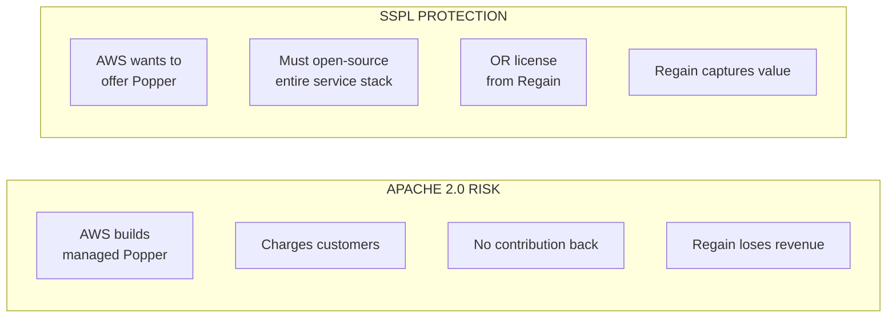
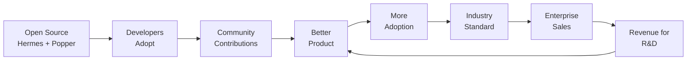
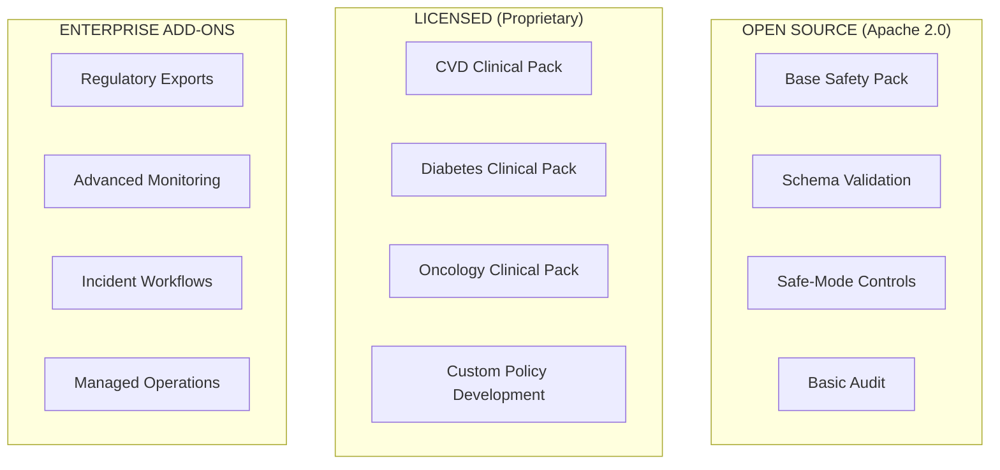
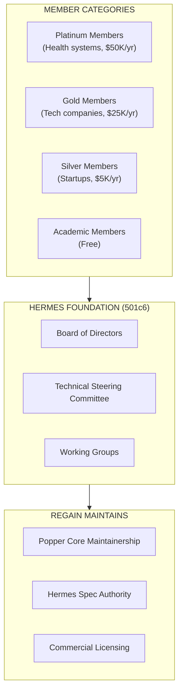

# Open Source Strategy: Hermes & Popper

## Executive Summary

This document details the open-source strategy for Regain's clinical agents system. The approach follows an **open-core model**: release Hermes (protocol) and Popper core (safety engine) as open source to establish industry standards, while monetizing through managed services, enterprise features, and proprietary components (Deutsch, cartridges).

---

## 1. Licensing Decisions

### Component Licensing Matrix

| Component | Recommended License | Rationale |
|-----------|---------------------|-----------|
| **Hermes (Protocol)** | Apache 2.0 | Maximum adoption; protocol should be universal |
| **Popper Core** | SSPL (MongoDB-style) | Open but protected from cloud providers |
| **Popper Policy Packs** | Dual (Apache 2.0 base / Proprietary clinical) | Free basics, licensed clinical packs |
| **Deutsch Engine** | Proprietary (closed) | Core IP; revenue driver |
| **Disease Cartridges** | Proprietary (licensed) | High-value clinical knowledge |
| **Regain App** | Proprietary (closed) | Implementation; not reusable |

### Why SSPL for Popper Core (Not Pure Apache 2.0)

The **Server Side Public License (SSPL)** protects against cloud providers offering a competing managed service:



**SSPL Precedents**:
- [MongoDB](https://www.mongodb.com/legal/licensing/server-side-public-license/faq): FY2025 revenue $2.01B
- [Redis](https://redis.io/legal/licenses/): Adopted SSPL/RSALv2 in 2024
- [Elastic](https://www.theregister.com/2024/03/22/redis_changes_license/): SSPL + Elastic License

### SSPL Considerations

| Factor | Impact |
|--------|--------|
| **OSI approval** | SSPL is NOT OSI-approved (not "open source" technically) |
| **Enterprise acceptance** | Most enterprises accept SSPL for internal use |
| **Fork risk** | AWS/Google may fork (like [Valkey](https://www.theregister.com/2024/03/22/redis_changes_license/) for Redis) |
| **Community sentiment** | Mixed; some prefer true open source |

### Alternative: AGPL Option

For maximum open-source credibility, consider **dual-licensing**:

| License | Use Case |
|---------|----------|
| SSPL | Default for all users |
| AGPL | For organizations requiring OSI-approved license |

This matches [Elastic's 2024 approach](https://www.theregister.com/2024/03/22/redis_changes_license/): added AGPLv3 as a third option alongside SSPL and ELv2.

---

## 2. Open-Source Benefits

### Strategic Value

| Benefit | Mechanism | Expected Outcome |
|---------|-----------|------------------|
| **Industry standard** | Everyone uses Hermes contracts | Regain controls the spec |
| **Regulatory trust** | Auditable code + deterministic behavior | Faster FDA engagement |
| **Hospital adoption** | Self-hostable, inspectable | TRAIN coalition members adopt |
| **Talent attraction** | Engineers want open-source work | Easier hiring |
| **Ecosystem** | Third parties build on Hermes | Network effects |
| **Credibility** | Transparent safety claims | Academic validation |

### Adoption Flywheel



---

## 3. What to Open Source

### Hermes (Protocol Library)

**Package Structure**:
```
@regain/hermes
├── @regain/hermes-core         # Base types, trace, IDs, errors
├── @regain/hermes-supervision  # SupervisionRequest/Response
├── @regain/hermes-control      # Control plane schemas
├── @regain/hermes-audit        # Audit events, disclosure bundles
├── @regain/hermes-fhir         # FHIR interop types (optional)
└── @regain/hermes-mcp          # MCP adapter (optional)
```

**What's Included**:
- Zod schemas for all message types
- TypeScript type definitions
- Validation utilities
- Fixture packs for conformance testing
- Documentation site
- Example implementations

**What's NOT Included**:
- Actual safety logic (that's Popper)
- Clinical knowledge (that's cartridges)
- Implementation code (that's Regain app)

---

### Popper Core (Safety Engine)

**Included in Open Core**:

| Component | Description |
|-----------|-------------|
| Safety DSL engine | Rule evaluation, boolean composition, grammar/syntax |
| Base policy pack | Minimal safety rules (examples only, not clinical-grade) |
| Hermes validation | Request/response checking against protocol schemas |
| Basic audit trails | Event logging (joinable by trace_id) |
| Safe-mode API | Enable/disable safe mode controls |
| HTTP server skeleton | Reference implementation for self-hosting |

**NOT Included (Proprietary)**:

| Component | Why Proprietary |
|-----------|-----------------|
| Clinical policy packs | Domain expertise (CVD, Diabetes, etc.); licensed value |
| DSL performance optimizations | Compiler/runtime tuning; competitive advantage |
| Policy authoring tooling | Clinical rule development IDE; enterprise feature |
| Advanced monitoring | Enterprise SLA dashboards; differentiator |
| Incident triage workflows | Enterprise compliance feature |
| Regulatory export bundles | FDA/audit-ready documentation; compliance value |
| 24/7 operations tooling | Managed service value |

### Policy Pack Tiers



---

## 4. Governance Model

### Option A: Single-Company Stewardship

Regain maintains full control with community input.

| Pros | Cons |
|------|------|
| Fast decisions | Less credibility with competitors |
| Clear direction | Single point of failure |
| Simpler legal | May limit enterprise trust |

### Option B: Foundation Model (Recommended)

Create a neutral foundation with industry participation.

| Pros | Cons |
|------|------|
| Industry credibility | Slower decisions |
| Neutral ground for competitors | Governance overhead |
| Health system participation | Requires initial funding |

**Proposed Structure**:



### Foundation Precedents

| Foundation | Model | Funding |
|------------|-------|---------|
| **Linux Foundation** | Project-based | $100M+ budget |
| **Apache Foundation** | Consensus-based | $2M budget |
| **OpenSSL Foundation** | Small, focused | $1M budget |
| **CNCF** | Vendor-neutral | $50M+ budget |

**Recommendation**: Start with single-company stewardship (Option A), announce intent to form foundation within 2 years once adoption proves demand.

---

## 5. Cloud Provider Strategy

### The AWS/Google/Microsoft Challenge

Cloud providers may:
1. **Fork and compete** (DocumentDB vs MongoDB)
2. **Build compatible alternatives** (Valkey vs Redis)
3. **Partner and distribute** (Azure offers MongoDB)
4. **Acquire** (Google + Looker pattern)

### Defense Strategies

| Strategy | Implementation |
|----------|----------------|
| **SSPL licensing** | Prevents direct hosting without contribution |
| **Rapid innovation** | Stay ahead of forks with features |
| **Community building** | Make the ecosystem harder to replicate |
| **Enterprise focus** | Forks lack compliance/support features |
| **Standard ownership** | Hermes spec evolution stays with Regain |

### Partnership Option

Rather than compete with cloud providers:

| Cloud Partner | Opportunity |
|---------------|-------------|
| **Microsoft Azure** | Already leads TRAIN coalition; natural ally |
| **AWS HealthLake** | Needs safety layer for FHIR AI |
| **Google Health AI** | HAI-DEF needs clinical safety |

**Ideal Partnership Structure**:
- Cloud provider distributes Popper managed service
- Regain receives % of revenue
- Regain maintains development
- Cloud provider handles infrastructure at scale

---

## 6. Community Building

### Initial Community Targets

| Segment | Why Target | Engagement Strategy |
|---------|------------|---------------------|
| **Health AI startups** | Early adopters | Free tier, developer advocacy |
| **Academic researchers** | Credibility, publications | Free access, co-authorship |
| **Clinical informaticists** | Hospital champions | Webinars, case studies |
| **EHR integration teams** | Implementation partners | Technical docs, certification |

### Community Programs

| Program | Description | Investment |
|---------|-------------|------------|
| **Ambassador Program** | Power users get early access, swag | $25K/yr |
| **Research Grants** | Fund academic Hermes/Popper research | $100K/yr |
| **Hackathons** | Quarterly virtual events | $50K/yr |
| **Conference Talks** | HIMSS, AMIA, etc. | $75K/yr |
| **Documentation** | Comprehensive, maintained docs | $100K/yr |

### Success Metrics

| Metric | Year 1 Target | Year 3 Target |
|--------|---------------|---------------|
| GitHub stars (Hermes) | 1,000 | 10,000 |
| npm downloads/month | 5,000 | 50,000 |
| Contributors | 50 | 200 |
| Production deployments | 20 | 200 |
| Certified integrations | 5 | 50 |

---

## 7. Intellectual Property Protection

### What's Protected

| IP Type | Protection Method | Notes |
|---------|-------------------|-------|
| **Hermes spec** | Copyright + trademark | Open protocol (Apache 2.0) |
| **Popper core** | Copyright (SSPL) | Includes DSL engine + basic rules |
| **Safety DSL grammar/engine** | Open (SSPL) | Rule evaluation, boolean composition |
| **Safety DSL optimizations** | Trade secret | Performance tuning, compiler optimizations |
| **Policy authoring tools** | Trade secret | Clinical rule development tooling |
| **Clinical policy packs** | Trade secret + copyright | Disease-specific rules (CVD, Diabetes) |
| **Deutsch** | Trade secret + copyright | Full reasoning engine |
| **Cartridges** | Trade secret + copyright | Domain-specific clinical knowledge |

> **Clarification**: The Safety DSL has two layers:
> 1. **Open**: Grammar, syntax, rule evaluation engine (included in Popper SSPL)
> 2. **Proprietary**: Performance optimizations, authoring tools, and all clinical policy content

### Trademark Strategy

| Mark | Purpose |
|------|---------|
| **HERMES™** | Protocol name |
| **POPPER™** | Safety engine name |
| **HERMES CERTIFIED™** | Certification badge |
| **ADVOCATE™** | Program name (with ARPA-H) |

### Contributor License Agreement (CLA)

All contributors must sign CLA granting Regain:
- Perpetual license to contributions
- Right to relicense (dual-licensing model)
- Patent license for contributions

Standard practice: [Apache ICLA](https://www.apache.org/licenses/contributor-agreements.html) or [CLA Assistant](https://cla-assistant.io/).

---

## 8. Open Source Risks & Mitigations

### Risk: Fork Takes Market Share

**Example**: Valkey forked from Redis in April 2024 with AWS/Google backing.

**Mitigation**:
- Rapid release cadence (harder to keep up)
- Enterprise features not in open core
- Community relationships
- Certification program creates lock-in

### Risk: Poor Community Reception

**Mitigation**:
- Be transparent about commercial intent
- Generous free tier
- Responsive to issues/PRs
- Invest in documentation

### Risk: Security Vulnerabilities

**Mitigation**:
- Security-focused development practices
- Bug bounty program ($5K-50K rewards)
- Responsible disclosure policy
- Regular security audits (annual, $50K+)

### Risk: Compliance Concerns (HIPAA, FDA)

**Mitigation**:
- Clear documentation of compliance scope
- Shared responsibility model (like AWS)
- Compliance-focused managed service tier
- Regular compliance attestations

---

## 9. Release Strategy

### Initial Release Plan

| Phase | Timeline | Scope |
|-------|----------|-------|
| **Private Preview** | Month 0-3 | 5-10 design partners |
| **Public Beta** | Month 3-6 | Open GitHub, npm publish |
| **GA (v1.0)** | Month 6-9 | Stable APIs, SLAs |
| **Enterprise GA** | Month 9-12 | Managed service launch |

### Release Artifacts

| Artifact | Channel |
|----------|---------|
| Source code | GitHub (regain-org/hermes, regain-org/popper) |
| npm packages | npmjs.com (@regain/hermes, @regain/popper) |
| Docker images | Docker Hub, GitHub Container Registry |
| Helm charts | Artifact Hub |
| Documentation | docs.regain.health |

### Versioning

Follow [Semantic Versioning](https://semver.org/):
- **MAJOR**: Breaking changes to Hermes contracts
- **MINOR**: New features, backward compatible
- **PATCH**: Bug fixes, security patches

Breaking changes require 6-month deprecation notice (enterprise expectation).

---

## 10. Success Criteria

### Year 1

| Metric | Target |
|--------|--------|
| GitHub stars | 1,000+ |
| npm downloads | 5,000/month |
| Production deployments | 20+ |
| Enterprise customers | 3+ |
| Community contributors | 50+ |

### Year 3

| Metric | Target |
|--------|--------|
| GitHub stars | 10,000+ |
| npm downloads | 50,000/month |
| Production deployments | 200+ |
| Enterprise customers | 50+ |
| Certified integrations | 50+ |
| Foundation formation | Complete |

---

## Summary

Open-sourcing Hermes (Apache 2.0) and Popper core (SSPL) creates a strategic moat:

1. **Industry standard** - Control the protocol that everyone uses
2. **Regulatory trust** - Auditable safety layer for FDA/health systems
3. **Cloud protection** - SSPL prevents competing managed services
4. **Ecosystem** - Third parties build on the platform
5. **Value capture** - Monetize through managed service, clinical packs, Deutsch, and certifications

The open-core model has proven successful at MongoDB ($2B revenue), Redis, and Elastic. Healthcare's regulatory requirements make an auditable, open safety layer even more valuable.

---

## Sources

- [MongoDB SSPL FAQ](https://www.mongodb.com/legal/licensing/server-side-public-license/faq)
- [Redis Licensing Changes](https://redis.io/legal/licenses/)
- [Elastic License Changes](https://www.theregister.com/2024/03/22/redis_changes_license/)
- [HashiCorp BSL Adoption](https://www.hashicorp.com/en/blog/hashicorp-adopts-business-source-license)
- [Open-Core Model (Wikipedia)](https://en.wikipedia.org/wiki/Open-core_model)
- [Goodwin: Source-Available Licensing Trends](https://www.goodwinlaw.com/en/insights/publications/2024/09/insights-practices-moving-away-from-open-source-trends-in-licensing)
- [MongoDB Business Success](https://www.dcfmodeling.com/blogs/history/mdb-history-mission-ownership)
