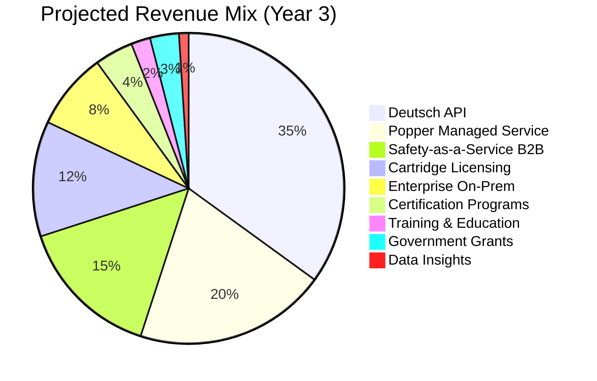
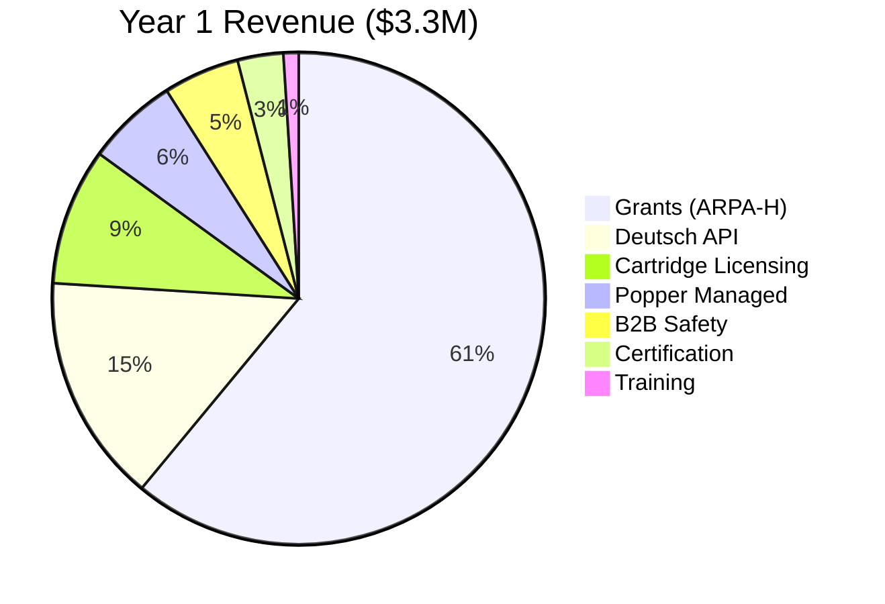
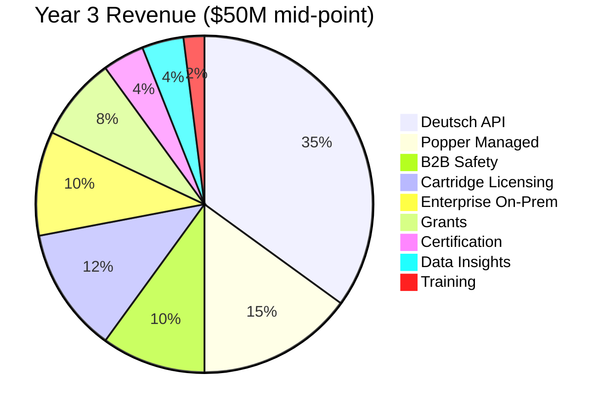

# Revenue Streams: Clinical Agents System

## Executive Summary

This document details all monetization paths for Regain's clinical agents system. The strategy diversifies revenue across 10 streams, balancing recurring SaaS revenue with high-margin licensing and one-time professional services.

---

## Revenue Stream Overview

| # | Revenue Stream | Model | Year 1* | Year 3 | Margin |
|---|----------------|-------|---------|--------|--------|
| 1 | Deutsch API | Usage-based SaaS | $500K | $15-50M | 50-60% |
| 2 | Popper Managed Service | Tiered subscription | $200K | $5-20M | 70-80% |
| 3 | Safety-as-a-Service B2B | B2B licensing | $150K | $5-20M | 70-80% |
| 4 | Cartridge Marketplace | License + rev share | $300K | $5-20M | 80-90% |
| 5 | Certification Programs | One-time + annual | $100K | $1-5M | 90%+ |
| 6 | Enterprise On-Prem | License + support | $0 | $5-15M | 60-70% |
| 7 | Training & Education | Per-seat + events | $50K | $500K-2M | 85% |
| 8 | Government Grants | Awards | $2M | $5-20M | 100%** |
| 9 | De-identified Data Insights | Per-query + licensing | $0 | $2-10M | 90% |
| 10 | Insurance Partnerships | Risk sharing | $0 | $5-50M | TBD |
| | **Total** | | **$3.3M** | **$35-135M** | |

*Year 1 = recognized revenue (partial-year contracts). See individual stream sections for ACV vs recognized breakdown.

**Grants are cost-reimbursement; margin reflects coverage of operating costs.

---

## 1. Deutsch API (Primary Revenue)

### Overview

The Deutsch reasoning engine as a cloud API service, powering patient-facing clinical AI applications.

### Business Model

| Model | Structure | Target Customer |
|-------|-----------|-----------------|
| **Usage-based** | Per-interaction pricing | Startups, SMBs |
| **Committed volume** | Prepaid packages | Growth companies |
| **Enterprise license** | Annual flat fee | Health systems |
| **White-label** | Revenue share (15-30%) | Platform partners |

### Pricing Tiers

See [02-pricing-strategy.md](./02-pricing-strategy.md) for detailed pricing.

| Tier | Price Range | Annual Commitment |
|------|-------------|-------------------|
| Developer | $0.01/interaction | None |
| Growth | $0.05/interaction | $10K minimum |
| Clinical | $0.10-0.20/interaction | $50K minimum |
| Enterprise | Custom | $200K-2M |

### Revenue Projections

| Year | Customers | Avg. Contract | Revenue |
|------|-----------|---------------|---------|
| 1 | 20 | $25K | $500K |
| 2 | 100 | $75K | $7.5M |
| 3 | 300 | $100K | $30M |

### Key Metrics

| Metric | Target |
|--------|--------|
| Gross margin | 55-65% |
| Net revenue retention | 120%+ |
| Payback period | <12 months |
| Churn | <5% annually |

---

## 2. Popper Managed Service

### Overview

Hosted, SLA-backed Popper safety supervision with compliance features.

### Business Model

Tiered subscription with usage-based add-ons.

### Tiers

| Tier | Annual Price | Target | Key Features |
|------|--------------|--------|--------------|
| **Community** | $0 | Self-serve | Open-source core |
| **Pro** | $10K | SMB | SLA, email support |
| **Health** | $50K | Mid-market | HIPAA, clinical packs |
| **Audit** | $100K+ | Enterprise | Regulatory exports |

### Revenue Projections

| Year | Community | Pro | Health | Audit | Recognized Revenue* |
|------|-----------|-----|--------|-------|---------------------|
| 1 | 100 | 10 | 5 | 1 | $200K |
| 2 | 500 | 50 | 25 | 5 | $2.5M |
| 3 | 2,000 | 150 | 75 | 20 | $10M |

*Recognized revenue accounts for partial-year contracts (customers sign throughout the year). Full annual contract value (ACV) for Y1 cohort: ~$450K, but only ~45% recognized in Y1 due to ramp timing.

### Key Metrics

| Metric | Target |
|--------|--------|
| Free-to-paid conversion | 5-10% |
| Tier upgrade rate | 20%/year |
| Gross margin | 75-80% |

---

## 3. Safety-as-a-Service (B2B)

### Overview

License Popper + Hermes to other AI healthcare companies who need FDA-grade safety infrastructure.

### Target Customers

| Segment | Est. Market Size | Target Penetration |
|---------|------------------|-------------------|
| AI health startups | 500+ companies | 5% = 25 customers |
| Digital therapeutics | 200+ companies | 10% = 20 customers |
| EHR vendors | 10 major | 30% = 3 customers |
| Telehealth platforms | 50 significant | 10% = 5 customers |

### Pricing Model

| Model | Annual Price | Notes |
|-------|--------------|-------|
| **Startup** | $25K | <$10M revenue |
| **Growth** | $75K | $10M-100M revenue |
| **Enterprise** | $250K+ | >$100M revenue |
| **Platform** | Custom (rev share) | EHR/telehealth |

### Value Proposition

> "Ship your clinical AI faster. Let Popper handle FDA-grade safety supervision."

- Saves 12-18 months of safety infrastructure development
- Pre-validated with FDA-aligned audit trails
- Reduces liability exposure
- Faster path to market

### Revenue Projections

| Year | Customers | Avg. Contract | Revenue |
|------|-----------|---------------|---------|
| 1 | 5 | $30K | $150K |
| 2 | 20 | $50K | $1M |
| 3 | 50 | $100K | $5M |

---

## 4. Cartridge Marketplace

### Overview

Disease-specific clinical knowledge modules that plug into the Deutsch engine.

### First-Party Cartridges

| Cartridge | Launch | Annual License |
|-----------|--------|---------------|
| CVD (HF, Post-MI) | Year 1 | $75K |
| Diabetes (T2D) | Year 2 | $75K |
| Oncology (Supportive) | Year 2 | $100K |
| Mental Health | Year 2 | $50K |
| CKD | Year 3 | $75K |

### Third-Party Marketplace

| Party | Revenue Share | Certification Fee |
|-------|---------------|-------------------|
| Developer | 70% | $25K one-time |
| Regain (platform) | 30% | - |

### Clinical Society Partnerships

| Model | Structure | Example |
|-------|-----------|---------|
| Co-development | 50/50 revenue | "AHA Heart Failure Cartridge" |
| Endorsement | 5% royalty | "ACC Recommended" |
| White-label | Custom | Society-branded, Regain-built |

### Revenue Projections

| Year | First-Party | Third-Party | Total |
|------|-------------|-------------|-------|
| 1 | $300K (4 customers × $75K) | $0 | $300K |
| 2 | $1.5M | $200K | $1.7M |
| 3 | $5M | $1M | $6M |

---

## 5. Certification Programs

### Overview

"Hermes Certified" program for third-party clinical AI tools.

### Program Tiers

| Level | Price | Includes | Badge |
|-------|-------|----------|-------|
| **Bronze** | $25K | Conformance testing | "Hermes Compatible" |
| **Silver** | $75K | + Integration audit | "Hermes Certified" |
| **Gold** | $200K+ | + FDA submission support | "Hermes Certified (FDA Ready)" |

### Annual Recertification

| Level | Annual Fee |
|-------|------------|
| Bronze | $10K |
| Silver | $15K |
| Gold | $25K |

### Revenue Projections

| Year | New Certs | Recerts | Revenue |
|------|-----------|---------|---------|
| 1 | 5 | 0 | $175K |
| 2 | 15 | 5 | $550K |
| 3 | 30 | 20 | $1.3M |

### Strategic Value

Beyond direct revenue, certification:
- Creates ecosystem stickiness
- Validates market position as standard
- Generates leads for other services
- Builds database of integration partners

---

## 6. Enterprise On-Premise

### Overview

Self-hosted deployments for health systems, VA/DoD, and enterprises with data sovereignty requirements.

### Target Customers

| Segment | Characteristics | Est. Market |
|---------|-----------------|-------------|
| Large IDNs | 10+ hospitals, IT team | 100 in US |
| VA/DoD | Government, air-gapped | 2 major |
| International | Data sovereignty | 500+ globally |
| Pharma | Clinical trial environments | 50 major |

### Pricing Model

| Component | Price Range |
|-----------|-------------|
| **Software license** | $300K-1M/year |
| **Installation** | $50K-100K one-time |
| **Training** | $25K-50K one-time |
| **Support (8x5)** | $50K/year |
| **Support (24x7)** | $100K/year |
| **Dedicated engineer** | $300K/year |

### Add-Ons

| Add-On | Price |
|--------|-------|
| FedRAMP compliance | +$100K setup, +$50K/yr |
| Air-gap deployment | +100% license |
| Custom integrations | $50K-200K one-time |

### Revenue Projections

| Year | Customers | Avg. Contract | Revenue |
|------|-----------|---------------|---------|
| 1 | 0 | - | $0 |
| 2 | 3 | $500K | $1.5M |
| 3 | 10 | $750K | $7.5M |

---

## 7. Training & Education

### Overview

Professional development programs for clinical AI implementation.

### Program Offerings

| Program | Price | Duration | Format |
|---------|-------|----------|--------|
| **Hermes Developer Cert** | $2K/person | 2 days | Online |
| **Popper Policy Workshop** | $5K/person | 3 days | In-person |
| **Executive Briefing** | $10K/session | 4 hours | On-site |
| **Implementation Bootcamp** | $15K/team | 1 week | Hybrid |

### Conference & Events

| Event | Revenue Model |
|-------|---------------|
| **HermesCon** (annual) | Tickets ($500-1,500) + Sponsorship ($25K-100K) |
| **Webinar series** | Free (lead gen) |
| **Podcast** | Sponsorship |

### Revenue Projections

| Year | Training | Events | Total |
|------|----------|--------|-------|
| 1 | $25K | $25K | $50K |
| 2 | $200K | $150K | $350K |
| 3 | $750K | $500K | $1.25M |

---

## 8. Government & Grant Funding

### Overview

Non-dilutive funding from government agencies and research programs.

### Target Programs

| Agency | Program | Typical Award | Fit |
|--------|---------|---------------|-----|
| **ARPA-H** | ADVOCATE (current) | $5-20M | Primary |
| **NIH** | SBIR/STTR | $1-2M | R&D funding |
| **VA** | Innovation funding | $500K-2M | Veteran health |
| **DoD** | Medical research | $2-10M | Military health |
| **CMS** | Innovation Center | $5-50M | Medicare pilots |
| **NSF** | I-Corps, SBIR | $250K-1M | Early stage |

### International

| Region | Program | Notes |
|--------|---------|-------|
| **UK** | NHSX, Innovate UK | NHS pilot funding |
| **EU** | Horizon Europe | €2-10M grants |
| **Canada** | CIHR, NRC | CAD $500K-2M |

### Revenue Projections

| Year | Grants | Notes |
|------|--------|-------|
| 1 | $2M | ARPA-H continuation |
| 2 | $5M | NIH + VA awards |
| 3 | $8M | CMS pilot + international |

### Strategic Value

Grants provide:
- Validation of clinical approach
- Access to health system partners
- Regulatory pathway acceleration
- Non-dilutive capital

---

## 9. De-identified Data Insights

### Overview

Aggregate, anonymized insights from clinical AI decision patterns for pharma, payers, and researchers.

### Data Products

| Product | Description | Price Model |
|---------|-------------|-------------|
| **Treatment Patterns** | How AI recommends treatments | Per-query ($1K-10K) |
| **Outcome Signals** | Post-recommendation outcomes | Per-report ($25K-100K) |
| **Benchmarking** | Compare vs. population | Subscription ($100K/yr) |
| **Trial Recruitment** | Identify eligible patients | Per-patient ($50-500) |

### Critical Requirements

| Requirement | Implementation |
|-------------|----------------|
| **IRB approval** | Protocol for each data product |
| **Patient consent** | Opt-in for data sharing |
| **De-identification** | HIPAA Safe Harbor / Expert Determination |
| **Audit trail** | Who accessed what, when |
| **Governance** | Ethics board oversight |

### Target Customers

| Segment | Use Case | Contract Size |
|---------|----------|---------------|
| **Pharma** | Drug safety signals, trial design | $500K-5M/yr |
| **Payers** | Utilization patterns, cost modeling | $200K-1M/yr |
| **Researchers** | AI behavior studies | $50K-200K/study |
| **Policy makers** | Public health insights | Grant-funded |

### Revenue Projections

| Year | Revenue | Notes |
|------|---------|-------|
| 1 | $0 | Building data volume |
| 2 | $500K | Early pharma deals |
| 3 | $3M | Multiple partnerships |

### Ethical Guardrails

- **Opt-in only** - No data without explicit patient consent
- **No re-identification** - Technical controls + contracts
- **Ethics board** - External oversight committee
- **Benefit sharing** - Consider patient benefit programs

---

## 10. Insurance & Risk Partnerships

### Overview

Partner with malpractice insurers to create financial incentives for Popper adoption.

### Value Proposition

If Popper demonstrably reduces clinical errors:
- Malpractice carriers have lower claims
- Providers pay lower premiums
- Regain captures portion of savings

### Partnership Models

| Model | Structure | Revenue Potential |
|-------|-----------|-------------------|
| **Premium discount** | Carrier offers X% discount for Popper users | Referral fee ($5K-50K/provider) |
| **Risk pool** | Create specialized AI liability pool | Underwriting margin (10-20%) |
| **Claims reduction share** | Share % of documented savings | 10-25% of savings |
| **Joint venture** | Co-own specialized product | Equity upside |

### Target Partners

| Company | Market Position | Approach |
|---------|-----------------|----------|
| **The Doctors Company** | #1 physician-owned | Premium discount pilot |
| **ProAssurance** | Specialty focus | Specialty pool |
| **Coverys** | Data-driven | Analytics partnership |
| **MagMutual** | Southeast US | Regional pilot |

### Revenue Projections

| Year | Revenue | Notes |
|------|---------|-------|
| 1 | $0 | Pilot design |
| 2 | $100K | First partnership |
| 3 | $500K-1M | Scaled partnerships |
| 5+ | $5-50M | Full market penetration |

### Execution Risk

This revenue stream has the highest uncertainty:
- Requires multi-year outcome data
- Complex actuarial validation
- Slow insurance industry sales cycles
- Regulatory complexity (state insurance boards)

**Recommendation**: Treat as long-term opportunity; don't depend on for near-term revenue.

---

## Revenue Mix Evolution

### Year 1: Foundation

### Year 3: Diversified

---

## Key Revenue Metrics

### Unit Economics

| Metric | Target | Notes |
|--------|--------|-------|
| **CAC (Customer Acquisition Cost)** | <$50K | For enterprise |
| **LTV (Lifetime Value)** | >$500K | 5+ year relationships |
| **LTV:CAC ratio** | >10:1 | Excellent unit economics |
| **Payback period** | <12 months | For enterprise contracts |
| **Gross margin** | 65-75% | Blended across products |
| **Net revenue retention** | 120%+ | Expansion > churn |

### Revenue Quality

| Factor | Target | Rationale |
|--------|--------|-----------|
| Recurring revenue % | >70% | Predictable, valued by investors |
| Multi-year contracts | >50% | Reduces churn risk |
| Logo concentration | <10% from top customer | De-risk revenue |
| Vertical diversification | 3+ segments | Multiple growth vectors |

---

## Summary

The clinical agents system has 10 viable revenue streams, ranging from near-term (grants, API) to long-term (insurance partnerships, data insights). The open-core model enables this diversity: open-source Hermes/Popper drive adoption and ecosystem, while proprietary Deutsch, cartridges, and enterprise services capture value.

**Primary revenue drivers**:
1. Deutsch API (35% of Year 3 revenue)
2. Popper Managed Service (15%)
3. Cartridge Licensing (12%)
4. Enterprise On-Prem (10%)
5. Safety-as-a-Service B2B (10%)

**Emerging opportunities**:
- Data insights (requires scale + ethics framework)
- Insurance partnerships (requires outcome data)

---

## Sources

- [Sacra: Viz.ai Revenue Model](https://sacra.com/c/viz-ai/)
- [Nasdaq: Tempus Revenue](https://www.nasdaq.com/articles/tempus-ai-revenue-jumps-85-pricing-catalysts-line)
- [Everest Group: Healthcare AI Pricing](https://www.everestgrp.com/healthcare-industry/optimizing-pricing-strategies-for-healthcare-ai-startups-expert-insights-for-payer-and-provider-innovation-blog.html)
- [MongoDB: Open-Core Success](https://www.mongodb.com/company/newsroom/press-releases/mongodb-issues-new-server-side-public-license-for-mongodb-community-server)
