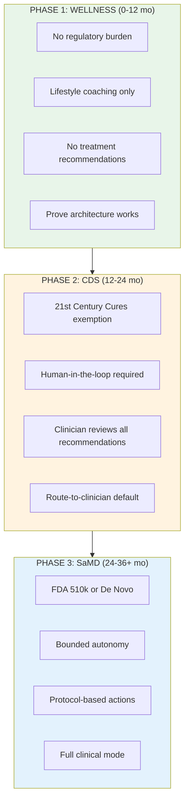

# Commercialization Strategy: Without ARPA-H Funding

## Scenario Overview

This document outlines the commercialization strategy assuming **no ARPA-H ADVOCATE funding**. The core strategy (open-core, Safety-as-a-Service, cartridge architecture) remains valid, but execution changes significantly.

---

## Key Differences from ARPA-H Scenario

| Dimension | With ARPA-H | Without ARPA-H |
|-----------|-------------|----------------|
| **Year 1 Revenue** | $3.3M | $1.0-1.5M |
| **FDA Path** | Fast-track De Novo | CDS exemption first |
| **First Cartridge** | CVD (mandated) | Wellness (market choice) |
| **Funding Strategy** | Grants + late VC | VC-first (seed critical) |
| **Validation Story** | "Government-vetted" | Open-source + pilots |
| **Time to Clinical** | 12-18 months | 24-36 months |
| **Initial Mode** | `advocate_clinical` | `wellness` |

---

## Revised Strategic Positioning

### CDS-First Regulatory Strategy

Without ARPA-H fast-track, the **Clinical Decision Support (CDS) exemption** becomes Plan A:

### CDS Exemption Requirements

Per [21st Century Cures Act](https://www.fda.gov/medical-devices/cdrh-transparency/cdrh-and-21st-century-cures-act), CDS is exempt from FDA if:

| Requirement | How Regain Meets It |
|-------------|---------------------|
| Support (not replace) clinical decisions | `ROUTE_TO_CLINICIAN` is default |
| Allow independent review of basis | `DisclosureBundle` shows reasoning |
| Not acquire/process medical images | Text-based, not imaging AI |
| Clinician can accept or reject | Human-in-the-loop enforced |

**Architecture already supports this**: Popper's `ROUTE_TO_CLINICIAN` and Hermes' `DisclosureBundle` are designed for clinician review.

---

## Revised Go-to-Market Strategy

### Phase 1: Wellness Foundation (Months 0-12)

**Objective**: Prove architecture with unregulated wellness use case.

| Action | Priority | Notes |
|--------|----------|-------|
| Launch Wellness cartridge | P0 | Lifestyle coaching, no clinical claims |
| Open-source Hermes | P0 | Build developer credibility |
| Open-source Popper core | P0 | Establish safety standard |
| Seed fundraise ($2-3M) | P0 | VC-first, no grant backup |
| 5 B2C wellness pilots | P1 | Consumer validation |
| 3 B2B Safety-as-a-Service LOIs | P1 | Enterprise demand signal |

**Revenue Target**: $500K-750K (primarily Popper managed service)

### Phase 2: CDS Expansion (Months 12-24)

**Objective**: Add clinical capabilities under CDS exemption.

| Action | Priority | Notes |
|--------|----------|-------|
| Launch CVD cartridge (CDS mode) | P0 | Human-in-the-loop required |
| 3 health system pilots | P0 | Clinician workflow integration |
| Series A ($5-10M) | P0 | Scale team |
| Parallel FDA pre-submission | P1 | Start SaMD pathway |
| Deutsch API launch | P1 | Primary revenue driver |

**Revenue Target**: $3-5M

### Phase 3: Full Clinical (Months 24-36+)

**Objective**: FDA clearance for bounded autonomy.

| Action | Priority | Notes |
|--------|----------|-------|
| FDA 510(k) or De Novo submission | P0 | For specific indications |
| Launch `advocate_clinical` mode | P0 | Post-clearance |
| Enterprise on-premise | P1 | VA/DoD, large IDNs |
| Cartridge marketplace | P1 | Third-party development |

**Revenue Target**: $15-25M

---

## Revised First Cartridge Choice

Without ARPA-H mandating CVD, choose based on market fit:

| Cartridge | Pros | Cons | Recommendation |
|-----------|------|------|----------------|
| **Wellness/Lifestyle** | No regulation, fast launch, large market | Lower ACV, no clinical credibility | **Start here** |
| **Mental Health** | Large market, lower clinical risk (no Rx) | Stigma, sensitive data | Good second cartridge |
| **Chronic Disease (non-Rx)** | Clinical credibility, high value | Still needs CDS exemption | After wellness proves out |
| **CVD** | High value, clear clinical need | High regulatory burden | After FDA pre-submission |

**Recommended Sequence**:
1. Wellness (Month 0-6) - Prove architecture
2. Mental Health (Month 6-12) - Add clinical credibility
3. CVD (Month 12-18) - Under CDS exemption
4. Diabetes, Oncology (Month 18+) - Expand clinical

---

## Revised Funding Strategy

### Investment Timeline

| Stage | Amount | Timing | Use of Funds |
|-------|--------|--------|--------------|
| **Pre-Seed** | $500K-1M | Month 0 | Core team, MVP |
| **Seed** | $2-3M | Month 3-6 | Wellness launch, open-source |
| **Series A** | $5-10M | Month 12-18 | CDS expansion, sales team |
| **Series B** | $20-30M | Month 24-30 | FDA pathway, scale |

### Investor Pitch (Without ARPA-H)

**Lead with**:
> "Every AI health company builds their own opaque safety layer. We're building the open, auditable safety layer they all use. Think 'Stripe for clinical AI safety.'"

**Traction to show**:
- GitHub stars / npm downloads (developer adoption)
- Pilot customers (demand validation)
- B2B Safety-as-a-Service LOIs (enterprise interest)
- Open-source community size

**Why now**:
- [22% of health systems now use domain-specific AI](https://menlovc.com/perspective/2025-the-state-of-ai-in-healthcare/) (7x growth YoY)
- [TRAIN coalition](https://news.microsoft.com/source/2024/03/11/new-consortium-of-healthcare-leaders-announces-formation-of-trustworthy-responsible-ai-network-train-making-safe-and-fair-ai-accessible-to-every-healthcare-organization/) (16 health systems) seeking safety standards
- No existing "Safety-as-a-Service" player

---

## What Stays The Same

The **core strategy** is unchanged:

| Element | Status | Notes |
|---------|--------|-------|
| Open-source Hermes + Popper | **Same** | Even more important for credibility |
| Safety-as-a-Service B2B | **Same** | Unaffected by ARPA-H |
| Cartridge architecture | **Same** | Just different first cartridge |
| Deutsch API | **Same** | Core revenue driver |
| MongoDB-style licensing (SSPL) | **Same** | Cloud provider protection |
| TRAIN coalition targeting | **Same** | Just harder without intro |
| Long-term revenue potential | **Same** | $35-135M at scale |

---

## Advantages of No-ARPA-H Path

| Advantage | Explanation |
|-----------|-------------|
| **Move faster** | No government milestone requirements |
| **Choose your market** | Not locked into CVD first |
| **More equity retained** | VC dilutes less than giving up control |
| **Simpler ops** | No compliance with federal grant terms |
| **Market-driven** | Build what customers want, not what grant requires |

---

## Risks Specific to No-ARPA-H Path

| Risk | Likelihood | Impact | Mitigation |
|------|------------|--------|------------|
| Slower credibility | High | Medium | Open-source + academic partnerships |
| Harder enterprise sales | Medium | High | Focus on Safety-as-a-Service B2B |
| Longer FDA timeline | High | Medium | CDS exemption buys time |
| Funding pressure | Medium | High | Prove PMF fast with wellness |
| Competitor with grant | Low | High | First-mover on open-source safety |

---

## Summary

Without ARPA-H, the path is **slower but still viable**:

1. **Start with Wellness** - Prove architecture without regulatory burden
2. **CDS exemption** is Plan A - Human-in-the-loop enables clinical use
3. **VC-first** - Seed fundraise is critical for runway
4. **Open-source harder** - Must compensate for missing government credibility
5. **Same destination** - Just 12-18 months longer

**Key metrics to hit**:
- Month 6: 500+ GitHub stars, Wellness cartridge live
- Month 12: $500K ARR, 3 B2B Safety customers
- Month 18: CDS mode live with health system pilots
- Month 24: $3M ARR, Series A closed, FDA pre-submission filed

---

## Related Documents

- [01-revised-timeline.md](./01-revised-timeline.md) - Detailed execution timeline
- [02-revised-revenue-projections.md](./02-revised-revenue-projections.md) - Financial projections
- [../00-commercialization-strategy-basics.md](../00-commercialization-strategy-basics.md) - Full ARPA-H scenario (for comparison)
