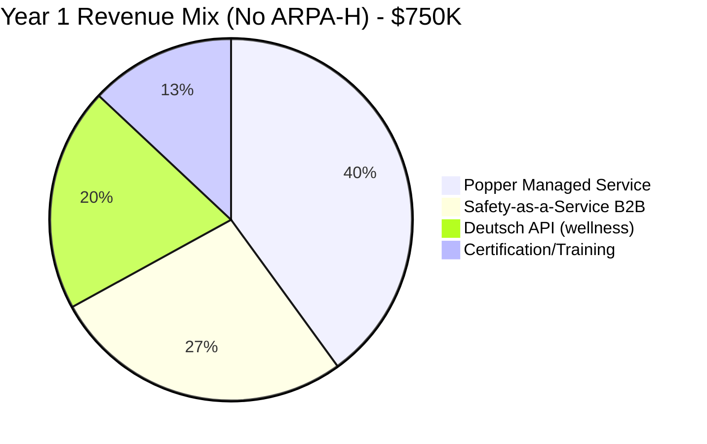
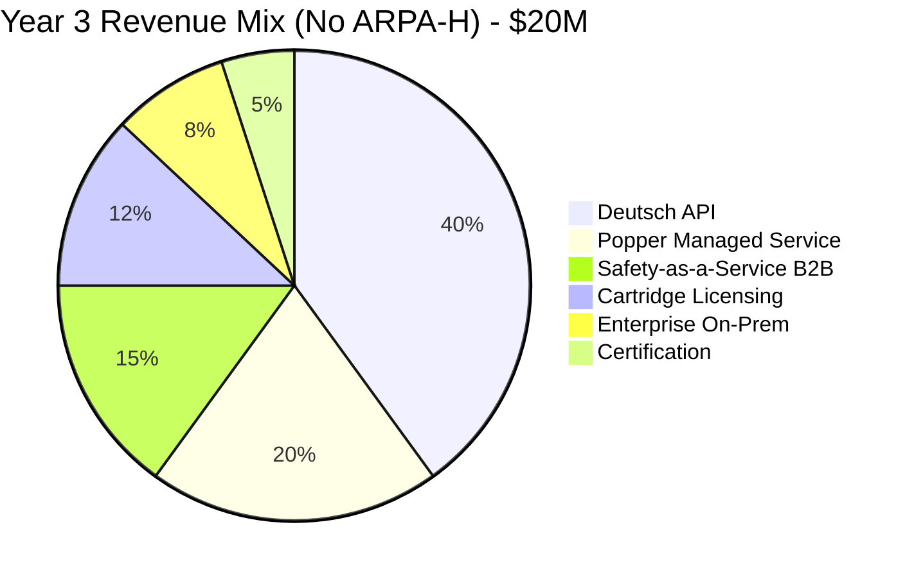

# Revised Revenue Projections: Without ARPA-H Funding

## Executive Summary

Without ARPA-H, Year 1 revenue drops from $3.3M to ~$750K (loss of $2M+ grants). The 3-year trajectory is approximately 50% lower, but the business remains viable with adjusted expectations.

---

## Revenue Comparison

### 3-Year Summary

| Year | With ARPA-H | Without ARPA-H | Difference |
|------|-------------|----------------|------------|
| **Year 1** | $3.3M | $750K | -77% |
| **Year 2** | $12M | $4.5M | -63% |
| **Year 3** | $50M | $20M | -60% |
| **Cumulative** | $65.3M | $25.25M | -61% |

### Revenue Mix Evolution

---

## Year 1 Detailed Projections

### Quarterly Breakdown

| Quarter | Revenue | Cumulative | Key Milestone |
|---------|---------|------------|---------------|
| Q1 | $25K | $25K | Seed closed, open-source launched |
| Q2 | $100K | $125K | First Popper paying customers |
| Q3 | $225K | $350K | Wellness pilots, B2B Safety LOIs |
| Q4 | $400K | $750K | Mental Health cartridge, Series A |

### Revenue by Stream (Year 1)

| Stream | Q1 | Q2 | Q3 | Q4 | Total |
|--------|----|----|----|----|-------|
| **Popper Managed** | $10K | $50K | $100K | $140K | $300K |
| **Safety-as-a-Service** | $0 | $25K | $75K | $100K | $200K |
| **Deutsch API** | $0 | $15K | $35K | $100K | $150K |
| **Certification/Training** | $15K | $10K | $15K | $60K | $100K |
| **Grants** | $0 | $0 | $0 | $0 | **$0** |
| **Total** | **$25K** | **$100K** | **$225K** | **$400K** | **$750K** |

### Customer Acquisition (Year 1)

| Segment | Q1 | Q2 | Q3 | Q4 | Total |
|---------|----|----|----|----|-------|
| Popper Community (free) | 20 | 50 | 100 | 200 | 370 |
| Popper Pro ($10K/yr) | 0 | 3 | 7 | 15 | 25 |
| Popper Health ($50K/yr) | 0 | 1 | 2 | 3 | 6 |
| Safety-as-a-Service | 0 | 1 | 3 | 5 | 9 |
| Deutsch API (paying) | 0 | 10 | 30 | 75 | 115 |

---

## Year 2 Detailed Projections

### Quarterly Breakdown

| Quarter | Revenue | Cumulative | Key Milestone |
|---------|---------|------------|---------------|
| Q1 | $600K | $600K | CVD cartridge, Series A closed |
| Q2 | $900K | $1.5M | Health system pilots live |
| Q3 | $1.3M | $2.8M | Deutsch API GA, certifications |
| Q4 | $1.7M | $4.5M | FDA pre-sub, Series B prep |

### Revenue by Stream (Year 2)

| Stream | Q1 | Q2 | Q3 | Q4 | Total |
|--------|----|----|----|----|-------|
| **Deutsch API** | $200K | $350K | $500K | $650K | $1.7M |
| **Popper Managed** | $175K | $225K | $275K | $325K | $1.0M |
| **Safety-as-a-Service** | $100K | $150K | $200K | $300K | $750K |
| **Cartridge Licensing** | $50K | $100K | $150K | $200K | $500K |
| **Certification** | $50K | $50K | $125K | $125K | $350K |
| **Training** | $25K | $25K | $50K | $100K | $200K |
| **Total** | **$600K** | **$900K** | **$1.3M** | **$1.7M** | **$4.5M** |

### Customer Acquisition (Year 2)

| Segment | EOY Count | New in Y2 | Avg ACV |
|---------|-----------|-----------|---------|
| Popper Pro | 60 | 35 | $10K |
| Popper Health | 20 | 14 | $50K |
| Popper Audit | 5 | 5 | $100K |
| Safety-as-a-Service | 20 | 11 | $50K |
| Deutsch API (paying) | 250 | 135 | $6.8K |
| Cartridge Licenses | 10 | 10 | $50K |

---

## Year 3 Detailed Projections

### Quarterly Breakdown

| Quarter | Revenue | Cumulative | Key Milestone |
|---------|---------|------------|---------------|
| Q1 | $3.5M | $3.5M | FDA filed, Series B closed |
| Q2 | $4.5M | $8M | Enterprise on-prem, marketplace |
| Q3 | $5.5M | $13.5M | FDA cleared, full clinical mode |
| Q4 | $6.5M | $20M | Foundation, international |

### Revenue by Stream (Year 3)

| Stream | Q1 | Q2 | Q3 | Q4 | Total |
|--------|----|----|----|----|-------|
| **Deutsch API** | $1.5M | $1.9M | $2.2M | $2.4M | $8M |
| **Popper Managed** | $750K | $900K | $1.0M | $1.35M | $4M |
| **Safety-as-a-Service** | $400K | $600K | $750K | $1.25M | $3M |
| **Cartridge Licensing** | $350K | $500K | $700K | $850K | $2.4M |
| **Enterprise On-Prem** | $250K | $350K | $500K | $500K | $1.6M |
| **Certification** | $150K | $175K | $225K | $250K | $800K |
| **Training** | $100K | $75K | $125K | $100K | $400K |
| **Total** | **$3.5M** | **$4.5M** | **$5.5M** | **$6.7M** | **$20.2M** |

---

## Unit Economics

### By Product Line

| Product | Gross Margin | CAC | LTV | LTV:CAC |
|---------|--------------|-----|-----|---------|
| **Popper Managed** | 75% | $5K | $75K | 15:1 |
| **Safety-as-a-Service** | 80% | $25K | $200K | 8:1 |
| **Deutsch API** | 55% | $2K | $25K | 12:1 |
| **Cartridge License** | 85% | $15K | $150K | 10:1 |
| **Enterprise On-Prem** | 65% | $50K | $500K | 10:1 |
| **Certification** | 90% | $5K | $50K | 10:1 |

### Blended Metrics

| Metric | Year 1 | Year 2 | Year 3 |
|--------|--------|--------|--------|
| **Blended Gross Margin** | 70% | 68% | 70% |
| **Blended CAC** | $8K | $12K | $15K |
| **Average Contract Value** | $15K | $25K | $35K |
| **Net Revenue Retention** | 100% | 115% | 125% |
| **Payback Period** | 10 mo | 8 mo | 7 mo |

---

## Funding Requirements

### Cash Flow Analysis (Without ARPA-H)

| Year | Revenue | OpEx | Net Burn | Funding Needed |
|------|---------|------|----------|----------------|
| Year 1 | $750K | $3M | -$2.25M | $3M (Seed) |
| Year 2 | $4.5M | $8M | -$3.5M | $7M (Series A) |
| Year 3 | $20M | $18M | +$2M | $25M (Series B)* |

*Series B for growth, not survival

### Investment Rounds

| Round | Amount | Timing | Use |
|-------|--------|--------|-----|
| **Pre-Seed** | $500K-1M | Month 0 | MVP, core team |
| **Seed** | $2-3M | Month 3-6 | Wellness launch, open-source |
| **Series A** | $5-10M | Month 12-15 | CDS expansion, sales |
| **Series B** | $20-30M | Month 24-27 | FDA, scale, international |

### Runway Analysis

| Scenario | Seed Only | + Series A | + Series B |
|----------|-----------|------------|------------|
| Runway | 15 months | 30 months | 48+ months |
| Break-even | No | No | Yes (Month 36+) |

---

## Scenario Analysis

### Conservative Case (-30%)

| Year | Revenue | Notes |
|------|---------|-------|
| Year 1 | $500K | Slower Popper adoption |
| Year 2 | $3M | Fewer health system pilots |
| Year 3 | $14M | FDA delays |

### Base Case

| Year | Revenue | Notes |
|------|---------|-------|
| Year 1 | $750K | Per this document |
| Year 2 | $4.5M | Per this document |
| Year 3 | $20M | Per this document |

### Optimistic Case (+50%)

| Year | Revenue | Notes |
|------|---------|-------|
| Year 1 | $1M | Strong B2B Safety demand |
| Year 2 | $7M | Fast health system adoption |
| Year 3 | $30M | FDA clears early |

---

## Comparison: Grant Revenue Impact

### What ARPA-H Would Have Provided

| Year | Grant Revenue | Impact |
|------|---------------|--------|
| Year 1 | $2M | 62% of total revenue |
| Year 2 | $3M | 25% of total revenue |
| Year 3 | $2M | 4% of total revenue |
| **Total** | **$7M** | Over 3 years |

### Compensating Revenue Required

To match ARPA-H scenario revenue, need to grow other streams faster:

| Stream | ARPA Scenario (Y3) | No-ARPA Need | Growth Required |
|--------|-------------------|--------------|-----------------|
| Deutsch API | $17M | $25M | +47% |
| Safety-as-a-Service | $5M | $8M | +60% |
| Enterprise | $5M | $10M | +100% |

**Reality check**: Unlikely to fully compensate. Accept ~50% lower revenue trajectory.

---

## Key Revenue Risks

| Risk | Likelihood | Impact | Mitigation |
|------|------------|--------|------------|
| Slow Popper adoption | Medium | High | Focus on Safety-as-a-Service first |
| Enterprise sales cycles | High | Medium | Start pilots early |
| Deutsch API price pressure | Medium | Medium | Usage-based with volume discounts |
| Certification slow uptake | Medium | Low | Bundle with training |
| FDA delays affect clinical | High | High | CDS revenue is still valid |

---

## Summary

Without ARPA-H, the financial trajectory is:

| Metric | Year 1 | Year 2 | Year 3 |
|--------|--------|--------|--------|
| **Revenue** | $750K | $4.5M | $20M |
| **Gross Margin** | 70% | 68% | 70% |
| **Funding Required** | $3M | $7M | $25M |
| **Break-even** | No | No | Yes (Month 36) |

**Total 3-year revenue**: $25.25M (vs. $65.3M with ARPA-H)

The business is **viable but slower**. Key dependencies:
1. Seed raise successful
2. Popper/Safety-as-a-Service gains traction
3. Series A before end of Year 1
4. Health system pilots validate CDS path
5. FDA clears by Month 30-33

---

## Related Documents

- [00-strategy-without-arpa-h.md](./00-strategy-without-arpa-h.md) - Strategy overview
- [01-revised-timeline.md](./01-revised-timeline.md) - Execution timeline
- [../04-revenue-streams.md](../04-revenue-streams.md) - Full ARPA-H scenario (for comparison)
