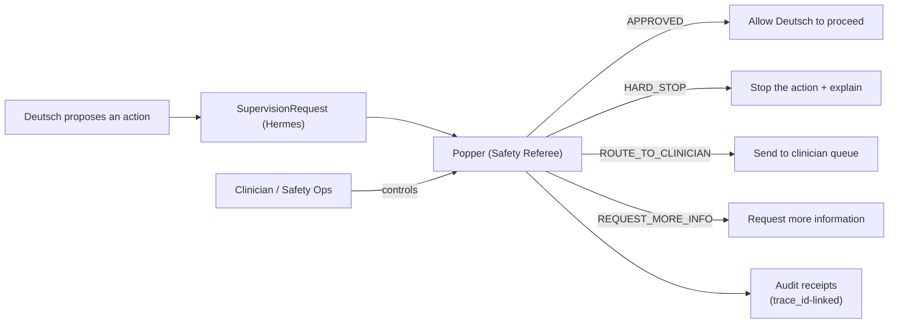
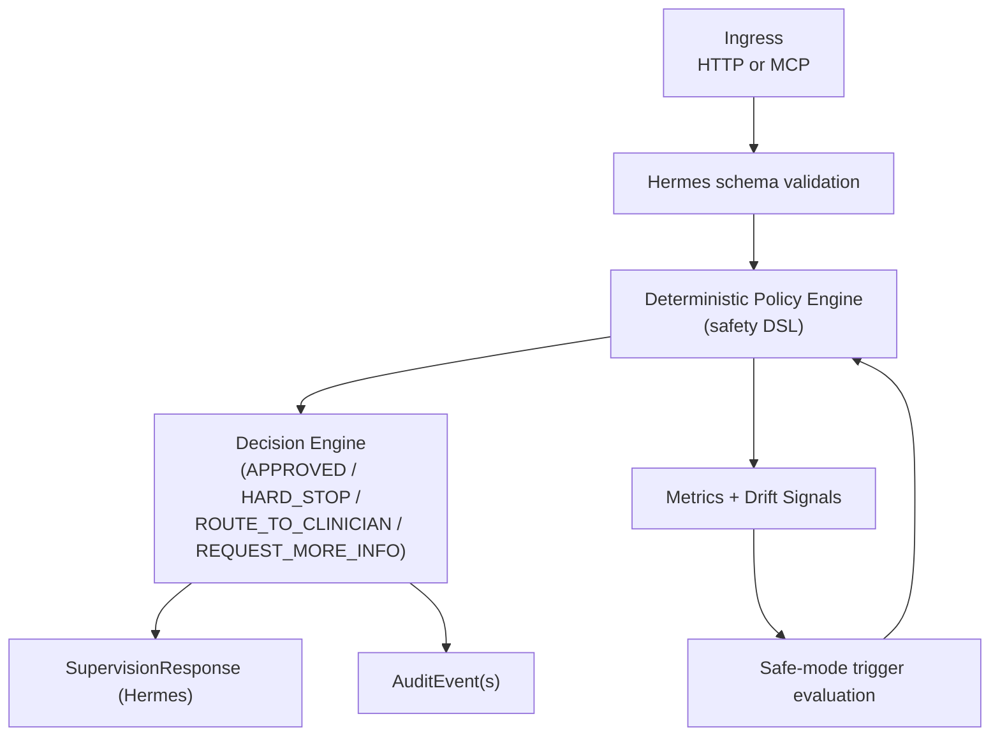

# Popper System Spec (TA2) — v1

## 0) Executive Summary

Popper is the **independent supervisory safety system** for clinical agents.

For v1, Popper’s job is simple and strict:
1. Receive a proposed action from Deutsch (`SupervisionRequest`)
2. Decide: **APPROVED**, **HARD_STOP**, **ROUTE_TO_CLINICIAN**, or **REQUEST_MORE_INFO**
3. Emit an audit-ready receipt for every decision
4. Provide a control plane (safe-mode + settings)

If anything is unclear, Popper defaults to safety.

## 1) Scope

### In scope (v1)
- Hermes-compliant supervision API (request/response)
- Deterministic safety/policy layer (no LLM required to hard stop)
- Safe-mode and operational settings control plane
- Audit events joinable by `trace_id`
- Drift/quality monitoring hooks (metrics counters + thresholds)
- Regulatory support primitives:
  - de-identified export bundle generation (format + redaction rules)
  - rapid issue triage workflow (incident records + safe-mode triggers)
- Minimal ops dashboard (for managed service tiers):
  - Policy status view (active policies, versions)
  - Audit log viewer (searchable, filterable by trace_id)
  - Safe-mode controls (enable/disable with reason)
  - Basic metrics visualization (supervision latency, decision distribution)

### Out of scope (v1)
- Full clinician UI product (patient-facing or care team workflows)
- Disease-specific logic hardcoded into Popper core
- Policy authoring/editing UI (policies managed via YAML/config files)

## 2) Hard Requirements

### 2.1 Independence
Popper MUST be developed and deployed independently from Deutsch:
- separate repo
- separate deployment artifact
- no “shared prompting/weights” assumptions

### 2.2 Disease-agnostic core
Popper MUST remain disease-agnostic:
- policies are generic (risk, uncertainty, safe-mode)
- any domain guidance arrives as:
  - evidence refs, or
  - configuration/policy packs (versioned), not hardcoded CVD logic

### 2.3 Default-to-safe
When uncertain, or when dependencies fail:
- Popper MUST choose `ROUTE_TO_CLINICIAN` or `HARD_STOP`
- never “approve by accident”

### 2.4 FDA MDDT Qualification (REQUIRED)

Per ARPA-H TA2 specs (§2.G, §5), technologies **not being developed for FDA MDDT qualification are OUT OF SCOPE**.

Popper MUST pursue FDA MDDT qualification under the **NAM (Non-Clinical Assessment Model)** category:

| Aspect | Requirement |
|--------|-------------|
| **Category** | NAM (Non-Clinical Assessment Model) |
| **Context of Use** | Independent oversight of AI clinical agents for safety and accuracy |
| **Goal** | Industry standard tool for generative/agentic AI monitoring |
| **Precedents** | MRI Temperature Rise Prediction Tool (Mar 2023), ENDPOINT numaScrew (May 2025) |

#### 2.5.1 MDDT-Specific Deliverables

- FDA MDDT Qualification application (NAM category)
- Context of Use (COU) statement aligned with ARPA-H TA2 requirements
- Evidence package meeting Phase 1B accuracy/hallucination targets
- Validation using FDA-qualified datasets (see §5.7)

#### 2.5.2 NAM Precedents

Popper's MDDT qualification strategy is informed by existing FDA-qualified computational NAMs:

| MDDT | Qualified | Relevance |
|------|-----------|-----------|
| **ENDPOINT numaScrew** | May 2025 | Latest computational simulation MDDT |
| **MRI Temperature Rise** | Mar 2023 | Computational model with safety predictions |
| **Virtual MRI Safety** | Nov 2021 | Safety simulation for device evaluation |
| **IMAnalytics** | May 2021 | First computational MDDT (MRI safety) |
| **TMM for HITU** | Jul 2019 | First FDA-developed MDDT |

**Reference:** [`../00-overall-specs/0B-FDA-alignment/13-qualified-mddt-solutions.md`](../00-overall-specs/0B-FDA-alignment/13-qualified-mddt-solutions.md) §8

### 2.5 Multi-tenant isolation (required)

In TA3 deployments, Popper MUST enforce strict organization isolation:

- In `advocate_clinical` mode, `subject.organization_id` MUST be present (Hermes constraint) and MUST be authorized for the caller.
- If `subject.organization_id` is missing in `advocate_clinical`, Popper MUST treat the request as unsafe (default: `HARD_STOP` with `reason_codes` including `schema_invalid`).
- If the caller is not authorized for `subject.organization_id`, Popper MUST `HARD_STOP` (default: `reason_codes` includes `policy_violation`) and emit `VALIDATION_FAILED` audit events tagged `unauthorized_org` (PHI-minimized).
- Popper MUST NOT allow cross-tenant protocol leakage:
  - `clinician_protocol_ref` MUST be validated against the allowlist for `subject.organization_id`
  - if `clinician_protocol_ref` encodes/targets a different org than `subject.organization_id` → treat as unsafe (`HARD_STOP`, `policy_violation`)
  - if `clinician_protocol_ref` is not in the allowlist for that org/site → `ROUTE_TO_CLINICIAN` (or `HARD_STOP` if the request appears malicious)
- Export bundles and control-plane operations MUST be scoped to the authenticated `organization_id`.

## 3) Architecture

### 3.1 Non-technical view



### 3.2 Core pipeline (required)



### 3.3 Replay protection + clock-skew enforcement (required in `advocate_clinical`)

In `advocate_clinical` mode, Popper MUST implement the following safety gates:

- **Clock-skew validation**:
  - Validate `SupervisionRequest.request_timestamp` against configured tolerance (default ±5 minutes; Hermes §1.2.1).
  - If outside tolerance, Popper MUST treat as unsafe (default: `HARD_STOP` with `reason_codes` including `schema_invalid`) and emit `VALIDATION_FAILED` audit events tagged `clock_skew_rejected`.

- **Idempotency / replay protection**:
  - Require `idempotency_key` and `request_timestamp` (Hermes §3.4.1).
  - Implement an idempotency cache keyed by `(subject.organization_id, idempotency_key)` with a replay window (default: 5 minutes).
  - On duplicate within window:
    - If the canonicalized request payload is identical, Popper SHOULD return the previously computed `SupervisionResponse`.
    - If the canonicalized request payload differs, Popper MUST treat as unsafe (`HARD_STOP`, `reason_codes` includes `policy_violation`) and emit `VALIDATION_FAILED` audit events tagged `replay_suspected`.

## 4) Deterministic Policy Engine (the “Safety DSL”)

Popper MUST have a deterministic layer that can:
- reject unsafe actions quickly (no LLM calls)
- enforce safe-mode
- enforce basic governance constraints

Detailed policy pack + evaluation semantics:
- `03-popper-safety-dsl.md`

### 4.1 Minimum required policy rules (v1)

Popper MUST implement at least:
- **Schema invalid** → `HARD_STOP` (reason: `schema_invalid`)
- **Safe-mode enabled** → `ROUTE_TO_CLINICIAN` for all high-risk proposals
- **Missing governance reference** (e.g., medication proposal without `clinician_protocol_ref`) → `ROUTE_TO_CLINICIAN`
- **Missing required evidence** (e.g., medication proposal with missing `evidence_refs`) → `ROUTE_TO_CLINICIAN` (reason: `insufficient_evidence`)
- **Urgent triage without evidence**: `TRIAGE_ROUTE` proposals with `urgency = "urgent"` SHOULD include `evidence_refs`; if missing, default to `ROUTE_TO_CLINICIAN` (reason: `insufficient_evidence`)
- **High uncertainty** (Deutsch disclosed uncertainty `high`) → `ROUTE_TO_CLINICIAN`
- **Input risk flags** (e.g., `SupervisionRequest.input_risk.flags` includes `prompt_injection_suspected` or `malware_suspected`) → `ROUTE_TO_CLINICIAN` (or `HARD_STOP` if suspected malicious activity)
- **Stale or unverifiable snapshot** → `REQUEST_MORE_INFO` (default) or `ROUTE_TO_CLINICIAN` (when clinician involvement is required)
- **Rate limiting / abuse** → `HARD_STOP` or `ROUTE_TO_CLINICIAN` (implementation-specific)

### 4.2 Safe-mode semantics (required)

Safe-mode is a global safety override.

When safe-mode is enabled:
- Popper MUST never return `APPROVED` for `MEDICATION_ORDER_PROPOSAL`
- Popper SHOULD route all non-trivial actions to clinicians
- Popper SHOULD include a clear reason code: `policy_violation` and/or `risk_too_high`

Safe-mode can be enabled by:
- clinician/safety ops (manual)
- Popper itself (automatic triggers, below)

#### 4.2.1 Safe-mode consistency + mid-flight semantics (required)

Popper MUST define deterministic behavior for safe-mode changes that occur while supervision requests are being processed:

- **State snapshot per request**: when Popper starts evaluating a `SupervisionRequest`, it MUST snapshot the current safe-mode state and use it consistently for the entire evaluation.
- **Effective time**: safe-mode changes MUST have an `effective_at` timestamp. Requests with `request_timestamp >= effective_at` MUST be evaluated under the new state. (If `request_timestamp` is not present, Popper SHOULD fall back to `trace.created_at`.)
- **No “approve by accident”**: if safe-mode is enabled for the request’s effective time, Popper MUST NOT return `APPROVED` for any high-risk proposal kinds, and MUST default to `ROUTE_TO_CLINICIAN`.
- **Audit binding**: Popper MUST record (in audit events and/or the `SupervisionResponse`) the safe-mode state used for the decision, so auditors can reconstruct enforcement.

## 5) Risk / acuity / uncertainty assessment (v1)

TA2 requires Popper to continuously evaluate risk, acuity, accuracy, and uncertainty.

In v1, Popper MUST implement a two-layer approach:

### 5.1 Deterministic checks (MUST)
- proposal kind (e.g., medication proposals are high risk)
- governance boundary checks (e.g., `clinician_protocol_ref` required in regulated mode)
- snapshot integrity checks (staleness + integrity):

#### 5.1.1 Staleness Validation (AUTHORITATIVE)

> **CRITICAL: Popper is the authoritative staleness validator.**
>
> Because Popper is designed as **open source** and **Brain-agnostic**, it MUST NOT assume that the Brain (Deutsch or any third-party agent) has validated staleness. The Brain MAY check staleness for UX optimization (faster user feedback), but Popper MUST validate independently as the **last line of defense**.

**Default staleness thresholds (configurable):**

| Mode | Default Threshold | Rationale |
|------|-------------------|-----------|
| `wellness` | **24 hours** | Lower risk, patient self-management |
| `advocate_clinical` | **4 hours** | Higher risk, clinical decisions |

**Configuration (popper-config.yaml):**

```yaml
staleness:
  thresholds:
    wellness_hours: 24
    clinical_hours: 4

  # Per-signal overrides (v2, optional extension)
  # signals:
  #   vitals: 4h
  #   labs: 24h
  #   medications: 72h

  behavior:
    low_risk_stale: "REQUEST_MORE_INFO"
    high_risk_stale: "ROUTE_TO_CLINICIAN"
```

TA3 sites MAY override these thresholds, but MUST version-control overrides (and effective dates) in their Site Integration Profile (`../03-hermes-specs/additional/TA3-SITE-INTEGRATION-PROFILE.template.md`) so audits can reconstruct what was in force.

**Stale snapshot behavior:**

| Context | Staleness Detected | Popper Decision |
|---------|-------------------|-----------------|
| Low-risk proposal | Snapshot stale | `REQUEST_MORE_INFO` with `required_action.kind = "refresh_snapshot"` |
| High-risk proposal in `wellness` | Snapshot stale | `ROUTE_TO_CLINICIAN` |
| Any proposal in `advocate_clinical` | Snapshot stale | `ROUTE_TO_CLINICIAN` |

**Response structure when stale:**

```typescript
{
  decision: "REQUEST_MORE_INFO",  // or ROUTE_TO_CLINICIAN
  reason_codes: ["snapshot_stale"],
  required_action: {
    kind: "refresh_snapshot",
    details: {
      current_age_hours: 26,
      threshold_hours: 24,
      snapshot_id: "snap_abc123"
    }
  }
}
```

> **Note:** Popper does NOT know how to refresh a snapshot. The Brain/Gateway is responsible for:
> 1. Receiving the `required_action`
> 2. Refreshing the snapshot from its data source (e.g., phi-service)
> 3. Retrying the `SupervisionRequest` with fresh data
  - **Snapshot hash mismatch**: if Popper can retrieve a snapshot payload and a `snapshot_hash` is provided, Popper SHOULD verify it; mismatch MUST be treated as unsafe (default: `HARD_STOP` with `reason_codes` including `policy_violation`) and MUST emit `VALIDATION_FAILED` audit events tagged `snapshot_integrity_failed`.
  - **Snapshot access policy (advocate_clinical)**:
    - In `advocate_clinical`, Popper MUST have access to snapshot bytes via at least one of:
      - `snapshot.snapshot_uri` present and resolvable within the deployment boundary, OR
      - `SupervisionRequest.snapshot_payload` present inline.
      - If neither is present, Popper MUST treat as unsafe (default: `HARD_STOP` with `reason_codes` including `schema_invalid`).
    - For high-risk proposals (especially `MEDICATION_ORDER_PROPOSAL`), Popper SHOULD verify `snapshot_hash`:
      - If `snapshot_payload` is present: compute hash over that payload (Hermes §2.5.1) and compare.
      - Else: fetch snapshot payload via `snapshot_uri` with a short timeout (default: **50ms**, configurable) and compare when `snapshot_hash` is present.
        - If snapshot fetch fails/timeouts for a high-risk proposal, Popper MUST default to `ROUTE_TO_CLINICIAN` (`reason_codes` including `high_uncertainty`).
    - If `snapshot.quality.missing_signals` or `snapshot.quality.conflicting_signals` are present, Popper SHOULD treat this as increased uncertainty and be more conservative for high-risk proposals.
- schema consistency checks (Hermes validation)
- claim sanity checks to reduce hallucination risk:
  - reject/route if the proposal references required evidence but `evidence_refs` are missing
  - reject/route if disclosed uncertainty is `high` for high-risk actions
- interoperability pointer failures (Hermes `InteropPayloadRef`) — required behavior:
  - when Popper fetches an interop payload via `InteropPayloadRef.uri` (e.g., for outbound alerts/tasks or validation), it MUST apply a timeout (default: 2 seconds; Hermes §6.1) and MUST fail safely on error/timeout.
  - if an interop payload is required to justify or validate a high-risk action and fetch fails, Popper MUST increase conservatism (default: route / request more info) and MUST NOT treat missing payloads as “proof”.

### 5.2 Quality evaluation signals (MUST, v1 “lightweight”)
Popper MUST emit structured quality signals suitable for:
- drift monitoring (spikes in routes/stops)
- hallucination rate estimation (proxy signals)
- clinician review prioritization

Minimum required signals (examples):
- `validation_failure_count`
- `missing_evidence_ref_count`
- `high_uncertainty_count`
- `policy_violation_count`

Popper MAY add model-based critics later, but v1 MUST not depend on them for safety gating.

### 5.3 Cross-Domain Conflict Evaluation (Normative)

When `SupervisionRequest.cross_domain_conflicts` is present (from multi-domain composition), Popper MUST evaluate the quality of conflict resolution. This enables TA2 independent oversight of cross-domain reasoning.

#### 5.3.1 Required Checks

| Condition | Action | Reason Codes |
|-----------|--------|--------------|
| Any conflict with `evidence_refs.length === 0` | `ROUTE_TO_CLINICIAN` | `insufficient_evidence` |
| Any conflict with `resolution_confidence === "low"` | `ROUTE_TO_CLINICIAN` | `high_uncertainty` |
| Any conflict with `resolution_strategy === "escalate"` | `ROUTE_TO_CLINICIAN` | `needs_human_review` |
| `cross_domain_conflicts.length > 5` | `ROUTE_TO_CLINICIAN` | `risk_too_high` (complexity) |
| Any `contributing_domains[].status === "failed"` AND domain_category is `clinical` | `HARD_STOP` | `policy_violation` |
| `composition_metadata.rule_engine_status === "failed"` | `HARD_STOP` | `policy_violation` |
| Any `drug_nutrient_interaction` conflict with concurrent `MEDICATION_ORDER_PROPOSAL` | `ROUTE_TO_CLINICIAN` | `needs_human_review`, `risk_too_high` |

#### 5.3.2 Per-Proposal Decisions

When `SupervisionRequest.proposals` contains mixed risk levels, Popper MAY return `per_proposal_decisions` with different outcomes per proposal.

Rules:
- Low-risk proposals (e.g., "drink more water") MAY be approved even if high-risk proposals are routed
- Partial approval MUST NOT violate safety invariants
- If proposals are interdependent (Deutsch signals via `ProposedIntervention.interdependency_group_id`), apply the strictest decision to the entire group
- Popper MUST NOT partially approve within an interdependency group
- If `per_proposal_decisions` is returned, Popper SHOULD set the top-level `decision` to the most conservative per-proposal decision
- If `per_proposal_decisions` is returned, Popper SHOULD include one entry per request `proposal_id` (to avoid ambiguity)

#### 5.3.3 Conflict Audit Requirements

For each conflict evaluated, Popper MUST emit an `AuditEvent` with:
- `event_type: "OTHER"`
- `other_event_type: "CROSS_DOMAIN_CONFLICT_EVALUATED"`
- `tags.conflict_id` — the conflict identifier
- `tags.conflict_type` — the conflict type
- `tags.resolution_strategy` — how Deutsch proposed to resolve
- `tags.popper_decision` — what Popper decided
- `tags.override_applied` — `true` if Popper overrode Deutsch's resolution

#### 5.3.4 Domain Priority Verification

Popper SHOULD verify that domain priority computation is reasonable:
- Validate `composition_metadata.priority_snapshot` is present (when composing) and values are within the expected range (1–100)
- If `priority_snapshot` is missing or malformed while composition fields are present, log a warning and increase conservatism (implementation-specific)
- This is NOT a blocking check: priority is context-dependent and Popper is not expected to impose a clinical-vs-lifestyle hierarchy

See Deutsch [`04-multi-domain-composition-spec.md`](../01-deutsch-specs/04-multi-domain-composition-spec.md) for full composition architecture.

### 5.4 HTV Score Evaluation (Normative)

Popper MUST evaluate HTV (Hard-to-Vary) scores provided by Deutsch on proposals. HTV scores implement Deutschian epistemology — good explanations are "hard to vary" and survive refutation attempts.

#### 5.4.1 HTV Threshold Checks

| Proposal Type | HTV Threshold | Action if Below |
|---------------|---------------|-----------------|
| `MEDICATION_ORDER_PROPOSAL` | 0.5 | `ROUTE_TO_CLINICIAN` |
| `TRIAGE_ROUTE` (urgent) | 0.5 | `ROUTE_TO_CLINICIAN` |
| `TRIAGE_ROUTE` (routine) | 0.4 | `ROUTE_TO_CLINICIAN` |
| proposals where `claim_type === "lifestyle_rec"` (typically `kind: "OTHER"`) | 0.3 | `ROUTE_TO_CLINICIAN` (default) |

Notes:
- Popper does not “edit” patient messaging. Deutsch MUST ensure the patient-facing output is consistent with supervision decisions and includes appropriate uncertainty disclosure.

#### 5.4.2 HTV-Based Safety DSL Conditions

Popper MUST support these conditions in the Safety DSL:

```typescript
// Route if HTV score below threshold
{ kind: 'htv_score_below', threshold: 0.4 }

// Route if evidence grade below threshold
{ kind: 'evidence_grade_below', threshold: 'cohort' }
```

See [`03-popper-safety-dsl.md`](./03-popper-safety-dsl.md) for full Safety DSL specification.

#### 5.4.3 HTV Drift Monitoring

Popper SHOULD track HTV calibration over time:
- Mean and median HTV scores per period
- Rate of proposals below key thresholds (0.3, 0.4, 0.7)
- Week-over-week trends

If mean HTV drops significantly, Popper SHOULD increase conservatism.

**Epistemological Grounding**: [`../00-overall-specs/00-epistemology-foundations/01-hard-to-vary-explanations.md`](../00-overall-specs/00-epistemology-foundations/01-hard-to-vary-explanations.md)

### 5.5 Accuracy Ascertainment (Normative)

Per ARPA-H TA2 requirements, Popper MUST implement accuracy ascertainment protocols:

| Phase | Target |
|-------|--------|
| Phase 1A | >85% ability to ascertain agent accuracy |
| Phase 1B | >95% ability to ascertain agent accuracy |

#### 5.5.1 Sampling Protocol

Popper MUST implement stratified random sampling of Deutsch proposals for clinician validation:
- `MEDICATION_ORDER_PROPOSAL`: 15% sampling rate
- `TRIAGE_ROUTE`: 10% sampling rate
- proposals where `claim_type === "lifestyle_rec"`: 5% sampling rate
- Always sample: low HTV score, high uncertainty, first proposal per session

#### 5.5.2 Accuracy Thresholds

| Proposal Type | Phase 1A Target | Phase 1B Target | Critical Error Max |
|---------------|-----------------|-----------------|-------------------|
| `MEDICATION_ORDER_PROPOSAL` | 95% | 98% | 0.1% |
| `TRIAGE_ROUTE` | 90% | 97% | 0.5% |
| proposals where `claim_type === "lifestyle_rec"` | 85% | 92% | 2% |

**Full Specification**: [`05-popper-measurement-protocols.md`](./05-popper-measurement-protocols.md) §2

### 5.6 Hallucination Quantification (Normative)

Popper MUST implement hallucination detection and quantification:

#### 5.6.1 Definition

A **hallucination** is a claim made by Deutsch that is:
1. Not supported by evidence in the HealthStateSnapshot, OR
2. Contradicts data present in the snapshot, OR
3. Fabricates patient history, metrics, or clinical context, OR
4. Cites non-existent guidelines or studies

#### 5.6.2 Detection Checks

For each proposal, Popper SHOULD verify:
- All `evidence_refs` resolve to valid sources
- Claims reference data present in snapshot
- No contradictions with `snapshot.quality.conflicting_signals`
- Cited guidelines/studies are verifiable

#### 5.6.3 Response Thresholds

| Hallucination Rate | Response |
|--------------------|----------|
| < 2% | Normal operation |
| 2-5% | Elevated monitoring, increase sampling |
| 5-10% | Safe-mode consideration |
| > 10% | Hard-stop + incident escalation |

**Critical Hallucinations** (any rate) require immediate action:
- Fabricated medication contraindication
- Invented lab values affecting treatment
- Non-existent guideline cited for medication order

**Full Specification**: [`05-popper-measurement-protocols.md`](./05-popper-measurement-protocols.md) §3

### 5.7 FDA-Qualified Validation Resources (Normative)

Popper MUST use FDA-qualified datasets and tools for IV&V validation where available. These resources are disease-agnostic tools that support accuracy ascertainment across clinical domains.

**See Appendix A** for the full catalog of FDA-qualified validation resources, including:
- UCSF Lethal Arrhythmia Database (LAD) — arrhythmia ground truth
- Future qualified datasets as they become available

**Reference:** [`../00-overall-specs/0B-FDA-alignment/13-qualified-mddt-solutions.md`](../00-overall-specs/0B-FDA-alignment/13-qualified-mddt-solutions.md) §9

### 5.8 Imaging Data Validation (Normative)

Popper MUST validate imaging data within `HealthStateSnapshot` to ensure the **"Reference, Don't Transfer"** pattern is enforced and imaging findings are trustworthy.

#### 5.8.1 Snapshot Size Validation

**NORMATIVE**: Popper SHOULD reject snapshots where `estimated_size_bytes > 1,000,000` (1 MB).

```typescript
// Size validation check
if (snapshot.estimated_size_bytes && snapshot.estimated_size_bytes > 1_000_000) {
  return {
    decision: 'HARD_STOP',
    reason_codes: ['policy_violation'],
    explanation: 'Snapshot exceeds maximum size limit (1 MB)',
  };
}
```

**Fallback when `estimated_size_bytes` is absent**:

| Condition | Mode | Action |
|-----------|------|--------|
| `estimated_size_bytes` present | Any | Validate against 1 MB limit |
| `estimated_size_bytes` absent, no imaging data | Any | Accept (no imaging concern) |
| `estimated_size_bytes` absent, imaging data present | `wellness` | Accept + log warning |
| `estimated_size_bytes` absent, imaging data present | `advocate_clinical` | Route to clinician |

```typescript
// Fallback for missing size estimate with imaging data
const hasImagingData = (snapshot.imaging_studies?.length ?? 0) > 0 ||
                       (snapshot.imaging_findings?.length ?? 0) > 0;

if (!snapshot.estimated_size_bytes && hasImagingData) {
  logWarning('missing_size_estimate_with_imaging', { snapshot_id: snapshot.snapshot_id });

  if (mode === 'advocate_clinical') {
    return {
      decision: 'ROUTE_TO_CLINICIAN',
      reason_codes: ['data_quality_warning'],
      explanation: 'Snapshot contains imaging data but missing size estimate',
    };
  }
}
```

**Rationale**: In clinical mode, missing size metadata indicates the snapshot may not have been properly constructed through the imaging pipeline. Conservative routing ensures a clinician reviews the data before clinical decisions are made.

#### 5.8.2 Imaging Finding Validation

For each `DerivedImagingFinding` in `snapshot.imaging_findings`:

| Check | Condition | Action |
|-------|-----------|--------|
| **Source study present** | `source_study.study_id` missing | Log hallucination warning |
| **Low confidence** | `finding.confidence < 0.5` | Add `high_uncertainty` to reason codes |
| **Critical finding** | `clinical_significance === 'critical'` | Increase conservatism, consider routing |
| **AI model missing** | `extractor.type === 'ai_model'` and `model_id` missing | Log data quality warning |
| **Stale imaging** | Study date exceeds cartridge threshold | Add `high_uncertainty` flag |

#### 5.8.3 Imaging Hallucination Detection

Imaging-specific hallucination signals:

- Finding references non-existent `study_id` (not in `imaging_studies`)
- Finding claims measurement not supported by modality (e.g., LVEF from X-ray)
- Finding `body_site` contradicts `source_study.body_part_examined`
- Finding `laterality` present for unpaired organ

#### 5.8.4 Imaging Evidence Grade Thresholds

| Evidence Source | Typical Grade | Notes |
|-----------------|---------------|-------|
| Radiologist finding | `expert_opinion` | Higher confidence for clinical decisions |
| AI model finding | `calculated` | Requires confidence threshold check |
| Automated extraction | `calculated` | Lowest confidence tier |

For `MEDICATION_ORDER_PROPOSAL` based on imaging:
- If all imaging evidence is `calculated` grade with confidence < 0.7, Popper SHOULD route
- If any imaging finding has `clinical_significance === 'critical'`, Popper SHOULD route

**Full Specification**: [`05-popper-measurement-protocols.md`](./05-popper-measurement-protocols.md) §3.5

**Hermes Types**: [`../03-hermes-specs/05-hermes-imaging-data.md`](../03-hermes-specs/05-hermes-imaging-data.md)

### 5.9 Prior Override Awareness (Normative)

When evaluating a `SupervisionRequest`, Popper MUST consider prior clinician overrides included in the request context. This enables patient-specific case reassessment without requiring Popper to make clinical judgments itself.

**Regulatory grounding:**
- FDA AI/ML TPLC requires post-market monitoring including feedback loops
- Malpractice best practices: clinician override patterns should inform future proposals
- Alert fatigue detection: high override rates suggest proposal quality issues

#### 5.9.1 Override-Aware Evaluation

When `SupervisionRequest.relevant_prior_overrides` is present:

| Condition | Recommendation | Reason Codes |
|-----------|----------------|--------------|
| Proposal repeats a `rejected` pattern with `confidence === 'high'` and `age_days < 180` | `ROUTE_TO_CLINICIAN` | `needs_human_review` |
| Proposal repeats a `rejected` pattern with `confidence === 'high'` and `age_days >= 180` | MAY proceed with disclosure | — |
| Proposal repeats a `rejected` pattern with `confidence !== 'high'` | Increase scrutiny but MAY approve | — |
| Override with `is_permanent === true` applies to proposed action | `ROUTE_TO_CLINICIAN` | `needs_human_review` |

**Key invariant**: Popper MUST NOT auto-reject proposals based solely on prior overrides — clinical context may have changed. Override awareness increases conservatism but does not create hard blocks.

```typescript
// Example evaluation logic
if (relevantPriorOverrides?.some(o =>
  o.action === 'rejected' &&
  o.confidence === 'high' &&
  o.age_days < 180 &&
  matchesProposal(o.applies_to, proposal)
)) {
  // Increase conservatism, consider routing
  return {
    decision: 'ROUTE_TO_CLINICIAN',
    reason_codes: ['needs_human_review'],
    explanation: 'Proposal similar to previously rejected clinician override',
  };
}
```

#### 5.9.2 Conflict Handling

When `SupervisionRequest.unresolved_override_conflicts` is non-empty AND any conflict affects the current proposals:

- Popper MUST return `ROUTE_TO_CLINICIAN` with `reason_codes` including `needs_human_review`
- `explanation` MUST reference the conflict

```typescript
if (unresolvedOverrideConflicts?.some(c =>
  c.affected_intervention_kinds.includes(proposal.kind)
)) {
  return {
    decision: 'ROUTE_TO_CLINICIAN',
    reason_codes: ['needs_human_review'],
    explanation: `Unresolved clinician conflict (${conflict.conflict_type}) affects this proposal`,
  };
}
```

#### 5.9.3 Alert Fatigue Response

When `SupervisionRequest.feedback_metrics` indicates potential alert fatigue:

| Condition | Response |
|-----------|----------|
| `override_rate_30d > 0.5` | Flag for quality review; Popper MAY increase conservatism |
| `avg_response_time_seconds < 30` AND `override_rate_30d > 0.3` | Likely alert fatigue; log warning for ops review |
| `override_rate_trend === 'increasing'` | Alert ops; review proposal quality trends |

**Normative behavior:**
- Popper SHOULD NOT change decisions based solely on alert fatigue metrics
- Popper MUST log warnings for ops review
- Popper MAY increase sampling rate for accuracy ascertainment

#### 5.9.4 Bias Signal Forwarding

Popper MUST aggregate `relevant_prior_overrides` for drift monitoring:
- Track override rates by `rationale_category`
- Track override rates by `applies_to.medication_class`
- Track override rates by clinician role

**Bias detection triggers:**
- If override rate differs by >20% across age groups (from demographic context in snapshot) → flag for review
- If specific medication class has >40% override rate → review proposal logic
- If specific clinician specialty consistently overrides → review domain expertise

When bias patterns are detected:
- Emit `AuditEvent` with `event_type: 'OTHER'`, `other_event_type: 'BIAS_DETECTION'`
- Include `tags.bias_type`, `tags.affected_group`, `tags.metric_delta`
- Consider safe-mode for affected intervention types if severe

#### 5.9.5 Liability Awareness

Popper SHOULD weight clinician role in override evaluation:

| Clinician Role | Override Weight |
|----------------|-----------------|
| `attending` | 1.0 (full weight) |
| `specialist` | 1.0 (full weight, higher for domain-specific) |
| `primary_care` | 0.9 |
| `nurse_practitioner` | 0.8 |
| `other` | 0.7 |

**Normative constraints:**
- Popper MUST NOT override attending physician decisions without explicit policy justification (documented in `explanation`)
- More recent overrides SHOULD carry more weight than older ones
- Specialist in relevant domain SHOULD carry more weight for domain-specific proposals

**Hermes Types**: [`../03-hermes-specs/02-hermes-contracts.md`](../03-hermes-specs/02-hermes-contracts.md) §4.2-4.3

**Deutsch Integration**: [`../01-deutsch-specs/01-deutsch-system-spec.md`](../01-deutsch-specs/01-deutsch-system-spec.md) §6.5

#### 5.9.6 RLHF Loop Closure (ARPA-H §2.F)

Per ARPA-H TA2 requirements (§2.F), Popper MUST support **continuous learning and human-in-the-loop feedback (RLHF)**. This section defines how clinician feedback flows back to system improvement.

##### Feedback Signal Sources

Popper aggregates RLHF signals from:

| Source | Signal Type | Destination |
|--------|-------------|-------------|
| Clinician overrides (§5.9.1) | `override_accepted`, `override_rejected` | Policy tuning |
| Accuracy validation (§5.5) | `ValidationResult.accuracy_verdict` | Deutsch model feedback |
| Alert fatigue metrics (§5.9.3) | `override_rate_30d`, `avg_response_time` | Threshold recalibration |
| Bias detection (§5.9.4) | `bias_type`, `affected_group` | Fairness monitoring |

##### Feedback Aggregation Pipeline

```
┌─────────────────┐     ┌──────────────────┐     ┌─────────────────┐
│ Clinician       │────▶│ Popper Feedback  │────▶│ De-identified   │
│ Override/Review │     │ Aggregator       │     │ RLHF Export     │
└─────────────────┘     └──────────────────┘     └─────────────────┘
                                │                         │
                                ▼                         ▼
                        ┌──────────────────┐     ┌─────────────────┐
                        │ Policy Tuning    │     │ Deutsch Model   │
                        │ Recommendations  │     │ Feedback (TA1)  │
                        └──────────────────┘     └─────────────────┘
```

##### RLHF Export Format

Popper SHOULD produce de-identified RLHF feedback bundles:

```typescript
interface RLHFFeedbackBundle {
  bundle_id: string;
  period: { start: string; end: string };

  // Aggregated signals (no PHI)
  override_signals: Array<{
    proposal_kind: string;
    override_action: 'accepted' | 'rejected';
    rationale_category: string;
    count: number;
  }>;

  validation_signals: Array<{
    proposal_kind: string;
    verdict: 'correct' | 'incorrect' | 'indeterminate';
    error_types: string[];
    count: number;
  }>;

  // Policy tuning recommendations
  recommendations: Array<{
    rule_id: string;
    suggested_change: 'increase_threshold' | 'decrease_threshold' | 'review';
    confidence: number;
    evidence_count: number;
  }>;
}
```

##### Feedback Loop Triggers

RLHF feedback collection is triggered when:
- Drift is detected (§6.1 thresholds exceeded)
- Scheduled export window (weekly by default)
- Manual ops request
- >100 validation samples collected since last export

##### Normative Constraints

- Popper MUST NOT automatically change policies based on RLHF — human review required
- RLHF exports MUST be de-identified (no `subject_id`, only aggregate counts)
- Feedback to Deutsch is via control plane, not direct model updates
- Policy tuning recommendations are advisory only

## 6) Drift monitoring & "hard-stop analysis"

Popper MUST track basic safety signals:
- count of `HARD_STOP`
- count of `ROUTE_TO_CLINICIAN`
- count of validation failures
- error rates / timeouts when supervising

Popper SHOULD additionally track:
- distribution of `reason_codes` over time
- decision latency p95/p99
- safe-mode toggles + duration

Popper SHOULD support trigger rules such as:
- if validation failures spike → enable safe-mode
- if hard-stops spike → enable safe-mode
- if repeated policy violations from Deutsch → route everything + alert ops

### 6.1 Quantified Drift Thresholds (Normative)

Per ARPA-H TA2 requirements, Popper MUST define quantified thresholds for drift detection:

| Signal | Warning Threshold | Critical Threshold | Action |
|--------|-------------------|-------------------|--------|
| `validation_failure_rate` | >2x baseline | >5x baseline | Enable safe-mode |
| `hard_stop_rate` | >2x baseline | >5x baseline | Enable safe-mode |
| `route_to_clinician_rate` | >1.5x baseline | >3x baseline | Alert ops |
| `high_uncertainty_count` | >2x baseline | >5x baseline | Increase sampling |
| `decision_latency_p95` | >500ms | >1000ms | Alert ops, technical review |

**Baseline Establishment**: Popper MUST establish baselines during Phase 1A IV&V studies. Baselines are recalculated:
- Weekly rolling average (default)
- Per TA3 site after 30-day stabilization period
- After major Deutsch model updates (requires explicit recalibration)

### 6.2 "Hard-stop analysis" (required behavior)
When Popper detects a safety dip (triggered by thresholds or manual ops):
- enable safe-mode (time-bounded when possible)
- create an incident record (implementation-specific storage)
- generate a de-identified export bundle for review (see §7.2)
- provide a summary suitable for clinician/safety ops triage

### 6.3 Imaging-Specific Drift Monitoring

Popper SHOULD track imaging-related quality signals:

#### 6.3.1 Imaging Quality Metrics

| Signal | Description | Warning Threshold |
|--------|-------------|-------------------|
| `imaging_finding_low_confidence_rate` | % findings with confidence < 0.7 | >20% |
| `imaging_critical_finding_rate` | % findings marked critical | >5% |
| `imaging_hallucination_rate` | % findings failing validation | >2% |
| `imaging_stale_study_rate` | % studies older than threshold | >30% |
| `imaging_ai_vs_radiologist_ratio` | Ratio of AI to radiologist findings | Monitor trend |

#### 6.3.2 Per-Modality Monitoring

Popper SHOULD track metrics per imaging modality:

```typescript
interface ImagingModalityMetrics {
  modality: ImagingModality;
  finding_count: number;
  avg_confidence: number;
  critical_finding_count: number;
  hallucination_count: number;
  avg_study_age_days: number;
}
```

Significant degradation in a specific modality (e.g., CT confidence dropping) SHOULD trigger:
- Alert to ops
- Increased conservatism for proposals relying on that modality
- Potential safe-mode for imaging-dependent clinical decisions

#### 6.3.3 AI Model Drift Detection

For AI-derived imaging findings:
- Track `model_id` and `model_version` distributions
- Detect sudden changes in confidence distribution per model
- Flag if unknown `model_id` appears (potential unauthorized model)

## 7) Auditability

Popper MUST emit audit events for:
- request received (optional)
- decision made (required)
- control command issued (required)
- safe-mode toggled (required)

Audit events MUST be joinable by `trace_id`.

### 7.1 Regulatory support (de-identified exports) — required

TA2 requires Popper to support useful data transfers to regulators and rapid issue triage.

Popper MUST be able to produce **de-identified export bundles** that include, at minimum:
- a trace-linked sequence of Hermes `AuditEvent`s
- the `SupervisionRequest.audit_redaction` + `SupervisionResponse.audit_redaction`
- the Popper policy/ruleset version used (`trace.producer.ruleset_version`)
- a summary of why the decision was made (PHI-minimized)

### 7.2 Export bundle spec

The detailed export bundle format and redaction rules are defined in:
- `04-popper-regulatory-export-and-triage.md` (this folder)

## 8) Non-functional requirements (v1 targets)

- Popper SHOULD be able to produce a decision quickly for deterministic checks.
- Popper SHOULD be designed so that Deutsch↔Popper supervision overhead can be kept low-latency (transport-dependent).
- If a deep evaluation would take too long, Popper SHOULD:
  - route to clinician immediately, and
  - optionally continue deeper analysis asynchronously (v1.1+)

### 8.1 Latency budget breakdown (normative)

TA2 requires a secure low-latency supervision (“fusion protocol”) path. For implementation clarity, define three related but distinct targets:

1. **Fusion protocol overhead (<100ms p95)**: request/response overhead attributable to transport + parsing/validation + serialization.
   - This excludes any optional deep/model-based evaluation; v1 MUST be safe without deep evaluation.
2. **Popper deterministic decision time (target <20ms p95)**: time to evaluate the Safety DSL + basic integrity checks and produce a decision.
3. **End-to-end supervision response time**: `ingress_received_at` → response emitted.
   - For deterministic-only decisions, Popper SHOULD target <100ms p95 end-to-end within the deployment network.

## 9) Testing & Acceptance Criteria

### 9.1 Contract tests
- Popper MUST validate Hermes fixtures and return Hermes-compliant responses.

### 9.2 Policy tests
- Popper MUST have unit tests for each policy rule (safe-mode, missing governance ref, etc).

### 9.3 Definition of done
- Popper can run locally and accept a `SupervisionRequest`, returning a valid `SupervisionResponse`.
- Popper defaults to safe decisions on failure.
- Popper exposes control plane endpoints for safe-mode/settings.

## 10) ARPA TA2 alignment checklist (spec completeness)

This checklist maps TA2 requirements (see `../00-overall-specs/C-arpa-TA2-Specs.md`) to this spec.

- **Clinical agent monitoring (risk/acuity/accuracy/uncertainty + drift)**: §§5–6 (deterministic checks + quality signals + drift triggers)
  - HTV score evaluation: §5.4
  - Accuracy ascertainment: §5.5 + `05-popper-measurement-protocols.md`
  - Hallucination quantification: §5.6 + `05-popper-measurement-protocols.md`
- **Clinical agent management (route/stop + safe-mode + direct control)**: §§4–6 + control plane endpoints (see contracts file)
- **Regulatory support (de-identification + data transfers + triage)**: §7 (exports + hard-stop analysis) + `04-popper-regulatory-export-and-triage.md`
- **Interoperability (APIs + MCP; FHIR/HL7 alignment)**: Popper API/MCP contracts + Hermes `InteropPayloadRef`
- **Lifecycle management (adapts to new knowledge + RLHF hooks)**: §6.1 (incident workflow) + policy/versioning requirements (Safety DSL spec)

## 11) Epistemological Grounding

Popper implements the **demarcation** aspect of Popperian epistemology — determining what is safe vs. unsafe for the patient. While Deutsch performs clinical reasoning (conjecture-refutation), Popper enforces safety boundaries.

### 11.1 Key Principles

| Principle | Popper Implementation |
|-----------|----------------------|
| **Fallibilism** | Default to safe when uncertain |
| **Error correction** | Accuracy ascertainment + hallucination detection |
| **Hard-to-vary** | HTV score evaluation + evidence grade thresholds |
| **Demarcation** | Safety DSL enforces boundaries |

### 11.2 Key Specifications

- **Measurement Protocols**: [`05-popper-measurement-protocols.md`](./05-popper-measurement-protocols.md)
- **Safety DSL**: [`03-popper-safety-dsl.md`](./03-popper-safety-dsl.md)
- **Epistemological Types**: [`../03-hermes-specs/04-hermes-epistemological-types.md`](../03-hermes-specs/04-hermes-epistemological-types.md)

### 11.3 Epistemology Foundations

- [`00-popper-deutsch-fundamentals.md`](../00-overall-specs/00-epistemology-foundations/00-popper-deutsch-fundamentals.md) — Core Popperian framework
- [`04-fallibilism-and-error-correction.md`](../00-overall-specs/00-epistemology-foundations/04-fallibilism-and-error-correction.md) — Error correction

### 11.4 HTV in Popper vs Deutsch (Clarification)

Both Deutsch and Popper use HTV (Hard-to-Vary) scores, but for **different purposes**:

| Aspect | Deutsch (TA1) | Popper (TA2) |
|--------|---------------|--------------|
| **Role** | Computes HTV | Evaluates HTV |
| **Purpose** | Internal reasoning quality during conjecture-refutation | External safety gating for demarcation |
| **When** | During hypothesis generation and selection | During supervision request evaluation |
| **Action on low HTV** | Refute hypothesis, try alternatives, invoke IDK Protocol | Route to clinician, increase conservatism |
| **Can approve based on high HTV?** | N/A (internal) | **NO** — HTV only increases conservatism, never decreases it |

**Key invariant**: Popper MUST NOT use high HTV scores to bypass safety gates. A proposal with HTV = 0.95 still requires `clinician_protocol_ref` for medication orders. HTV is used only to **increase** conservatism when low, not to **decrease** it when high.

This implements the **Non-Trust Principle** (see Safety DSL §8.0): epistemological metadata from Deutsch can make Popper more conservative, but never less conservative.

**Popperian mapping**:
- Deutsch implements Popper's **methodology** (conjecture-refutation)
- Popper implements Popper's **demarcation** (what counts as safe to proceed)

---

## Appendix A: FDA-Qualified Validation Resources

This appendix catalogs FDA-qualified datasets and tools used for IV&V validation. These resources are disease-agnostic and support Popper's accuracy ascertainment across clinical domains.

### A.1 UCSF Lethal Arrhythmia Database (LAD)

| Aspect | Details |
|--------|---------|
| **MDDT Status** | FDA-qualified March 2024 |
| **Category** | Biomarker Test (ground truth dataset) |
| **Disease Domain** | Cardiac (arrhythmia classification) |
| **Use in Popper** | Validate accuracy ascertainment for arrhythmia-related proposals |
| **Application** | IV&V studies for arrhythmia detection accuracy claims |

**Context of Use**: When Popper evaluates Deutsch proposals involving arrhythmia classification or AFib burden assessment, accuracy claims SHOULD be validated against UCSF LAD ground truth.

**Validation Protocol**:
1. Sample Deutsch arrhythmia-related proposals
2. Compare Popper's accuracy ascertainment against clinician gold standard
3. Use UCSF LAD as reference for arrhythmia classification ground truth
4. Document alignment with FDA-qualified methodology

**Reference:** [`../00-overall-specs/0B-FDA-alignment/13-qualified-mddt-solutions.md`](../00-overall-specs/0B-FDA-alignment/13-qualified-mddt-solutions.md) §9.2

### A.2 Future Qualified Resources

As additional FDA-qualified datasets and tools become available, they will be added to this appendix. Candidate resources include:

- Imaging ground truth datasets (CT, MRI)
- PRO instrument validation cohorts
- Medication safety databases

Each resource entry will include:
- MDDT status and qualification date
- Disease domain applicability
- Context of Use for Popper validation
- Validation protocol integration points
