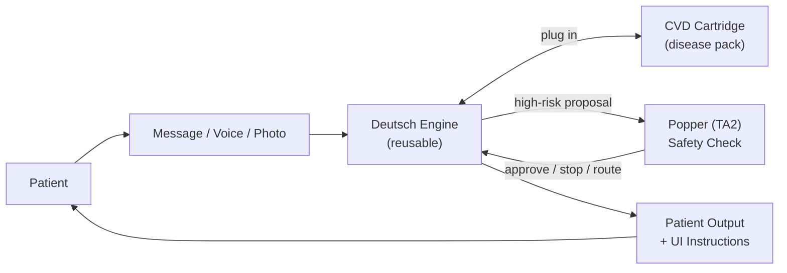

# Deutsch System Spec (TA1) — v1

## 0) Executive Summary

Deutsch is the **patient-facing clinical agent**. It is responsible for:
- understanding patient messages + patient state
- generating an assessment and a plan
- proposing actions (care navigation, triage, and in regulated mode: clinician-governed actions)
- producing patient-friendly output

Deutsch does **not** get to unilaterally execute higher-risk actions. For anything high-risk, Deutsch MUST request supervision from Popper using the Hermes contract.

## 1) Scope

### In scope (v1)
- Engine + Cartridge architecture (reusable core + CVD cartridge)
- Supervised action flow (Deutsch → Popper → Deutsch)
- Patient-facing outputs (text + structured UI instruction objects)
- Multimodal intake support (voice + images/files via attachments → structured case)
- Audit-ready trace + disclosure bundles
- Failure-safe behavior when Popper is unavailable
- Hooks for lifecycle management (drift signals + human feedback capture for RLHF)

### Out of scope (v1)
- Building Popper (TA2)
- Defining Hermes (consume Hermes)
- Full EHR vendor integrations (Deutsch consumes `HealthStateSnapshot` built elsewhere)
- Full RLHF training pipelines (Deutsch MUST still capture/emit feedback signals for RLHF)

## 2) Hard Requirements

### 2.1 Must be “Engine + Cartridge”
Deutsch MUST be implementable so that:
- the **Engine** can run with different disease cartridges
- cartridges can be swapped without modifying engine code

### 2.2 Must be “Supervised by Popper”
Deutsch MUST:
- call Popper for supervision for any “high-risk” proposed action
- obey the response decision (approve / hard stop / route)
- default to safety if Popper cannot be reached

### 2.3 Must be auditable (“Glass Box”)
Deutsch MUST produce:
- a `trace_id` for every interaction/action
- a structured `DisclosureBundle` and `EvidenceRef[]` for any non-trivial recommendation
- an audit event stream joinable by `trace_id`

## 3) System Architecture

### 3.1 High-level flow (non-technical)



### 3.2 Repository structure (recommended)

Deutsch SHOULD be built as a repo with:
- `packages/core` (engine — internal reasoning logic)
- `packages/specs/cvd` (cartridge — CVD domain module)
- `packages/service` (HTTP API service — primary deployment)
- `packages/client` (TypeScript SDK for API consumers)
- `packages/adapters/*` (integration adapters for phi-service, etc.)

**Primary deployment**: The `packages/service` is the main deliverable — a stateful HTTP service with streaming support.

**Secondary deployment**: For enterprise on-prem, `packages/core` + `packages/specs/*` can be packaged as an embeddable library.

### 3.3 Core modules (required)

#### A) `Engine` (reusable)
Responsibilities:
- Convert user input + snapshot into a structured “case”
- Run reasoning loop (conjecture → refute → select survivor)
- Produce:
  - patient output (safe wording + clear next steps)
  - proposed interventions (structured)
  - evidence pointers and disclosure bundles
- Decide whether Popper supervision is required

#### B) `Cartridge` (CVD spec pack)
Responsibilities:
- Provide CVD-specific vocabulary/ontology
- Provide guideline references and guardrails
- Provide test cases (synthetic scenarios + expected safe outcomes)

#### C) `Protocol Engine` (“muscle”)
Responsibilities:
- Turn an approved plan into concrete tasks/actions:
  - triage routing
  - scheduling requests
  - documentation tasks
  - (clinical mode only) medication order proposals under approved protocol ref

#### D) `Popper Client`
Responsibilities:
- Build Hermes `SupervisionRequest`
- Send to Popper via configured transport (HTTP or MCP)
- Validate `SupervisionResponse`
- Return decision to engine
- Apply `SupervisionResponse.control_commands` deterministically (safe-mode / operational settings):
  - commands take effect for subsequent actions/messages immediately after the response is received (they do not retroactively change the already-issued decision)
  - emit `AuditEvent.event_type = "CONTROL_COMMAND_APPLIED"` for each applied command (PHI-minimized)

#### E) `Audit Emitter`
Responsibilities:
- Emit Hermes `AuditEvent` objects
- Ensure PHI-safe redaction for logs where required

### 3.4 ArgMed Reasoning Engine

The Engine implements **Popperian conjecture-refutation** via the ArgMed multi-agent debate pattern. This ensures clinical recommendations are:

1. **Bold** — multiple hypotheses are generated
2. **Tested** — hypotheses are actively criticized
3. **Selected** — only survivors of criticism are presented
4. **Transparent** — the reasoning process is auditable

#### Three-Agent Architecture

| Agent | Role | Popperian Function |
|-------|------|-------------------|
| **Generator** (Conjecturer) | Produces ≥2 bold hypotheses per clinical claim | Bold conjectures |
| **Verifier** (Critic) | Adversarial testing, seeks refutation, applies HTV scoring | Attempted refutation |
| **Reasoner** (Synthesizer) | Selects survivors, computes final confidence | Tentative adoption |

#### HTV (Hard-to-Vary) Scoring

Each hypothesis is scored on four Deutschian dimensions:

- **Interdependence** (0.0-1.0): How tightly coupled are claim components?
- **Specificity** (0.0-1.0): How precise are predictions?
- **Parsimony** (0.0-1.0): Are all elements necessary?
- **Falsifiability** (0.0-1.0): What would refute this?

**Thresholds**:
- HTV ≥ 0.7 → Good explanation (proceed)
- HTV 0.4-0.7 → Moderate (disclose uncertainty)
- HTV 0.3-0.4 → Poor (route for high-risk)
- HTV < 0.3 → Refuted (reject hypothesis)

**Full Specification**: [`07-deutsch-argmed-debate.md`](./07-deutsch-argmed-debate.md)

### 3.5 Imaging Data Handling

Medical imaging (MRI, CT, X-ray) can be 100-500 MB per study. Deutsch follows the **"Reference, Don't Transfer"** pattern: raw imaging pixels never flow to the clinical agent.

#### Normative Constraints

**NORMATIVE**: Deutsch MUST NOT request, receive, or process raw imaging pixels.

**NORMATIVE**: Deutsch MUST only consume `DerivedImagingFinding` from `HealthStateSnapshot`.

**NORMATIVE**: Imaging findings MUST be treated as `OBSERVATION` claim type.

#### Imaging Pipeline

```
Raw Pixels (PHI Service) → Imaging AI Pipeline → DerivedImagingFinding → Snapshot → Deutsch
```

Deutsch sees:
- `ImagingStudyRef` — references to studies (NOT content)
- `DerivedImagingFinding` — extracted findings (measurements, classifications, ~KB each)

Deutsch CANNOT access:
- Raw DICOM files
- Imaging pixel data
- Storage endpoints

#### ArgMed Integration

- **Generator**: MAY use imaging findings as evidence for hypotheses
- **Verifier**: MUST check if imaging findings contradict hypotheses
- **Reasoner**: SHOULD weight AI-derived findings by `DerivedImagingFinding.confidence` (finding-level). For `finding_type === "classification"`, `classification.confidence` MAY be used as an input when populating the top-level `confidence`.

**Full Specification**: [`09-deutsch-imaging-integration.md`](./09-deutsch-imaging-integration.md)

**Hermes Types**: [`../03-hermes-specs/05-hermes-imaging-data.md`](../03-hermes-specs/05-hermes-imaging-data.md)

## 4) "High-risk" actions (when Deutsch MUST call Popper)

Deutsch MUST call Popper supervision when it proposes any of the following:
- Medication order proposal (start/stop/titrate/hold)
- Any statement that could be interpreted as a diagnosis or treatment instruction in clinical mode
- Any triage routing of urgency `urgent`
- Any action that changes care plan state (appointments, escalations) beyond simple reminders
- Any time uncertainty is `high`

Deutsch MAY respond without Popper only for “low-risk” content:
- clarifying questions
- explaining what data is missing
- lifestyle coaching in wellness mode (non-clinical, non-medication)

If uncertain whether an action is high-risk, Deutsch MUST treat it as high-risk and call Popper.

## 5) Modes (behavior boundary)

### 5.1 `wellness` mode
- Deutsch MUST NOT propose treatment-changing actions.
- Medication proposals MUST be transformed into:
  - route-to-clinician, or
  - “discuss with your clinician” guidance.

### 5.2 `advocate_clinical` mode
- Deutsch MAY propose clinician-governed actions only if:
  - the proposal contains `clinician_protocol_ref` (approved protocol)
  - Popper approves
- If missing protocol ref or governance boundary, Deutsch MUST route to clinician.

## 6) Data model assumptions

Deutsch does not own raw EHR data ingestion.

Deutsch consumes:
- `HealthStateSnapshot` **by reference** as the stable basis for reasoning.
  - The reference MUST be Hermes-compatible (`HealthStateSnapshotRef`).

Minimum required snapshot contents (conceptual):
- demographics (age range, sex) — de-identified if possible
- conditions list (HF/post-MI status, comorbidities)
- meds list (current meds)
- vitals trends (BP, weight)
- symptoms/mood (patient-reported)
- key labs (K, creatinine, BNP where available)
- recent encounters/events (admissions, ED visits)

### 6.1 FDA-Qualified PRO Instruments (Normative for CVD)

Deutsch MUST support FDA-qualified Patient-Reported Outcome (PRO) instruments for HF patients:

#### Heart Failure Core PROs (REQUIRED)

| Instrument | FDA MDDT Status | Scoring | Use |
|------------|-----------------|---------|-----|
| **KCCQ-23/KCCQ-12** | Qualified Oct 2016 | 0-100 (higher = better) | HF symptom tracking, quality of life |
| **MLHFQ-21** | Qualified May 2018 | 0-105 (lower = better) | HF quality of life assessment |

Snapshot SHOULD include when available:
- `pro_scores.kccq_total`: 0-100
- `pro_scores.kccq_symptom_frequency`: subscale
- `pro_scores.kccq_physical_limitation`: subscale
- `pro_scores.mlhfq_total`: 0-105

#### Digital Health Biomarker (RECOMMENDED)

| Instrument | FDA MDDT Status | Use |
|------------|-----------------|-----|
| **Apple Watch AFib History** | Qualified May 2024 (first digital health MDDT) | AFib burden monitoring |

Snapshot MAY include:
- `afib_burden.weekly_percentage`: Weekly AFib burden from Apple Watch
- `afib_burden.detection_events`: Array of detection timestamps

#### Comorbidity PROs (OPTIONAL, when applicable)

| Instrument | FDA MDDT Status | Patient Population |
|------------|-----------------|-------------------|
| **INSPIRE** | Qualified Jun 2020 | HF + Type 1 Diabetes with automated insulin dosing (AID) |
| **WOUND-Q** | Qualified Nov 2024 | HF + chronic wounds (venous ulcers, pressure injuries) |

Snapshot MAY include:
- `pro_scores.inspire_psychosocial`: For diabetic HF patients with AID
- `pro_scores.inspire_quality_of_life`: AID-specific QoL
- `pro_scores.wound_q_bother`: Symptom burden for wound patients
- `pro_scores.wound_q_healing`: Perceived healing progress

#### Cardiac Implant Status (REQUIRED when applicable)

For patients with pacemakers, ICDs, or CRT devices:
- `cardiac_implant.device_type`: `'pacemaker' | 'icd' | 'crt' | 'loop_recorder' | 'none'`
- `cardiac_implant.mri_conditional`: boolean (validated per IMAnalytics/Virtual MRI Safety MDDT methodology)
- `cardiac_implant.last_interrogation`: ISO timestamp

**Reference:** [`../00-overall-specs/0B-FDA-alignment/13-qualified-mddt-solutions.md`](../00-overall-specs/0B-FDA-alignment/13-qualified-mddt-solutions.md) §4-8

**Implementation note:** the snapshot format itself can be internal, but the snapshot reference MUST be Hermes-compatible so Popper can reason reproducibly over the same state.
In `advocate_clinical` mode, `snapshot_hash` is strongly recommended to support reproducibility and audit artifacts.

In `advocate_clinical` mode (normative for TA3 deployments):
- Deployments MUST ensure Popper can access snapshot bytes for verification, via at least one of:
  - `snapshot_uri` present and resolvable by Popper within the deployment trust boundary (internal-only; never public), OR
  - inline `snapshot_payload` on the `SupervisionRequest` (used when Popper cannot/should not fetch snapshots over the network).
- Deployments SHOULD populate `snapshot.quality` flags (missing/conflicting signal keys) so Deutsch/Popper can default to safe behavior without guessing.

### 6.1 Required: Snapshot builder contract (TA1 data processing & integration)

ARPA TA1 requires low-latency, interoperable data processing (<100ms on the query-response path). Deutsch can only meet this if the deployment provides a snapshot builder that:
- identifies relevant record types for the current context
- extracts pertinent fields
- indexes and de-duplicates records
- normalizes units/timezones/codes
- summarizes long documents into bounded representations
- materializes a cached snapshot for fast access by Deutsch and Popper

Deutsch therefore REQUIRES a host-provided snapshot capability with these properties:
- **Input standards**: FHIR R4 resources + HL7v2 messages (where applicable) and wearable streams (vendor-specific)
- **Output**: a versioned internal snapshot object stored in a PHI-approved system + a Hermes `HealthStateSnapshotRef`
- **Performance budget** (target):
  - Snapshot retrieval by `snapshot_ref` SHOULD be <50ms p95 within the deployment network
  - Snapshot reference validation + parsing SHOULD be <5ms p95

### 6.2 Required: Interoperability posture (FHIR / HL7v2 / TEFCA / USCDI)

Deutsch itself stays EHR-vendor-agnostic, but the TA1 system MUST:
- support data ingestion and normalization for FHIR + HL7v2
- align with US health IT standards where required (TEFCA/USCDI)

See:
- Minimum required mapping subset (CVD v1): [`04-deutsch-interoperability-mappings.md`](./04-deutsch-interoperability-mappings.md)
- Canonical implementation guide: `docs/01-product/technical-specs/29-ehr-interoperability.md`

Deutsch’s required behavior:
- never assume a specific EHR vendor schema
- treat missing/partial data as an uncertainty driver (trigger clarifying questions, IDK protocol, or route)
- include evidence pointers (`EvidenceRef[]`) that can be traced back to the source category (EHR vs wearable vs patient-reported), without embedding raw PHI in audit payloads

### 6.3 Required: Identity, access control, and privacy boundary (IAM)

TA1 requires end-to-end encryption, RBAC, and comprehensive audit logs (HIPAA/GDPR/NIST posture).

Deutsch requirements (system-level):
- all identifiers in Hermes messages MUST be pseudonymous (`subject_id`), never direct PII (email/phone/name)
- all audit payloads MUST be PHI-minimized using Hermes `audit_redaction` fields
- Deutsch deployments MUST enforce RBAC such that:
  - patients can only access their own sessions
  - clinicians/safety ops access is explicitly granted and audited
- transport MUST be secured (mTLS or equivalent) for Deutsch↔Popper in regulated deployments

### 6.4 Required: Lifecycle management (drift + RLHF hooks)

ARPA TA1 requires drift monitoring, continuous learning, and human-in-the-loop feedback (RLHF).

Deutsch MUST:
- emit structured audit events for every supervision interaction (traceable by `trace_id`)
- emit lightweight "quality signals" suitable for Popper drift monitoring (e.g., counts of routes/hard-stops, validation failures)
- support capture of human feedback events (patient and clinician) as input to RLHF and quality review
  - v1 requirement: define the event shape and where it is persisted (implementation-specific)
  - v1 requirement: ensure feedback events are linked to `trace_id` and the `snapshot_ref` used

**Clarification — RLHF vs Case Reassessment:** Feedback events serve TWO distinct purposes with different data governance:

| Aspect | RLHF (Model Training) | Case Reassessment |
|--------|----------------------|-------------------|
| **Purpose** | Improve model performance over time | Inform future reasoning for same patient |
| **Scope** | Aggregated across patients | Per-patient, in `prior_clinician_overrides` |
| **Data form** | De-identified, derived aggregates | PHI-minimized but patient-linked |
| **Latency** | Batch (days/weeks) | Real-time (next session) |
| **Pipeline** | Separate ML training pipeline | Hermes → Snapshot Builder → Deutsch |
| **Governance** | IRB/ethics review for training data | Clinical data governance (HIPAA) |

Both purposes use the same `ClinicianFeedbackEvent` format (Hermes §4.2), but:
- RLHF consumes de-identified aggregates via a **separate pipeline** (not defined in Hermes v1)
- Case reassessment consumes events per-patient, in `prior_clinician_overrides` (defined in §6.5)

**Important:** The `ClinicianFeedbackEvent` as defined in Hermes §4.2 is the source event. RLHF pipelines MUST de-identify before training. Case reassessment uses the event directly but with PHI-minimization per Hermes §1.4.

### 6.5 Clinician Feedback Integration (Case Reassessment)

Deutsch MUST use prior clinician feedback to inform future reasoning about the same patient.
This is DISTINCT from RLHF (model training) — it is patient-specific context.

**Regulatory grounding:**
- FDA AI/ML TPLC requires post-market monitoring including feedback loops
- HIPAA 45 CFR 164.316(b) requires 6-year documentation retention for policies and procedures
- JAMIA AI-CDS recommendations: document "whether or not a clinician reviewed and agreed"
- Malpractice best practices: "short documentation explaining why the clinician agreed or disagreed"

**Note on retention:** The 6-year retention applies to HIPAA-required documentation. State medical record retention laws may require longer periods (e.g., 7+ years). Deployments SHOULD consult legal counsel for jurisdiction-specific requirements.

#### 6.5.1 Consuming Clinician Override History

When processing a patient session, Deutsch MUST:
1. Check `snapshot.prior_clinician_overrides` for active overrides
2. Check `snapshot.prior_clinician_overrides.unresolved_conflicts` for pending conflicts
3. Include override history in hypothesis generation context
4. Avoid proposing actions that would repeat rejected patterns

**Normative behavior:**
- If `prior_clinician_overrides.active_overrides[]` contains a `rejected` override for a medication class,
  Deutsch MUST NOT propose medications of that class without explicit new clinical indication
- If `prior_clinician_overrides.active_overrides[]` contains a `modified` override,
  Deutsch SHOULD prefer the clinician's approach for similar scenarios
- If `prior_clinician_overrides.unresolved_conflicts[]` contains conflicts,
  Deutsch MUST route to clinician for resolution before proposing affected interventions

#### 6.5.2 ArgMed Integration

The Generator agent MUST be aware of clinician override history:
- **Hypothesis generation**: Avoid generating hypotheses that contradict active overrides
- **Evidence weighting**: Weight clinician rationale as `evidence_grade: 'expert_opinion'`
  with high confidence (0.8-0.9) for this specific patient
- **Conflict awareness**: If generating a hypothesis that would contradict an override,
  MUST include explicit justification in the hypothesis

The Verifier agent MUST check hypotheses against override history:
- Flag hypotheses that would repeat previously-rejected proposals
- Include override rationale in refutation arguments
- Weight override confidence: `high` confidence overrides are stronger refutations

**Implementation note:** Override history is patient-specific expert opinion that supplements but does not replace guideline evidence.

#### 6.5.3 Disclosure Requirements

When Deutsch's reasoning is influenced by prior clinician feedback:
- `DisclosureBundle.rationale_bullets` MUST include: "Adjusted based on prior clinician feedback"
- `DisclosureBundle.key_unknowns` SHOULD include uncertainty about whether override still applies
- `EvidenceRef[]` SHOULD include a reference to the original override (via `original_trace_id`)

**State law compliance (2025):**
Per Illinois, Texas (eff. 2026), and Utah HB 452 disclosure requirements:
- When AI is used in treatment decisions, Deutsch MUST include in patient-facing output:
  - Acknowledgment that AI-assisted decision support was used
  - That a clinician will review and make final decisions
- TA3 sites MUST configure appropriate consent/disclosure workflows per their jurisdiction
  (see `../03-hermes-specs/additional/TA3-SITE-INTEGRATION-PROFILE.template.md`)

#### 6.5.4 Override Expiration and Re-evaluation

Deutsch MUST handle override expiration:
- If `applies_to.valid_until` is past, treat as informational (not binding)
- If `applies_to.is_permanent === true`, treat as active regardless of age
- Default: overrides without explicit expiration SHOULD decay after 180 days
  (configurable per TA3 site)

**Re-evaluation triggers:**
If `applies_to.re_evaluation_trigger` is specified, Deutsch MUST:
- Monitor snapshot for the trigger condition (e.g., "new renal function test")
- When trigger fires, generate a `TRIAGE_ROUTE` proposal to clinician:
  "Prior override may need re-evaluation based on new [trigger]"

**Override decay algorithm (normative):**
- 0-90 days: Full weight (1.0)
- 91-180 days: Declining weight (0.9 → 0.5)
- >180 days: Informational only (weight 0.3), recommend re-evaluation
- If `rationale.confidence === 'high'`: Extend all thresholds by 90 days

#### 6.5.5 Emitting Clinician Feedback Events

When Deutsch learns of a clinician decision (via TA3 integration):
- The **gateway** MUST emit a Hermes `ClinicianFeedbackEvent` (see Hermes §4.2.3 and §4.5 trust chain)
- Deutsch MUST NOT emit `ClinicianFeedbackEvent` directly; instead, Deutsch MUST forward the clinician decision to the gateway (or ingest the emitted event) so the gateway can act as the authoritative producer (`trace.producer.system = 'gateway'`)
- Event MUST link to original `trace_id` and `proposal_id`
- Event MUST be PHI-minimized per Hermes §1.4
- Event MUST include `response_time_seconds` for alert fatigue analysis

**Documentation requirements (per malpractice best practices):**
- `rationale.summary` is REQUIRED, not optional
- Event MUST be retained for at least 6 years to support compliance documentation and clinical governance (HIPAA documentation retention: 45 CFR 164.316(b)); jurisdictions or organizational policy may require longer retention
- Event MUST include `rationale.category` for structured analytics

#### 6.5.6 Conflict Resolution (Multiple Clinicians Disagree)

When `prior_clinician_overrides.unresolved_conflicts[]` is non-empty:

1. **Identify conflict type:**
   - `reversal`: A clinician explicitly reversed another's override
   - `disagreement`: Two clinicians gave conflicting feedback on same issue

2. **Resolution hierarchy:**
   - Attending physician > Specialist > Primary care > Nurse Practitioner/Physician Assistant
   - More recent decision wins within same role level
   - Specialist in relevant domain wins cross-specialty conflicts

3. **Deutsch behavior:**
   - If conflict involves `medication_class`, MUST route to clinician before proposing
   - If conflict involves `intervention_kind`, SHOULD route to clinician
   - Include conflict summary in `DisclosureBundle.key_unknowns`

4. **Conflict persistence:**
   - Conflicts MUST be surfaced until explicitly resolved by attending
   - Resolution event MUST reference all prior conflicting trace_ids

#### 6.5.7 Clinical Handoff Continuity

When `snapshot.prior_clinician_overrides.last_handoff` indicates recent transfer:

1. **Override validation:**
   - Deutsch SHOULD treat transferred overrides with slightly lower weight (0.8x)
   - New attending MAY need to re-confirm critical overrides

2. **Disclosure:**
   - `DisclosureBundle` SHOULD note: "Patient recently transferred; some clinical context may need re-confirmation"

3. **Re-evaluation prompt:**
   - For overrides with `is_permanent === true`, generate recommendation:
     "Please confirm permanent contraindication [X] still applies after transfer"

**Grounding:** Institute of Medicine notes that "It is in inadequate handoffs that safety often fails first."

#### 6.5.8 Alert Fatigue Detection

Deutsch MUST monitor for alert fatigue patterns:

1. **Indicators:**
   - `override_rate_trend === 'increasing'`: Warning
   - `response_time_seconds < 10` consistently: Possible rubber-stamping
   - Same clinician rejecting >50% of proposals: Review proposal quality

2. **Reporting:**
   - Emit aggregate metrics to Popper for drift monitoring
   - Flag patterns that suggest alert fatigue in audit events

3. **Self-correction:**
   - If high override rate for specific `intervention_kind`, Deutsch SHOULD:
     - Increase threshold for proposing that intervention
     - Include uncertainty disclosure for that category

### 6.6 Demographic Bias Monitoring in Feedback

Per FDA AI/ML guidance requirements, Deutsch MUST support monitoring for demographic bias in clinician override patterns.

**Regulatory grounding:**
- FDA AI/ML TPLC requires evidence that devices benefit all demographic groups similarly
- FDA Request for Comment on Real-World Performance recommends monitoring for "data drift"

#### 6.6.1 Aggregate Monitoring

Deutsch MUST emit aggregate metrics (NOT per-patient, de-identified) for:
- Override rates by `demographic_context.age_group`
- Override rates by `rationale.category`
- Override rates by `clinician_ref.specialty`
- Override rates by `applies_to.medication_class`

**Bias indicators:**
- If override rate differs by >20% across age groups → flag for review
- If specific medication class has >40% override rate → review proposal logic
- If specific clinician specialty consistently overrides → review domain expertise in prompts

#### 6.6.2 Feedback Loop Correction

When bias is detected:
1. Flag in Popper drift monitoring dashboard
2. Generate recommendation for model re-calibration
3. Temporarily increase routing to clinician for affected demographic/intervention combinations

#### 6.6.3 Audit Trail

- All bias detection events MUST be logged with `AuditEvent.event_type = 'OTHER'`
  and `other_event_type = 'BIAS_DETECTION'`
- Include `tags.bias_type`, `tags.affected_group`, `tags.metric_delta`
- Retain for FDA inspection per post-market surveillance requirements

## 7) Failure modes (must be safe)

### 7.1 Popper unavailable / timeout
- Default behavior MUST be safe:
  - do NOT execute high-risk proposals
  - **`advocate_clinical`**: default to `ROUTE_TO_CLINICIAN` for any high-risk proposal
  - **`wellness`**: default to `HARD_STOP` for any high-risk proposal (no treatment-changing actions; “discuss with your clinician” posture)
- Deutsch MUST emit an audit event: `VALIDATION_FAILED` (PHI-minimized) with tags such as:
  - `tags.dependency = "popper"`
  - `tags.failure_code = "timeout" | "popper_unreachable" | "invalid_response"`

### 7.2 Hermes validation failure (request or response)
- Treat as unsafe, route/hard-stop
- Emit `AuditEvent.event_type = "VALIDATION_FAILED"` with tags such as:
  - `tags.kind = "schema_invalid"`

### 7.3 Snapshot unavailable / stale
- Deutsch MUST ask clarifying questions and/or route to clinician rather than guessing.
- **Default staleness thresholds (normative; configurable per TA3 org):**
  - `wellness`: snapshot is stale if `snapshot.created_at` is older than **24 hours**
  - `advocate_clinical`: snapshot is stale if `snapshot.created_at` is older than **4 hours**
- **Behavior when snapshot is unavailable or stale (normative):**
  - Deutsch MUST treat missing/stale snapshot data as an uncertainty driver.
  - For **high-risk** actions, Deutsch MUST default to safety (route to clinician) rather than attempting a best-guess plan.
  - Deutsch SHOULD request a snapshot refresh via the host integration layer when possible and MAY return `REQUEST_MORE_INFO` style questions to the patient to close critical gaps.
  - In `advocate_clinical`, if the snapshot cannot be verified/retrieved (e.g., `snapshot_uri` missing/unavailable AND no `snapshot_payload` is available for Popper) and the contemplated action is treatment-changing, Deutsch MUST route to clinician.
  - If `snapshot.quality.missing_signals` or `snapshot.quality.conflicting_signals` indicates degraded snapshot quality, Deutsch MUST:
    - disclose the uncertainty (via `DisclosureBundle.key_unknowns`) and
    - prefer conservative posture (route / request more info) for high-risk proposals.

TA3 override governance:
- TA3 sites MAY override staleness thresholds and "required signal" policies, but MUST version-control these settings in their Site Integration Profile (`../03-hermes-specs/additional/TA3-SITE-INTEGRATION-PROFILE.template.md`) so audits can reconstruct which thresholds were in force.

### 7.4 IDK Protocol (epistemic humility)

When Deutsch cannot form a reliable recommendation, it MUST invoke the **IDK Protocol** — a formalized "I Don't Know" response that admits uncertainty honestly rather than confabulating.

#### IDK Triggers

| Trigger | Condition |
|---------|-----------|
| **LOW_HTV** | All hypotheses have HTV < 0.4 after ArgMed debate |
| **NO_SURVIVORS** | All hypotheses refuted during debate |
| **MISSING_DATA** | Required snapshot signals absent |
| **CONFLICTING_DATA** | Unresolvable contradictions in data |
| **INSUFFICIENT_EVIDENCE** | No supporting guidelines/studies found |
| **STALE_DATA** | Snapshot beyond staleness threshold |

#### Behavior by Mode

| Mode | IDK Response |
|------|--------------|
| `wellness` | Provide safe fallback + educational content + "discuss with clinician" |
| `advocate_clinical` | Route to clinician with structured IDK disclosure |

#### Required Elements

Every IDK response MUST include:
- `reason_code` — Why IDK was triggered
- `missing_information` — What data would resolve the uncertainty
- `patient_explanation` — Plain language for the patient
- `clinician_explanation` — Technical summary for provider review

**Full Specification**: [`08-deutsch-idk-protocol.md`](./08-deutsch-idk-protocol.md)

**Epistemological Grounding**: [`../00-overall-specs/00-epistemology-foundations/04-fallibilism-and-error-correction.md`](../00-overall-specs/00-epistemology-foundations/04-fallibilism-and-error-correction.md)

### 7.5 Imaging-Specific IDK Triggers

Deutsch MUST trigger IDK Protocol for imaging-related uncertainty:

| Trigger | Condition | Response |
|---------|-----------|----------|
| **MISSING_IMAGING** | Required imaging per cartridge is absent | Suggest imaging study |
| **STALE_IMAGING** | Imaging older than cartridge threshold | Request repeat imaging |
| **LOW_CONFIDENCE_IMAGING** | AI classification confidence < 0.7 | Request radiologist review |
| **CRITICAL_IMAGING** | `clinical_significance === 'critical'` | Immediate escalation |

#### Required Imaging by Cartridge

Domain cartridges MAY specify required imaging for clinical contexts:

```typescript
// Example: CVD cartridge
{
  clinical_context: 'lvef_assessment',
  required_modality: 'MR',
  max_staleness_days: 90,
  confidence_threshold: 0.8,
}
```

If required imaging is missing or stale, Deutsch MUST:
1. Trigger IDK with `reason_code = 'MISSING_DATA'`
2. Include `suggested_imaging` in the response
3. Route to clinician in `advocate_clinical` mode

**Full Specification**: [`09-deutsch-imaging-integration.md`](./09-deutsch-imaging-integration.md) §5

## 8) Non-functional requirements (v1 targets)

- **Correctness > speed** for high-risk actions.
- Supervision request/response round-trip transport SHOULD be designed to allow **<100ms** overhead (excluding any optional deep model calls).
- Deutsch SHOULD provide user-perceived responsiveness via:
  - quick acknowledgement
  - progressive updates (e.g., streaming or staged UI instructions)

### 8.1 Latency budget breakdown (normative)

TA1/TA2 specify multiple latency targets; implementations MUST keep them distinct:

1. **TA1 data processing (<100ms p95)**: snapshot ingestion/normalization/indexing on the reasoning path (implemented by the snapshot builder, not Deutsch core).
2. **TA2 fusion protocol overhead (<100ms p95)**: Deutsch↔Popper supervision request/response transport + parse/validate/serialize overhead.
3. **End-to-end user-perceived response**: Deutsch’s time from user message to initial safe response (may use progressive/staged UI to avoid blocking on non-critical work).

## 9) Testing & Acceptance Criteria

### 9.1 Contract tests
- Deutsch MUST pass Hermes fixture tests for:
  - `SupervisionRequest` generation
  - `SupervisionResponse` parsing/validation

### 9.2 Safety tests (CVD cartridge)
- Provide a suite of scenario tests (synthetic patients) that verify:
  - no medication advice in wellness mode
  - high-risk proposals always require Popper
  - when Popper rejects, Deutsch obeys

### 9.3 Operational acceptance (“definition of done”)
- A developer can run a local flow:
  - provide snapshot + user message
  - Deutsch produces a plan
  - Deutsch calls Popper (stub ok)
  - Deutsch returns final output + audit events

## 10) ARPA TA1 alignment checklist (spec completeness)

This checklist maps TA1 requirements (see `../00-overall-specs/B-arpa-TA1-Specs.md`) to this spec.

- **Agentic execution & clinical reasoning**: Covered by §§3–5 (Engine/Cartridge/Protocol Engine + mode boundaries)
- **Medical device functions (Rx management)**: Covered by §§4–5 and the CVD cartridge spec (medication proposals are always supervised and protocol-bound)
- **Non-device functions (care navigation/triage/etc.)**: Covered by §3.3 + `ProposedIntervention.kind` (including `OTHER` for extensibility)
- **Data processing & integration (<100ms)**: Covered by §6.1 (snapshot builder contract + snapshot-first requirement)
- **Interoperability (FHIR/HL7v2/TEFCA/USCDI)**: Covered by §6.2 (system posture; Deutsch remains vendor-agnostic)
- **IAM (encryption/RBAC/audit logs; HIPAA/GDPR/NIST)**: Covered by §6.3 + Hermes audit/redaction rules
- **Lifecycle management (drift/RLHF/updates)**: Covered by §6.4 (hooks + traceable feedback)

## 11) Multi-Domain Composition (Extension)

Deutsch supports composing multiple domain modules (clinical + lifestyle + behavioral) into unified sessions. This enables holistic care recommendations across domains like:

- Cardiology + Nutrition + Exercise
- Nephrology + Nutrition + Mental Health
- Oncology + Nutrition + Exercise + Mental Health

### 11.1 Key Principles

1. **Domain-agnostic** — No hardcoded disease vs lifestyle hierarchy
2. **Data-driven rules** — Interaction rules loaded from registries, not code
3. **Context-dependent priority** — Patient state determines domain precedence
4. **Transparent supervision** — All cross-domain conflicts surfaced to Popper

### 11.2 Related Specifications

- **Multi-Domain Composition Spec**: [`04-multi-domain-composition-spec.md`](./04-multi-domain-composition-spec.md) — Full architecture and requirements
- **Domain Module Template**: [`05-domain-module-template.md`](./05-domain-module-template.md) — Template for creating domain modules
- **Interaction Rule Registry Spec**: [`06-interaction-rule-registry-spec.md`](./06-interaction-rule-registry-spec.md) — Format for interaction rules

### 11.3 TA2 Compliance

Multi-domain composition maintains TA2 supervisory visibility by:

- Surfacing ALL cross-domain conflicts to Popper (even resolved ones)
- Including conflict resolution evidence and confidence levels
- Allowing Popper to override/escalate conflict resolutions
- Tracking per-domain health status and degradation

See [`04-multi-domain-composition-spec.md`](./04-multi-domain-composition-spec.md) §8 for full TA2 integration requirements.

## 12) Epistemological Grounding

Deutsch implements **Popperian epistemology** as operationalized by David Deutsch. All clinical reasoning follows the conjecture-refutation method, and all explanations are evaluated using the Hard-to-Vary (HTV) criterion.

### 12.1 Core Principles

| Principle | Deutsch Implementation |
|-----------|------------------------|
| **Bold conjectures** | Generator produces multiple diverse hypotheses |
| **Attempted refutation** | Verifier adversarially attacks each hypothesis |
| **Error elimination** | Refuted hypotheses are discarded (HTV < 0.3) |
| **Tentative adoption** | Survivors become recommendations with uncertainty disclosure |
| **Fallibilism** | IDK Protocol admits uncertainty rather than confabulating |

### 12.2 Key Specifications

- **ArgMed Debate**: [`07-deutsch-argmed-debate.md`](./07-deutsch-argmed-debate.md)
- **IDK Protocol**: [`08-deutsch-idk-protocol.md`](./08-deutsch-idk-protocol.md)
- **Epistemological Types**: [`../03-hermes-specs/04-hermes-epistemological-types.md`](../03-hermes-specs/04-hermes-epistemological-types.md)

### 12.3 Epistemology Foundations

The following reference documents provide philosophical grounding:

- [`00-popper-deutsch-fundamentals.md`](../00-overall-specs/00-epistemology-foundations/00-popper-deutsch-fundamentals.md) — Core Popperian framework
- [`01-hard-to-vary-explanations.md`](../00-overall-specs/00-epistemology-foundations/01-hard-to-vary-explanations.md) — Deutschian quality criterion
- [`03-conjecture-and-refutation.md`](../00-overall-specs/00-epistemology-foundations/03-conjecture-and-refutation.md) — Scientific method
- [`04-fallibilism-and-error-correction.md`](../00-overall-specs/00-epistemology-foundations/04-fallibilism-and-error-correction.md) — Honest uncertainty
- [`06-medical-reasoning-alignment.md`](../00-overall-specs/00-epistemology-foundations/06-medical-reasoning-alignment.md) — Clinical mapping

### 12.4 Relationship to Popper (TA2)

| Component | Epistemological Role |
|-----------|---------------------|
| **Deutsch (TA1)** | Implements Popper's *methodology* — conjecture-refutation reasoning |
| **Popper (TA2)** | Implements Popper's *demarcation* — safety boundary enforcement |

Deutsch performs ALL clinical reasoning and hypothesis evaluation. Popper performs disease-agnostic supervisory oversight — it does NOT generate clinical conjectures.
